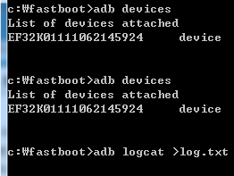
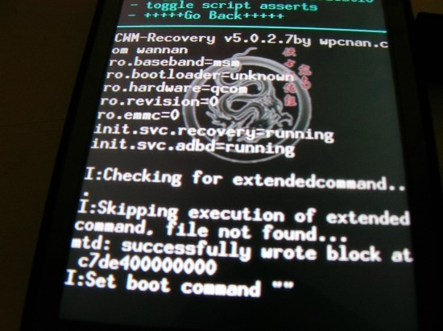

수단과 방법을 가리지 않고 로그를 뽑아보고 있습니다

1. `adb logcat`을 이용한 방법

먼저 adb를 준비합니다

이건 이미 컴에 깔려있고...

부팅될때 바로 `adb devices`로 체크 해 보았다



이걸 보시면 devices라고 뜨는거 보이시죠?

이게 리커버리 들어가는 부분에서 멈출때 나오는 부분입니다

log.txt는...

```
\* daemon not running. starting it now on port 5037 \*

\* daemon started successfully \*
```

와우 ㅋㅋㅋㅋ

아무리 시도해도 log.txt에는 아무런 로그가 담기지 않는다...

2. cwm에서의 로그켓 뽑기 시도

cwm진입상태에서 `adb logcat > log.txt`를 시도하면 lot.txt에는

```
/sbin/sh: exec: line 1: logcat: not found
```

이런 로그가 발생한다...

이게 뭔 뜻일까요?

3. cwm기능중 Show log기능을 사용한다

cwm의 어드벤스드에 들어가면 로그 기능이 있는대 그거 해보니

```
ro.baseband=msm

ro.bootloader=unknown

ro.hardware=qcom

ro.revision=0

ro.emmc=0

init.svc.recovery=running

init.svc.adbd=running

I:Checking for extendedcommand...

I:Skipping execution of extendedcommand, file not found...

mtd: successfully wrote block at c7de400000000

I:Set boot command ""
```



이런것이 화면에 나타난다;;

이게 무슨뜻 일까요?

리버커리 서비스와 adb서비스가 활성화 되었다

이것말고는 알아듯기 힘드네요...

4. cwm의 리포트 에러 기능

어드벤스트에 있는 기능인 리포트 에러를 했더니

sdcard/clockworkmod에 로그가 있다고 하더라고요

뽑아 왔습니다~
```
Starting recovery on Mon Sep  3 08:59:55 2012

framebuffer: fd 4 (320 x 480)

CWM-Recovery v5.0.2.7by wpcnan.com wannan

recovery filesystem table

=========================

  0 /tmp ramdisk (null) (null)

  1 /boot mtd boot (null)

  2 /cache yaffs2 cache (null)

  3 /data yaffs2 userdata (null)

  4 /misc mtd misc (null)

  5 /recovery mtd recovery (null)

  6 /sdcard vfat /dev/block/mmcblk0p1 /dev/block/mmcblk0

  7 /system yaffs2 system (null)

W:Unable to get recovery.fstab info for /sd-ext during fstab generation!

I:Completed outputting fstab.

I:Processing arguments.

mtd: successfully wrote block at c7de400000000

I:Set boot command "boot-recovery"

I:Checking arguments.

I:device_recovery_start()

Command: "/sbin/recovery"

ro.secure=0

ro.allow.mock.location=1

ro.debuggable=1

persist.service.adb.enable=1

ro.build.id=GINGERBREAD

ro.build.display.id=GINGERBREAD

ro.build.version.incremental=eng.p11387.20111006.122319

ro.build.version.sdk=10

ro.build.version.codename=REL

ro.build.version.release=2.3.3

ro.build.date=Thu Oct  6 12:24:05 KST 2011

ro.build.date.utc=1317871445

ro.build.type=user

ro.build.user=p11387

ro.build.host=bs200

ro.build.tags=release-keys

ro.product.model=IM-A740S

ro.product.brand=SKY

ro.product.name=sky-ef31s

ro.product.device=ef31s

ro.product.board=7x27

ro.product.cpu.abi=armeabi

ro.product.manufacturer=PANTECH

ro.product.locale.language=ko

ro.product.locale.region=KR

ro.wifi.channels=

ro.board.platform=msm7k

ro.product.boardnswver=7x27 V1.78

ro.product.baseband_ver=S0210178

ro.product.baseband_ver_hidden=S0210178a

ro.product.checksum=

ro.carrier=SKT-KOR

ro.build.product=ef31s

ro.build.description=sky-ef31s-user 2.3.3 GINGERBREAD eng.p11387.20111006.122319 release-keys

ro.build.fingerprint=SKY/sky-ef31s/ef31s:2.3.3/GINGERBREAD/eng.p11387.20111006.122319:user/release-keys

rild.libpath=/system/lib/libril-qc-1.so

rild.libargs=-d /dev/smd0

persist.rild.nitz_plmn=

persist.rild.nitz_long_ons_0=

persist.rild.nitz_long_ons_1=

persist.rild.nitz_long_ons_2=

persist.rild.nitz_long_ons_3=

persist.rild.nitz_short_ons_0=

persist.rild.nitz_short_ons_1=

persist.rild.nitz_short_ons_2=

persist.rild.nitz_short_ons_3=

ril.subscription.types=NV,RUIM

DEVICE_PROVISIONED=1

debug.sf.hw=1

debug.composition.type=mdp

media.stagefright.enable-player=true

media.stagefright.enable-meta=false

media.stagefright.enable-scan=false

media.stagefright.enable-http=true

ro.opengles.version=131072

ro.use_data_netmgrd=false

ro.bluetooth.remote.autoconnect=true

ro.sf.lcd_density=160

dalvik.vm.heapsize=48m

ro.setupwizard.mode=OPTIONAL

ro.com.google.gmsversion=2.3_r3

ro.config.notification_sound=OnTheHunt.ogg

ro.config.alarm_alert=Alarm_Classic.ogg

ro.com.google.clientidbase=android-skt-kr

net.bt.name=Android

net.change=net.bt.name

dalvik.vm.stack-trace-file=/data/anr/traces.txt

ro.factorytest=0

ro.serialno=

ro.bootmode=unknown

ro.baseband=msm

ro.bootloader=unknown

ro.hardware=qcom

ro.revision=0

ro.emmc=0

init.svc.recovery=running

init.svc.adbd=running

I:Checking for extendedcommand...

I:Skipping execution of extendedcommand, file not found...

mtd: successfully wrote block at c7de400000000

I:Set boot command ""
```

?

이게 뭔가요?

아까 Show log에 있던 내용도 있고...

빌프 내용 같은것도 있고...

이부분은 상관이 없습니다!

고수님들 알려주세요!!!
