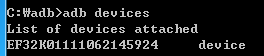
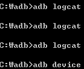

이 두개의 사진을 보아 미루어 짐작해볼때,

cm부팅때 sky로고후 검은화면 + 위 글씨(전과 동일한증상)때의 adb는 잡힙니다.

logcat의경우 아에 표시할 로그가 없는것 같습니다.

또한 system을 복원한뒤 재부팅해도 문제가 일어나는것으로 보아

boot.img의 문제이며 같은 커널을 쓰지만 하나는 cm, 하나는 순정인 부트이미지가 있을때

cm램디스크인 boot.img에서는 문제발생, 순정 램디스크인 boot.img에서는 정상 부팅인것으로 보아

cm의 boot.img속 램디스크에 문제가 있는것 같습니다.

init.rc등을 수정해서 부팅만 이라도 성공해 보고 싶네요 ㅋㅋ
