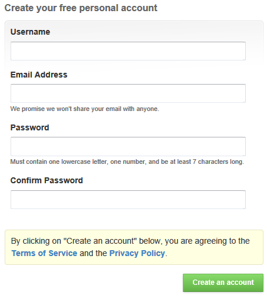
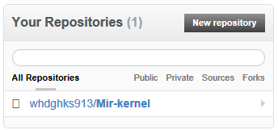
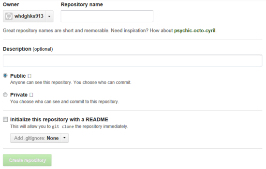
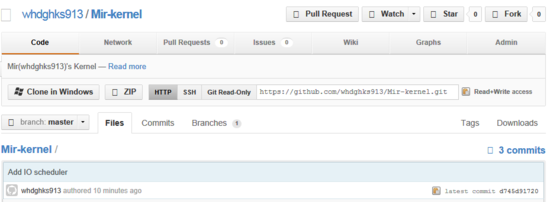

안드로이드 등을 주로 만지시는 분들은 소스 파일을 관리해야 할때가 많은데요.

그럴때 사용하는것이 바로 Github입니다.

이 깃허브는 아마 CM이나 AOSP등의 소스를 받을때 github.com/이라는 사이트를 보실 수 있습니다.

우리는 이 사이트를 이용하여 커널소스등을 Github에 저장하고 갱신할 것 입니다.

https://github.com/

일단 이사이트에 가입합시다.

Github는 소스를 오픈하여 모든 사람들이 볼수 있게 하는 대신 무료로 서비스를 제공하고 있습니다.

을 클릭하여

역시 무료는 오픈소스입니다. ㅎㅎ

Create a free account를 눌러 계정을 만드세요.

아주 간단한 정보만 입력하시면 됩니다.

사용자 이름, 이메일, 암호를 지정하신뒤 계정을 만드시면 끝입니다.

만드셨으면 로그인 해주세요.

아래 보시면 창이 있습니다.

저는 하나 만들어서 한개가 뜨는데요.

위 버튼을 눌러 하나를 만들어 줍시다.

맨위 프로젝트 이름, 설명, 공개여부를 선택해 주신후 만들어 주세요.

비공개로 하실경우 유료...입니다.

만드신후 프로젝트에 들어가시면 아래처럼 뜨게 됩니다.

저기 부분의 <https://github.com/itmir913/Mir-kernel.git>을 복사해 두세요~

이제 우분투(리눅스)가 필요합니다.

저는 리눅스에서의 github를 서술하겠습니다.

터미널을 실행하신후.

`sudo apt-get install git-core`

을 입력하세요.

git을 설치합니다.

그다음 (커널소스를 풀어놓으신후) 자신이 github에 등록할 소스가 있는 폴더로 이동하세요.

`cd ~/바탕화면/경로`

아마 이렇게 되겠죠?

그다음 입력해 주세요.

`git init`

.git이라는 폴더를 생성하게 됩니다.

이것은 이 폴더를 Github의 작업폴더로 사용하겠다는 뜻이 됩니다.

그다음 (커널 소스등을 넣으신뒤) `git status` 을 입력해 주세요.

현재 상태를 확인하게 됩니다

우리는 아직 서버에 저장하지 않았으므로 빨간색의 폴더 경로 글씨가 뜨게 됩니다.

이제 등록해야 합니다.

`git add .`

add뒤 파일을 지정하면 그 파일만, .(점)을 쓰면 모든 파일이 해당하게 됩니다.

깃허브의 구조를 이해하셔야 이부분을 왜 하는지 아실탠데요.

우리가 수정한것을 add하면 index에 들어가게 되고요.

commit 하면 HEAD로 확정지어지게 됩니다.

그다음 push해야 서버에 저장되게 되는 것 입니다.

지금까지 우리는 index에 들어가게 하였습니다.

이제 확정 지어야 하는데요.

`git commit -m "커밋 문구"`

이렇게 commit하시면 됩니다.

-m뒤 따음표 안 어떤것을 수정했는지 영어로 쓰시면 되겠죠?

그럼 한눈에 알아볼수 있을것 입니다.

이제 우리는 `git status`하면 아무 것도 commit 할 것이 없다고 나타나게 됩니다.

마지막으로 push하게 되면 서버에 저장되게 됩니다.

그런데요 git은 우리의 서버주소를 아직 모르고 있습니다;;

그냥 push하면 당연히 안되죠...

그럼 우리가 git에게 주소를 알려주어야 합니다.

아까 복사해둔 <https://github.com/itmir913/Mir-kernel.git>을 가져와 주세요.

`git remote add origin (아까 복사해둔 주소)`

이렇게 입력해주면 서버의 주소를 가지고 있는 origin이라는 remote를 생성하게 됩니다.

예를 들면 제경우

`git remote add origin https://github.com/itmir913/Mir-kernel.git`

이렇게 말이죠 ㅎㅎ

이제 마지막으로 우리의 사랑스러운 Github서버에 등록해 볼까요?

`git push origin master`

이렇게 되면 HEAD에 저장된 내용을 origin을 통해 원격 서버(github)에 저장하게 됩니다.

그럼 아이디와 비번을 입력하라고 하게 됩니다.

이 부분은 비밀정보라 입력해도 나타나지 않으니 안심하고 입력하세요~

오류 뜨시는 분은

`git push origin +master`

이렇게 입력해보세요.

저도 이러니 되더라고요.

(주의: github의 모든 commit을 지우고 새로 등록합니다.)

참고:<http://stardust99.blogspot.kr/2012/06/git-non-fast-forward.html>

완료되었습니다~

우리는 이제 Github를 이용하는 자랑스러운 한국인이 되었습니다~

이상으로 강좌를 마칩니다.
