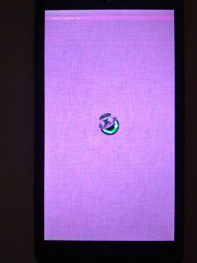
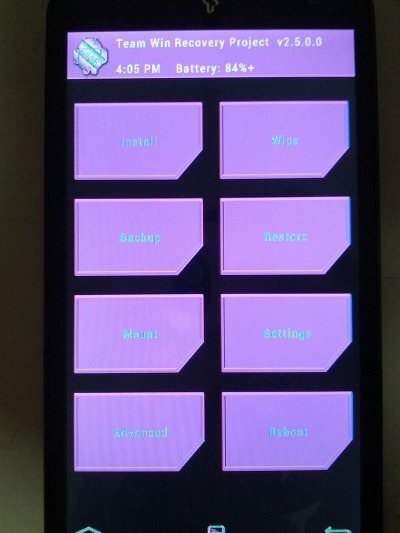

지금까지 제가 격은 문제와 그 해결법에 대해 정리하도록 하겠습니다

참고로 이 글은 <http://whdghks913.blog.me/20166024812> 게시글을 옮긴 것이며

티스토리에는 <http://whdghks913.blog.me/20166024812>게시글을 따로 포스팅 하지 않았습니다

앞으로의 내용추가는 이 게시글 에서 갱신하도록 하겠습니다

대부분의 해결은 능력자 분들의 말씀을 인용한것입니다 인용시 그 분:말씀 이렇게 작성하였습니다

**CM빌드 오류**

**brunch, make clobber 오류**

make clobber치면

build/core/product_config.mk:196: *** _nic.PRODUCTS.[[vendor/cyanogen/products/cyanogen_sunfire.mk]]: "device/motorola/sunfire/sunfire.mk" does not exist. 멈춤.

**brunch a750k**

No command 'brunch' found, did you mean:

Command 'branch' from package 'rheolef' (universe)

brunch: command not found

도라도라 : . build/envsetup.sh 한뒤에 brunch a750k 를 실행하세요

호호 : 파일 추가는 하셨는지

Vendor/cyanogen 에서 h를 수정해야하고

Vendor/cyanogem/product 에서 cyanogen_기기명.mk를 작성하시고 androidproduct.mk 도 수정해야합니다

Cyanogen_기기명.mk는 다른 파일들을 참고하시고 작성하시면 됩니다

vendorsetup.sh수정은 add_lunch_combo cyanogen_a750k - eng

Target device명을 device/회사명 안에 기기명과 같게해야할겁니다

부가 설명: brunch a750k를 하기전 파일을 추가해야 한다

Vendor/cyanogen/vendorsetup.sh,

Vendor/cyanogem/product/cyanogen_기기명.mk

Vendor/cyanogem/product/androidproduct.mk

Target device는 cyanogen_기기명.mk의 디바이스 부분이다

**libaudio을 만들규칙이 없습니다;;**

target Strip: libeffects (out/target/product/a750k/obj/lib/libeffects.so)

make: *** `out/target/product/a750k/obj/SHARED_LIBRARIES/libaudioflinger_intermediates/LINKED/libaudioflinger.so'에서 필요로 하는  타겟 `out/target/product/a750k/obj/lib/libaudio.so'를 만들 규칙이 없습니다.  멈춤.

호호 : libaudio.so라는 파일을 해당경로에 가져다 놔도 되고

Boardconfig.mk에 BOARD_USES_GENERIC_AUDIO:= true 라는 구문을 추가해주세요

나의 해결법 : out/target/product/a750k/obj/SHARED_LIBRARIES/libaudioflinger_intermediates

이경로폴더를 삭제했습니다 libaudioflinger.so 생성 완료

**libcamera.so을 만들규칙이 없습니다**

make: *** `out/target/product/ef32k/obj/SHARED_LIBRARIES/libcameraservice_intermediates/LINKED/libcameraservice.so'에서 필요로 하는  타겟 `out/target/product/ef32k/obj/lib/libcamera.so'를 만들 규칙이 없습니다.  멈춤.

검색, 참고자료SDA: <http://cafe.naver.com/skydevelopers/96508>

호호 : Boardconfig.mk에 USE_CAMERA_STUB:= true을 추가해 주시면 됩니다

**램디스크 부분 (init부분)**

호호 : Init를 강제로 넣지 않는이상 자동으로 init가 빌드됩니다;;;;;

INit는 미르님이 넣지않는이상 자동으로 빌드되구요

Init.rc도 넣지않으면 알아서 던져주는데 그거 빼와서 원래 init.rc랑 섞어야합니다

복사 명령어

PRODUCT_COPY_FILES := \

device/pantech/a750k/init.rc:root/init.rc \

이정도겠네요

부가 설명: 복사 명령어는

PRODUCT_COPY_FILES := \

파일의 경로:복사될 경로 \

/home/계정명을 생략하고 소스가 담긴폴더를 기준으로 한다

또한 복사될 경로는 빌드시 생성되는 out/target/~을 기준으로 한다

**롬 매니저 오류**

잘가다가 오류;;

make: *** `out/target/product/a750k/system/app/RomManager.apk'에서 필요로 하는 타겟 `vendor/cyanogen/proprietary/RomManager.apk'를 만들 규칙이 없습니다. 멈춤.

는 뭘까요?

호호 : 저 위오류는 vendor/cyanogen에 gotuprommanager(이름이....여튼rommanager라고 되있는 파일있을겁니다)그걸 실행시켜주시면 해결됩니다

**벤더 수정후 오류**

make clobber

**부팅실패+리커버리로 강제 재부팅**

리커버리로 강제로 재부팅됬다는건 init.rc문제로 알고있습니다 init.rc확인해보시길

일단 init.rc는 cm7에서 던져주는것을 쓰는게 좋습니다 그리고 나서 쓰는 기기의 init.rc와 적절하게 섞어주세요 그리고 추가오류가 뜨면 그에따른 수정을 해줘야합니다

마운트가 안될경우 손봐야 할 부분

Init.rc에서 on fs on -emmc fs on -post fs부분이다

init.rc는 cm7의 init.rc에 순정펌 init.rc를 섞고 (pantech에서 추가한 사항들을 넣어주세요) 파일 복사 매크로를 이용해서 root폴더에 넣어주셔야 합니다

그리고 추정건데 ueventd.rc또한 cm7에서 던져준것으로 추정되는데 ueventd.rc는 순정펌의 것을 root폴더에 매크로로 넣어주셔야합니다

그리고 아마 root폴더에 init.qcom.rc또한 없을거 같은데 이것도 순정에서 매크로로 넣어주셔야 합니다

강제 리커버리 부분

Init.rc에서(혹은 init.qcom.rc) 서비스중에 critical 라는 문구가 들어간 서비스가 3분이내에 몇번이상 종료되면 강제로 리커버리로 재부팅 된다고 하더라구요 ueventd.rc servicemanager 서비스등으로 추측가능하겠네요

<http://m.cafe.naver.com/ArticleRead.nhn?clubid=24846429&menuid=78&articleid=880&query=%EC%82%AC%EB%9E%8C>

링크가시면 사람님의 작업파일이있습니다

같은 위치 다른 문구가 있으면?

Pantech것을 따라주셔야하는데 가장윗부분에 export BOOTCLASSPATH 부분은 CM것

그대로 내비두세요

기본적으로 부팅을 위해선 해당기기의 라이브러리나 바이너리들을 써야합니다;; 저번에 올려드린 링크참고해주세요 보시면 순정펌에서 바이너리들과 라이브러리들을 뽑아서 넣어주는것을 볼수있을거에요;;

일단 다시 사람님 작업파일중 ef18.mk등을 참고해주세요

어떻게 디바이스와 벤더를 구축하셨는지 모르겠네요;;

여튼 바이너리파일과 라이브러리 일부파일의 순정사용은 거의 필수 겠지요..

<http://m.cafe.naver.com/ArticleRead.nhn?clubid=22277982&menuid=179&articleid=86106&query=hpa>(hpa님의 이자르cm7)

확실한건 servicemanager나 다른한파일이 문제를 일으키는걸로보이네요 아마 부팅에 필요한 바이너리파일이나 라이브러리파일들이 부족하기때문으로 감히 추측해봅니다

큼칠 커널 init.rc부분의 framework경로를 일치시켜야 합니다 램디스크안의 init파일은 호호님이 언급하신것처럼 큼칠의 init를 써야하구요

**OpenVpn오류**

make: *** [out/target/product/ef32k/obj/EXECUTABLES/openvpn_intermediates/LINKED/openvpn] 오류 1

sudo apt-get install openvpn

를 하게 되면 해결됩니다

+ 2013-01-16 추가/수정

**Acp.o 생성 오류**

make: *** [out/host/linux-x86/obj/EXECUTABLES/acp_intermediates/acp.o] Error 1

Error: make: *** [out/host/linux-x86/obj/EXECUTABLES/acp_intermediates/acp] Error 1

이 두개의 오류의 해결법은

sudo apt-get install libc6-dev-i386

sudo apt-get install g++-multilib

을 입력하여 설치하세요

**Cgi.o 생성 오류**

make: *** [out/host/linux-x86/obj/SHARED_LIBRARIES/libneo_cgi_intermediates/cgi.o] Error 1

sudo apt-get install zlib1g-dev

**Aapt.o 생성 오류**

make: *** [out/host/linux-x86/obj/EXECUTABLES/aapt_intermediates/aapt] Error 1

sudo apt-get install lib32z1-dev

**aidl_language_y.cpp 오류**

make: *** [out/host/linux-x86/obj/EXECUTABLES/aidl_intermediates/aidl_language_y.cpp] Error 127

sudo apt-get install bison

**aidl_language_l.cpp 오류**

make: *** [out/host/linux-x86/obj/EXECUTABLES/aidl_intermediates/aidl_language_l.cpp] Error 127

sudo apt-get install flex

**adb 오류**

make: *** [out/host/linux-x86/obj/EXECUTABLES/adb_intermediates/adb] Error 1

sudo apt-get install lib32ncurses5-dev

sudo apt-get install libncurses5-dev

**Main-common.o 생성 오류**

make: *** [out/host/linux-x86/obj/EXECUTABLES/emulator_intermediates/Android/Main-common.o] Error 1

sudo apt-get install libx11-dev

**CSSPropertyNames.h 혹은****CSSPropertyNames.h 오류**

make: *** [out/target/product/generic/obj/STATIC_LIBRARIES/libwebcore_intermediates/WebCore/css/CSSPropertyNames.h] Error 25

make: *** Deleting file `out/target/product/generic/obj/STATIC_LIBRARIES/libwebcore_intermediates/WebCore/css/CSSPropertyNames.h ‘

sudo apt-get install gperf

참고 : <http://cafe.naver.com/nexusdevelops/7381> [( 검색 유입 )](http://cafeblog.search.naver.com/search.naver?where=article&query=out%2Fhost%2Flinux-x86%2Fobj%2FEXECUTABLES%2Facp_intermedlates%2Facp.o&cafe_url=nexusdevelops&sm=tab_crs&ie=utf8)

**predefs.h 파일 에러**

/usr/include/features.h:324:26: fatal error: bits/predefs.h: No such file or directory

sudo apt-get install gcc-multilib

**센서 픽스방법**

BOARD_NEEDS_CUTILS_LOG := true

구문 추가

출처: <http://cafe.naver.com/skydevelopers/104865> (hPa님)

**overlay 문제 해결**

target Export Resources: framework-res (/home/whdghks913/cluster/system/out/target/common/obj/APPS/framework-res_intermediates/package-export.apk)

device/pantech/ef46l/overlay/frameworks/base/core/res/res/values/config.xml:30: error: Resource at config_networkLocationProviderPackageName appears in overlay but not in the base package; use **<add-resource>** to add.  
device/pantech/ef46l/overlay/frameworks/base/core/res/res/values/config.xml:33: error: Resource at config_geocodeProviderPackageName appears in overlay but not in the base package; use **<add-resource>** to add.  
device/pantech/ef46l/overlay/frameworks/base/core/res/res/values/config.xml:40: error: Resource at config_autoBrightnessButtonKeyboard appears in overlay but not in the base package; use **<add-resource>** to add.  
make: *** [/home/whdghks913/cluster/system/out/target/common/obj/APPS/framework-res_intermediates/package-export.apk] 오류 1  
make: *** 파일 `/home/whdghks913/cluster/system/out/target/common/obj/APPS/framework-res_intermediates/package-export.apk'을(를) 지웁니다

cm10→cm10.1에서 체험한 문제입니다

표시된 내용을 보면 <add-resource>를 추가해 해결할 수 있습니다

String위에 아래 구문을 추가하세요

<add-resource type="string" name="오류난 overlay의 구문 이름"></add-resource>

예를 들면

<String name="testoverlay">가 문제가 있다면

<add-resource type="string" name="testoverlay"></add-resource>를 추가해 주시면 됩니다

출처: <http://cafe.naver.com/develoid/165665>

error: undefined reference to 오류 해결법

/home/whdghks913/cm-10.1/system/prebuilts/gcc/linux-x86/arm/arm-linux-androideabi-4.6/bin/../lib/gcc/arm-linux-androideabi/4.6.x-google/../../../../arm-linux-androideabi/bin/ld: /home/whdghks913/cm-10.1/system/out/target/product/ef46l/obj/EXECUTABLES/hostapd_intermediates/src/drivers/driver_nl80211.o: in function nl80211_set_p2p_powersave:external/wpa_supplicant_8/hostapd/src/drivers/driver_nl80211.c:9062: **error: undefined reference to 'wpa_driver_set_p2p_ps'**

/home/whdghks913/cm-10.1/system/prebuilts/gcc/linux-x86/arm/arm-linux-androideabi-4.6/bin/../lib/gcc/arm-linux-androideabi/4.6.x-google/../../../../arm-linux-androideabi/bin/ld: /home/whdghks913/cm-10.1/system/out/target/product/ef46l/obj/EXECUTABLES/hostapd_intermediates/src/drivers/driver_nl80211.o: in function wpa_driver_nl80211_ops:driver_nl80211.c(.data.rel.ro.wpa_driver_nl80211_ops+0x104): **error: undefined reference to 'wpa_driver_set_ap_wps_p2p_ie'**

/home/whdghks913/cm-10.1/system/prebuilts/gcc/linux-x86/arm/arm-linux-androideabi-4.6/bin/../lib/gcc/arm-linux-androideabi/4.6.x-google/../../../../arm-linux-androideabi/bin/ld: /home/whdghks913/cm-10.1/system/out/target/product/ef46l/obj/EXECUTABLES/hostapd_intermediates/src/drivers/driver_nl80211.o: in function wpa_driver_nl80211_ops:driver_nl80211.c(.data.rel.ro.wpa_driver_nl80211_ops+0x140): **error: undefined reference to 'wpa_driver_get_p2p_noa'**

/home/whdghks913/cm-10.1/system/prebuilts/gcc/linux-x86/arm/arm-linux-androideabi-4.6/bin/../lib/gcc/arm-linux-androideabi/4.6.x-google/../../../../arm-linux-androideabi/bin/ld: /home/whdghks913/cm-10.1/system/out/target/product/ef46l/obj/EXECUTABLES/hostapd_intermediates/src/drivers/driver_nl80211.o: in function wpa_driver_nl80211_ops:driver_nl80211.c(.data.rel.ro.wpa_driver_nl80211_ops+0x144): **error: undefined reference to 'wpa_driver_set_p2p_noa'**

/home/whdghks913/cm-10.1/system/prebuilts/gcc/linux-x86/arm/arm-linux-androideabi-4.6/bin/../lib/gcc/arm-linux-androideabi/4.6.x-google/../../../../arm-linux-androideabi/bin/ld: /home/whdghks913/cm-10.1/system/out/target/product/ef46l/obj/EXECUTABLES/hostapd_intermediates/src/drivers/driver_nl80211.o: in function wpa_driver_nl80211_ops:driver_nl80211.c(.data.rel.ro.wpa_driver_nl80211_ops+0x1a0): **error: undefined reference to 'wpa_driver_nl80211_driver_cmd'**

collect2: ld returned 1 exit status

make: *** [/home/whdghks913/cm-10.1/system/out/target/product/ef46l/obj/EXECUTABLES/hostapd_intermediates/LINKED/hostapd] 오류 1

이런 오류가 뜨며 빌드가 진행 되지 않았습니다

<http://ac100.wikispaces.com/Wpa_supplicant>

이 사이트에서 제시하고 있는

CONFIG_DRIVER_NL80211 := true

BOARD_WPA_SUPPLICANT_PRIVATE_LIB        := lib_driver_cmd_bcmdhd  
BOARD_HOSTAPD_PRIVATE_LIB               := lib_driver_cmd_bcmdhd  
이 문구를 BoardConfig.mk에 추가한다음 빌드해 보면

NOTICE-TARGET-STATIC_LIBRARIES-lib_driver_cmd_bcmdhd을 만들 규칙이 없다고 나타납니다

그러므로 저는 hostapd를 빌드하는 소스의 위치, 즉 external/wpa_supplicant_8/hostapd위치에 있는 android.config을 열어보면

CONFIG_DRIVER_NL80211=y가 주석처리 되어 있는대 이 부분의 주석을 제거해 주면 오류가 나타나지 않고 빌드가 됩니다

**external/bluetooth/bluedroid/Android.mk:8: NO BOARD_BLUETOOTH_BDROID_BUILDCFG_INCLUDE_DIR, using only generic configuration**

device/samsung/msm8660-common 또는 msm8660-common에 들어간 다음 bluetooth라는 폴더를 만들어 주세요

이 파일을 아까 만든 bluetooth폴더안에 넣어주시면 됩니다

이제 BoardConfigComon.mk을 수정할 겁니다

이 파일은 device/samsung/msm8660-common또는 msm8660-commom에 들어 있습니다

BOARD_BLUETOOTH_BDROID_BUILDCFG_INCLUDE_DIR := device/samsung/msm8660-common/bluetooth

이 구문을 추가해 주세요

만약 이미 있다면 #을 풀어주시거나 없다면 추가해 주시면 됩니다

이제 NO BOARD_BLUETOOTH_BDROID_BUILDCFG_INCLUDE_DIR, using only generic configuration오류는 나타나지 않을 것 입니다

[2013/04/06 - [강좌/팁/커널/빌드 강좌] - NO BOARD_BLUETOOTH_BDROID_BUILDCFG_INCLUDE_DIR, using only generic configuration](/archive/itmir/2013/188)

출처 : <http://forum.xda-developers.com/showthread.php?p=35522843>

In file included from hardware/qcom/display/liboverlay/overlayImpl.h:34:0,

                                 from hardware/qcom/display/liboverlay/overlay.cpp:31:

hardware/qcom/display/liboverlay/overlayRotator.h: In member function 'virtual int overlay::MdssRot::getDstMemId() const':

hardware/qcom/display/liboverlay/overlayRotator.h:444:21: **error: 'const struct msmfb_overlay_data' has no member named 'dst_data'**

hardware/qcom/display/liboverlay/overlayRotator.h: In member function 'virtual uint32_t overlay::MdssRot::getDstOffset() const':

hardware/qcom/display/liboverlay/overlayRotator.h:447:21: **error: 'const struct msmfb_overlay_data' has no member named 'dst_data'**

make: *** [/home/obi-wan-kenobi/mydev/android-source/cm10point1/out/target/product/e730/obj/SHARED_LIBRARIES/liboverlay_intermediates/overlay.o] Error 1

이 오류는 뭔가 선언되지 않아 발생하는 오류라 생각(일뿐 자세하게는 모릅니다)합니다

오류를 해결하기 위해 include을 찾아야 하는대요

플레폼 소스폴더안에서 msm_mdp.h을 찾으시던지 아니면 이 파일을 직접 include하고 있다던지 아무튼 파일을 열어주세요

include/linux/msm_mdp.h을 열어주셨으면 아래를 찾아주세요

"struct msmfb_overlay_data"

이게 없다면 아래 문장을 추가해 주시고 있다면 보충해 주세요

struct msmfb_overlay_data {

         uint32_t id;

         struct msmfb_data data;

         uint32_t version_key;

         struct msmfb_data plane1_data;

         struct msmfb_data plane2_data;

         struct msmfb_data dst_data;

};

<http://forum.cyanogenmod.org/topic/70073-building-cm-101-422/>

**hardware/qcom/display/libgralloc/fb_priv.h:48:26: error: field 'fence' has incomplete type**

**hardware/qcom/display/libgralloc/fb_priv.h:49:31: error: field 'commit' has incomplete type**

이 오류도 선언과 관련있는거라 생각됩니다

오류가 뜨는 파일인 fb_priv.h을 열어

struct mdp_buf_fence fence;

struct mdp_display_commit commit;

이 두개를 추가해 주시고 필요로 하는 h파일을 include할수 있도록 아래도 추가해 주세요

#include <linux/fb.h>

#include <linux/msm_mdp.h>

모두 추가했는대도 문제가 발생한다면 현재 include하고 있는 폴더를 잠시 주석처리해 둔다음 빌드하시면 정상적으로 됩니다

출처: <http://forum.cyanogenmod.org/topic/70073-building-cm-101-422/>

  
**out/target/product/(기기명)/obj/KERNEL_OBJ/usr'를 만들 규칙이 없습니다. 멈춤.[1]**  
이 오류는 그냥 obj/KERNEL_OBJ/usr 폴더를 만들어 주면 됩니다

DEVICE=기기명

mkdir -p ../../../out/target/product/$DEVICE/obj/KERNEL_OBJ/usr

이런식으로 스크립트를 짜주시면 되지요 ㅎㅎ

리커버리 화면이 분홍색(보라색)으로 변함

사진

RECOVERY_GRAPHICS_USE_LINELENGTH := true

이것을 추가해 준다음 빌드하니 정상으로 됨

미라크a의 CWM리커버리 화면이 짤릴때 해결방법

1. 디바이스 소스-삼성 폴더에 들어가시면 cooper이라는 폴더가 있는대요

(이것은 갤럭시 Ace의 코드네임 입니다)

이 다바이스 소스안 recovery폴더에 있는 graphics.c를 가져와 자신의 디바이스 폴더에 넣습니다

2. 자신이 만든 logo.rle를 포팅하려는 기기의 소스폴더안에 넣습니다

3. device_기기명.mk에 다음과 같은 내용을 추가합니다

# Logo.rle

PRODUCT_COPY_FILES += \

device/제조사/기기명/logo.rle:root/logo.rle \

device/제조사/기기명/logo.rle:root/initlogo.rle

아래 문구는 BoardConfig.mk에 추가합니다

# Custom Graphics

BOARD_CUSTOM_GRAPHICS := ../../../device/제조사/기기명/graphics.c

4. make clobber을 해줍니다

(보드컨픽이 수정되었기 때문에 꼭 해주셔야 합니다)

5. 빌드를 합니다 (make -j4 recoveryimage)

**[출처]** [빌드한 ClockWorkMod Recovery - 화면 안짤림 - 기기명 ef32k (KT미라크A)](http://blog.naver.com/whdghks913/20176732787)|**작성자** [미르](http://blog.naver.com/whdghks913)

**기타 우분투 문제**

**/bin/sh: lzop: not found오류 해결법**

커널 마이너 패치후 일어났습니다

참고 자료: <http://cafe.naver.com/androiddevforum/1635,> <http://ez.analog.com/thread/14516>

sudo apt-get install lzop 하시면 해결됩니다

**make menuconfig문제**

ncurses을 설치해 주세요

sudo apt-get install libncurses5-dev

출처:http://cafe.naver.com/androidhacker/1015 ,(S1)

**APK (디)컴파일 문제**

error: Multiple substitutions specified in non-positional format; did you mean to add the formatted="false" attribute?

error: Found tag </item> where </plurals> is expected

이 컴파일 오류는 $으로 해결이 가능합니다

오류가 난 xml(plurals.xml)을 연뒤 문제 발생 줄을 살펴보면

EX)%d/%d라 되어 있는대 이때 %뒤에 1$, 2$를 삽입해 주면 해결됩니다

→%1$d/%2$d

  
Exception in thread "main" java.lang.OutOfMemoryError: Java heap space

이런 오류가 log.txt에 나타날경우 최대 메모리 사이즈 (Heap size)를 변경해 주신다음 컴파일 하시면 해결됩니다

apk manager기준으로 20번 최대 메모리 설정 (heap size)를 기본 60mb을 다른 값으로 변경해 주시면 됩니다

256mb, 512mb 등으로 말이죠 ㅋㅋ