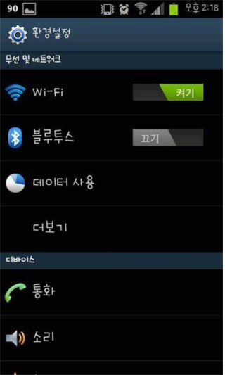
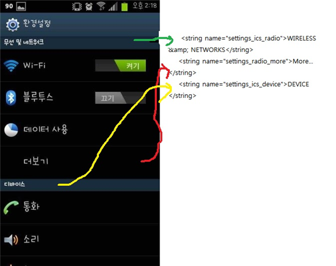

진저사용자 분들 이런 설정창 부러우셨나요?

우리들도 저런 창을 만들수 있습니다

하지만 켜기/끄기는 되지 않지만요...

그럼 다음을 준비해 주세요

settings.apk

apk manager

노트패드++

이렇게 준비해 주시면 됩니다

1. 디컴파일하기

apk manager로 디컴파일 해줍시다

따로 언급하지 않겠습니다

2. res/vaules 에 들어가서 strings.xml를 엽니다

<string name="settings_ics_radio">WIRELESS & NETWORKS</string>

<string name="settings_radio_more">More...</string>

<string name="settings_ics_device">DEVICE</string>

<string name="settings_ics_personal">PERSONAL</string>

<string name="settings_ics_system_cap">SYSTEM</string>

<string name="settings_battery">Battery</string>

이것을 추가하세요

vaules-ko에도 들어가서 strings.xml를 엽니다

<string name="settings_ics_radio">무선 및 네트워크</string>

<string name="settings_radio_more">더보기...</string>

<string name="settings_ics_device">디바이스</string>

<string name="settings_ics_personal">개인</string>

<string name="settings_ics_system_cap">시스템</string>

<string name="settings_battery">배터리</string>

이 두개의 공통점에서 string name은 마음대로 하셔도 됩니다만 수정하실때 모두 같아야만 합니다

형태는 위 사진과 같습니다

3. Settings.xml (경로: res\xml\settings.xml)

이제 좀 중요합니다 Settings.xml을 열어주세요 (잘못하면 설정어플 맛이 갑니다)

<com.android.settings.IconPreferenceScreen android:title="타이틀 string값" android:key="call_settings" settings:icon="사용될 사진"> <intent android:targetPackage="com.android.settings" android:action="android.intent.action.MAIN" android:targetClass="명령" /> </com.android.settings.IconPreferenceScreen>

이것이 한 구분선 입니다

이제 저 양식을 체워야 합니다

타이틀 string값에 들어갈 내용은

@string/값

입니다 여기서 값은 res/vaules/strings.xml에서 settings_ics_radio와 같습니다

그렇다면 @string/settings_ics_radio 이렇게 작성해서 넣으면 되지요

사용될 사진에 들어갈 내용는

@drawable/사진

입니다 drawable-hdpi같은 폴더에 넣은 사진명을 확장자까지 넣어주시면 됩니다

마지막으로 명령에 들어갈 내용은

Wi-Fi: com.android.settings.wifi.WifiSettings

블루투스: com.android.settings.bluetooth.BluetoothSettings

배터리: com.android.settings.fuelgauge.PowerUsageSummary

위 세개중 아무거나 넣으시면 됩니다 ㅎ

지금까지는 새로운 설정탭을 만드는 방법이었습니다

이제는 구분선을 넣는 방법을 설명하겠습니다

<PreferenceCategory android:title="@string/값" />

위 구문을 넣어주시면 됩니다

아까한 방법과 마찬가지로 @string/값에는 settings_ics_radio등 아주 위에서 만든것을 넣으시면 됩니다

이제 컴파일하신후 적용하시면 됩니다

그럼 마치겠습니다

출처: http://forum.xda-developers.com/showthread.php?p=24317850

ps. 다른 강좌에는

<intent android:targetPackage="com.android.phone"

아마 이렇게 되어 있습니다

하지만 이럴 경우 기능이 재대로 작동하지 않는대요

<intent android:targetPackage="com.android.settings"

다음과 같이 바꿔주시면 정상적으로 기능이 활성화 됩니다.