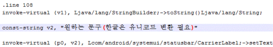

퀵패널의 Olleh등의 통신사 문구를 변경하여 봅시다.

대부분 태마의 저작권 표시 또는 간지용으로 하실것 같네요. ㅋㅋ

준비물 : SystemUI.apk, 노트패드 ++, apk manager

노트패드 ++는 기본적으로 그냥 깔아두시는것도 좋아요.

1. SystemUI를 디컴파일 해줍시다.

우리는 classes.dex 이파일을 수정해야 하므로 일단 디컴파일 ㄱ

2. 디컴파일된 폴더에 들어가서

smali--com-android-systemui-statusbar

위 경로로 이동해 주세요.

3. CarrierLabel.smali 이라는 파일을 찾아 열어주신후

컨트롤키+F로 .line 108을 검색해 주세요.

4. 우리는 .line 108부분을 수정해야 합니다.

순정이라면 move-result-object이 line 108부분에 있을겁니다.

이부분을 지워주시고 const-string v2, "내용"

이렇게 바꿔 주세요.

5. 만약 한글을 집어넣으실려면 유니코드 변환하셔서 넣으시면 된다고 합니다 .

6. 이제 SystemUI를 컴파일 해주세요.

7. 언사인된 UI에 있는 classes.dex를 원본 UI에 덮어쓰기 해주세요. (중요)

8. 이제 적용해 보시면 됩니다. ㅎㅎ
