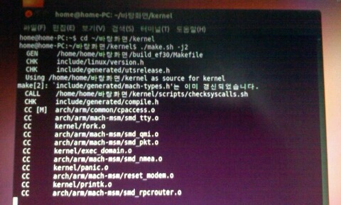
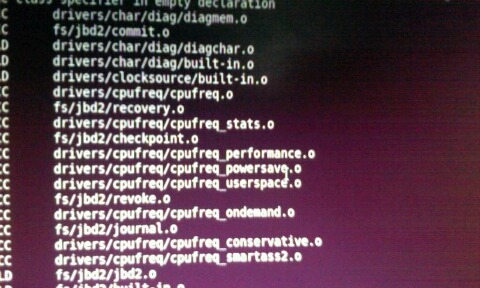
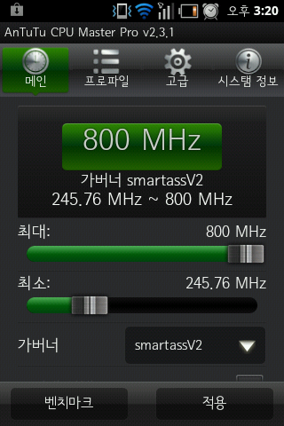

./make.sh -j2명령어 때문인지 컴파일이 40분으로 된것 같네요 ㅋㅋㅋ

그전에 가상머신 설정을 바꿔서 그런지 빌드 시간이 줄어든듯 합니다 ㅋㅋ

부팅은 성공했습니다

그런대 추가는 되지 않았네요 ㄷㄷ;;

빌드는 문제 없이 됩니다만...

추가가 안됬나?

아무튼 저는 다시 확인하러 갑니다...

  
-j2빼먹을뻔 했어요ㅋㅋㄱㅋㅋㅋㅋㅋ  
  
아무튼 오류의 원인이 나때문이라 믿고 커널 지우고 순정커널로 재작업 했습니다~  
./make.sh menuconfig도 빼먹지 않았구요!  
  
지금 컴파일중입니다아~  
오래걸리니 숙제마저하려고요ㅋ  
제가 나름대로 수정한 make.sh피일말고 원본에 수정해야하는부분만 건드린 파일로 했어요!  
  
근대 툴체인 부분이 달라 오류품어 해결ㅎㅎ  
  
잠시뒤 결과 알려드리겠습니다~!  
  
아래사진보시면 가버너가 컴파일은 되는듯 하네요...  
결과가 기대됩니다ㅋ

이거 보시면 smartassV2가 적용되어 있는거 보이시죠?ㅎㅎ

으하하하하하하

추가 완료 했습니다~

make.sh사용했고요 3:10분에 컴파일 완료 되었습니다

아까 올린것이 40분쯤이니 약 30분 정도 소요 되는군요!

이정도면 3:30보단 양호한 편이니 ㅎㅎ

다시한번 도와주신 많은 분들께 감사드립니다!

사용한 make.sh도 올리겠습니다(우분투 또 켜야 한다는건 안비밀)

사용한 명령어

./make.sh menuconfig

./make.sh

이렇게 포스팅 해둬서 자료 남겨두는게 미래에 좋다고 하네요 ㅋㅋ

