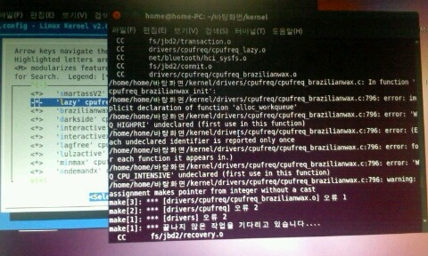
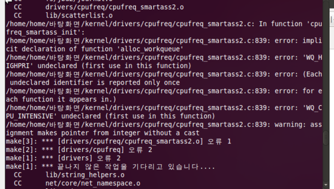

으엉... smartass2와 lazy까지 컴파일이 안된듯 하네요 ㅠㅠ

다시 해봅니다...

+아나 ㅡㅡ

정작 필요한 전 해뒀는대 가버너 소스를 안넣었다는...;;

다시 넣고 컴파일 해봅니다;;

+아까도 컴파일 했는대 .o가 안되는 거예요;;

이게 안되면 컴파일이 안되는 건대;;

그래서 menuconfig를 봤더니 체크 안됨...

아ㅡㅡㅡㅡㅡㅡㅡㅡㅡㅡㅡㅡㅡㅡㅡㅡㅡㅡㅡㅡㅡㅡㅡㅡㅡㅡㅡㅡㅡㅡ

정말 오늘은 되는 일이 없네요 ㅋㅋㅋ

smartass2와lazy까지는 오류없이 성공했는대 다른 많은 가버너 추가하면서 개속 오류가 발생합니다...

내일부터 천천히 하나하나씩 추가해서 오류를 줄여나가도록 하겠습니다...

도대체 뭘까요 원인이?ㅠㅠㅠ

정말 짜증나네요 이제 ㅇㅅㅇ

오늘은 제발 성공하기를 하는 마음입니다...

제발~ 성공해라!!!

안될수도 있지만 수정 내역은

그냥 smartass2랑 lazy랑 lulzactive추가했다는 정도?

안될 가능성이 더 많겠죠

제 XX같은 우분투 땜에 ㅇㅅㅇ

사용 명령어

./make.sh -j3

부팅은 되는대 갑자기 검은화면 프리징;;

재부팅중 ...

룰즈 액티브랑 레이지는 추가가 되었는데 스마테스2는 추가가 안되어 있네요?!
