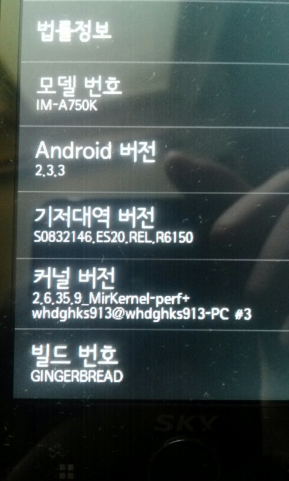

전 포스팅이 허상오버 였는데 그때부터 오늘까지 한달 정도 걸린것 같다;;

이 한달동안 많은 일들이 있었다.

쉰 커널 작업을 본격적으로 한것은 오늘로 부터 약 4 일전이다.

가상머신 우분투도 날라가고 멘붕이 심해 몇주는 커널작업을 하지 않았다.

지금은 노트북에 USB로 우분투를 깔아서 전 작업을 이어 가고 있다.

이번에 한것은 마이너 패치이다

솔직히 말하면 zram이랑 클린캐쉬 작업하다가 실패해서 소스를 날리고 처음부터 git설정까지 했다.

이 버전은 당연히 github에 등록되어 있다

kernel.patch파일을 이용해 2.6.35.9버전까지 마이너 패치 하였다.

순정은 2.6.35.7버전이다.

마이너 패치 방법은 강좌/팁 게시판에 설명해 뒀으니 글 읽어보길 바란다.

커널에 관련된 제목의 게시글은 모두 읽어보시면 됩니다.

