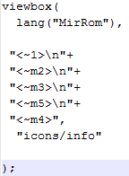

아로마 인스톨러를 처음 사용하시는 롬쿠커 분들!

제 강좌 천천히 따라하시면 꼭 성공하실수 있을거라 믿고 강좌 서술해 봅니다

아로마 인스톨러 원문입니다

[http://forum.xda-developers.com/showthread.php?p=21755929](http://forum.xda-developers.com/showthread.php?p=21755929)

현재 최신 아로마 인스톨러 바이너리 버전이 2.5이므로 이것을 바탕으로 강좌 진행하도록 하겠습니다

먼저 바이너리들을 받아 볼까요?

1. 아로마 인스톨러의 틀

[다운받기](http://forum.xda-developers.com/attachment.php?attachmentid=1201161&stc=1&d=1342411110)

먼저 이 파일을 받아주세요~

압축을 푸시면 신기한(?) 파일이 있습니다!

근대 아로마 인스톨러 원본은 주석에 엄청난 설명(?)이 있습니다

영어 하시는분들은 하세요 ㅋㅋㅋㅋ

AROMA Resource Dir  = META-INF/com/google/android/aroma

이것은 아로마 인스톨러의 롬파일안 파일 위치 입니다

이곳안에 대부분의 자료가 다 들어있습니다

이참에 롬파일 설명을 하면

META-INF - com - google - android ┎                            aroma ┎ fonts

                                                    │aroma-config                   │ icons

                                                    │update-binary                  │ langs

                                                    │update-binary-installer     │ themes

                                                    └updater-script                 └ ttf

이렇게 구성되어 있다고 생각하시면 됩니다
AROMA Temporary Dir = /tmp/aroma/

그리고 이 경로는 설치할때의 임시 저장 장소 라고 생각하시면 됩니다

2. aroma-config를 해부하자

주석부분은 지워도 됩니다

먼저 맨처음에 필요한 세팅값을 알려드리겠습니다

ini_set("rom_name",             "AROMA Test Zip");
ini_set("rom_version",          "2.50");
ini_set("rom_author",           "amarullz");
ini_set("rom_device",           "Any Device");
ini_set("rom_date",             "Apr, 25 2012");

이부분은 꼭필요한 부분입니다

검색(메뉴)버튼에서 정보를 들어가시면 나와있는 부분입니다

ini_set("dp","1"); #-- LDPI ( 240x320 / QVGA )
ini_set("dp","2"); #-- MDPI ( 340x480 / HVGA )
ini_set("dp","3"); #-- HDPI ( 480x800 / WVGA )
ini_set("dp","4");
ini_set("dp","5");

이것은 해상도에 맞게 dpi를 설정해주는 부분입니다

calibrate_matrix("63052.50","840.00","-903390.00","-1680.00","125895.00","-371670.00","120021.25","0");

터치 미세조정이라고 생각하시면 됩니다

이 값은 여러분들이 설정해줘야 하는것으로

검색(메뉴)버튼에서 화면조정을 하시면 됩니다

참고로 저는 미라크a 3.5인치 HVGA에서의 값

calibrate_matrix("17760.00","120.00","8800.00","-350.00","17650.00","46115.00","17417.00","0");

를 찾았습니다

ini_set("customkeycode_up",     "115");
ini_set("customkeycode_down",   "114");
ini_set("customkeycode_select", "116");
ini_set("customkeycode_menu",   "229");
ini_set("customkeycode_back",   "158");

이것은 하드웨어 키를 설정할때 쓰는것으로 그다지 필요 없습니다

splash(
  #-- Duration 2000ms / 2 seconds
    2000,

  #-- <AROMA Resource Dir>/sample.png
    "sample"
);

이것은 sample이라는 png를 표시하는 것입니다

2000는 2초를 뜻합니다

anisplash(
  #-- Number of Loop
    4,

  #-- Frame 1 [ Image, duration in millisecond ]. <AROMA Resource Dir>/splash/a[1..6].png
    "splash/a1", 500,
    "splash/a2", 30,
    "splash/a3", 30,
    "splash/a4", 30,
    "splash/a5", 30,
    "splash/a6", 30
);

aroma폴더안 splash폴더안에 있는 a1~a6.png를 애니메이션 처럼 재생시킨다 생각하시면 됩니다

마치 부팅 애니메이션에서 설정해주는 것과 같고요

500, 30은 표시할 시간입니다

3. 아로마 한글화

[http://siryua.sloud.kr/160567007](http://siryua.sloud.kr/160567007)

이글을 참고하시면 더욱 좋은 한글을 만들수 있습니다

한글화는 kr.lang을 이용해서 만드는 겁니다

언어마다 각기 다른 변수를 설정해서 불러들이는 겁니다

아래처럼 불러들입니다

lang("lang"),

<~lang>

언어를 선택한뒤 (아래 참고) lang파일을 불러 들인뒤

변수에 맞는 값을 불러들인다 생각하시면 됩니다

예를들어 한국어를 선택한뒤 loadlang("langs/kr.lang");명령어가 실행되고

<~Mir>라는 것이 있다면 kr.lang파일에서 Mir의 값을 불러들이는 겁니다

Mir=표시할 내용

이렇게 추가하시면 됩니다

4. 각종 박스들

selectbox(
 "Aroma Settings",

이부분은 가장 위에 표시될 타이틀 입니다
 "Choose the language,Theme to Aroma Install!",

타이틀 아래 나올 부가 설명 입니다
 "icons/set",

사용할 아이콘을 설정합니다
 "Language.prop",

선택한 값을 저장할 임시파일 입니다
 "Korean",     "Touch to use Korean",    1,[1은 체크, 0은 체크안함 입니다]
 "English",     "Touch to use English",   0[이렇게 마지막 부분에는 ,(쉼표)를 제거해야 합니다]
[소제목]        [설명]

);

if 만약
 prop("Language.prop","selected.0")=="1"

Language.prop의 selected.0값이 1
then 이라면
 loadlang("langs/kr.lang"); kr.lang을 불러 들인다
 fontresload( "0", "ttf/Nanumgodic.ttf;ttf/DroidSans.ttf", "12" );
 fontresload( "1", "ttf/Nanumgodic.ttf;ttf/DroidSans.ttf", "18" );

글꼴을 사용한다
endif;if절을 마친다

라고 하시면 됩니다

이렇게 if절은 updater-script와 aroma-config에서 자주 사용하는 명령이니 잘 이해하셔야 합니다

theme("sense");

aroma폴더의 themes폴더속 miui, ics등의 테마를 적용합니다

이것은 아로마 테마입니다

이것을 처음에 놓아도 되지만 응용하면

selectbox(
 "Aroma Theme",
 "Choose the Theme to Aroma Install",
 "icons/set",
 "Theme.prop",

 "Basic",                "Unthemed AROMA Installer",     0,
    "MIUI",                 "MIUI Theme by mickey-r & amarullz",  1,
    "MIUI 4,ICS",           "MIUI 4/ICS Theme by amarullz & Lennox", 0,
    "ICS",                  "Ice Cream Sandwitch by DemonWav & amarullz",0,
    "Sense",                "HTC Sense Theme by amarullz",    0

[소제목]                           [설명]

);

if prop("Theme.prop","selected.2")=="2" then
  theme("miui");
endif;

if prop("Theme.prop","selected.2")=="3" then
  theme("miui4");
endif;

if prop("Theme.prop","selected.2")=="4" then
  theme("ics");
endif;

if prop("Theme.prop","selected.2")=="5" then
  theme("sense");
endif;

이렇게 사용자가 아로마 테마를 선택하게 할수 있습니다

viewbox(
  lang("MirRom"),

lang파일에서 MirRom의 값(MirRom=어쩌구)를 불러들입니다
 "<~1>\n"+
 " <~m2>\n"+
 " <~m3>\n"+
 "<~m5>\n"+

\n은 줄바꿈 표시 입니다 이표시를 넣으면 그 다음 줄에서 표시가 됩니다
 "<~m4>", [마지막 부분은 + 대신 ,(쉼표)를 집어넣습니다]
  "icons/info"

아시겠죠? 아이콘
);

글꼴이 않좋내요;;

원본 사진 입니다 ㅎㅎ

checkbox(
 lang("check"),

타이틀 제목 입니다
 "<~check1>",

부제목 입니다
 "icons/default",

아시겠죠? 아이콘 위치 경로 입니다
 "check.prop",

임시 폴더속 선택한거 저장할 파일 입니다

 "<~1>",     "<~11>",0,
 "<~2>",     "<~22>",0,
 "<~3>",     "<~33>",0,
 "<~4>",     "<~44>",1,
 "<~5>",     "<~55>",1,
 "<~6>",     "<~66>",0 [꼭 마지막 ,(쉼표) 없어야 합니다]

[소제목]           [설명]
);

다들 아실것 같습니다

체크박스는 1 중복이 가능합니다 선 체크되야 하는것들 1로 해두세요

textbox(
    "<~Log>",

처음 타이틀 부분

    "<~ChangeLog>",

약간의 설명

    "icons/log",

아이콘 위치를 나타냅니다

    resread("log.txt")

txt파일을 불러들어 표시합니다 한글은 UTF-8형식으로 인코딩해야 표시됩니다

META-INF/com/google/android/aroma/log.txt입니다
);

언어에 따라 다른 txt를 불러들이도록 할수 있으나 시간이 없어 패스하겠습니다

지금쯤 눈치 빠르시면 아시겠죠 ㅎㅎ

agreebox(
    "<~agreebox>",

제목/타이틀 부분 입니다

    "<~agreebox1>",

그 위 나타날 약간의 설명입니다

    "icons/agreement",

아이콘 위치입니다

    resread("agreeboxen.txt"),

이것도 역시 txt파일을 불러들이며 META-INF/com/google/android/aroma/agreement.txt입니다

    "<~agreebox.1>",

위 내용에 동의하시면 체크하세요 부분 입니다

    "<~agreebox.2>"

체크를 하지 않았을경우 나타나는 경고문(?)의 내용입니다
);

agreebox는 오류가 너무 많이 일어나서 대부분의 개발자들은 viewbox또는 textbox를 사용합니다

install(
 lang("installing"),

타이틀 부분
 "<~installing1>",

약간의 설명을 추가해 주시면 됩니다
 "icons/install"

아이콘 부분
);

마지막 설치를 할때 사용합니다

이부분으로 넘어오게 되면 실제로 설치가 이루어지며

updater-script과 연동하게 됩니다

updater-script는 다음에 포스팅 하도록 하겠습니다

ini_set("text_next", "Finish");

위문장 다음에 사용되며 설치가 끝났다는 명령어 입니다

이다음에 reboot("onfinish");
reboot("now");
reboot("disable"); 명령어등을 통해 바로 재부팅 하게 해도 됩니다

그러나 재부팅을 사용자가 선택하게하고 싶다면

checkviewbox(
 lang("Completed"),

제목

    "<~Completed3>\n",

약간의 설명

    "icons/license",

아이콘 위치

    "<~Completed4>",

체크표시 옆 문구

    "1",

    "reboot_it"
);

if
  getvar("reboot_it")=="1"
then
  reboot("onfinish");
endif;

이것을 추가해주시면 됩니다

이렇게 해서 aroma-config편 강좌를 끝내게 됩니다

한시간동안 타자 두들이며 쓴것입니다...;;

질문 있으시면 제 능력안에서 도와드리겠습니다!!
