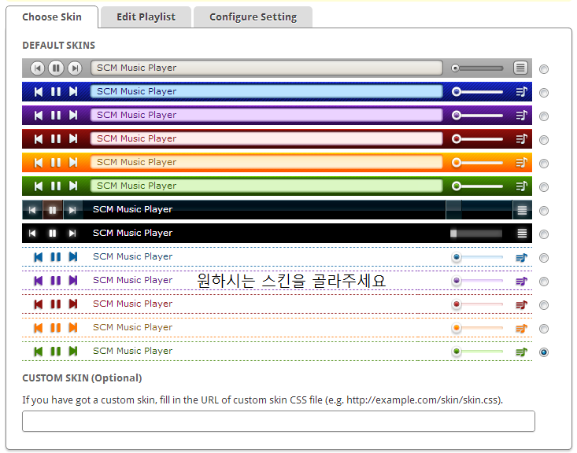
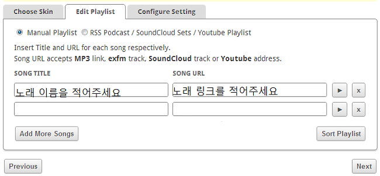
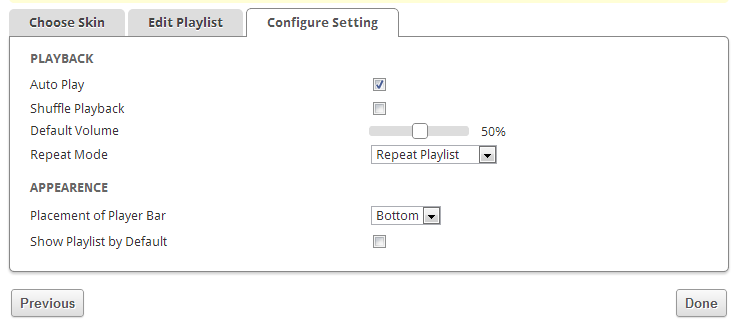
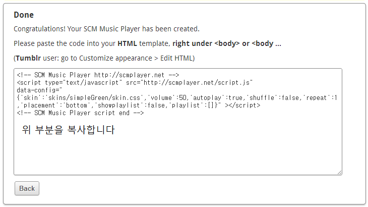
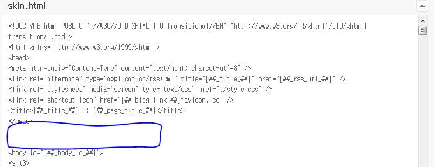

티스토리등 자신의 블로그에 BGM를 깔아봅시다.

이게 첫 포스팅 이군요. ㅋ

일단 <http://scmplayer.net/> 사이트에 들어가 줍시다.

그다음 어떤 스킨을 사용할건지 선택한다음 NEXT를 클릭해 줍시다.

재생하고 싶은 노래를 입력해야 하는데요.

노래이름을 적고 링크를 넣어줘야 합니다.

자동 재생등의 설정을 입력해 줍시다. ㅎㅎ

발번역을 돌리자면,

자동재생 : 자동으로 노래를 재생할건가?

랜덤재생 : 랜덤으로 노래를 재생할건가?

기본 볼륨 : 처음으로 설정된 볼륨 크기는 몇인가?

뮤직 플레이어 위치 : 뮤직 플레이어는 어디에 위치하나?

기본재생목록 : 재생 목록을 기본으로 보여주게 할것인가?

이제 테그가 완성되었습니다.

이것을 이제 넣어줘야 합니다.

태그를 모두 복사해 주세요. ㅋ

티스토리 설정에 들어가서 html/css설정에 들어가 주세요.

조기 파란색으로 박스친 부분에 태그를 넣어주세요.

<body> 위에 넣어주시면 됩니다.

이제 모든 설정이 끝났습니다!

참고로 전 했다가 불편해서 제거했습니다 ㄷㄷ
