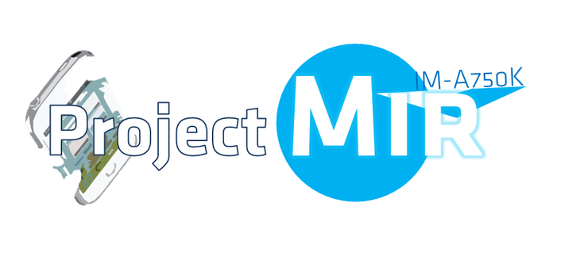

cm-7-20130124-UNOFFICIAL-ef32k

미라크A의 CM7입니다. (세이님께서 포팅하신 미라크 CM7이 아닙니다.)

약 반년동안 포팅해서 만든 CM7입니다.

제가 hPa님의 소스를 분석해서 미라크a의 디바이스 소스를 구성했고, 잦은 오류를 해쳐 마침내 CM7포팅에 성공했습니다!!

wifi등의 실사가 가능할 때 배포하려 했는데, 아무리 해도 픽스가 안되기에 그냥 배포합니다.

**- Workings**

부팅

cyanogenmod 설정

후면 카메라 (아직 모든 기능이 되는지 확인 안됨)

usb, sd카드 마운트

**- Known Issues**

Workings를 제외한 모든 것

전면 카메라

통화, 3G, sms, mms, 유심인식

imei 인식안됨

사운드

wifi, bluetooth, tetherting, gps

자동밝기, 진동등의 센서작동기능

etc

**문제점**

통화등의 모든 통신기능이 작동하지 않습니다.

imei 날라감의 위험이 있으나 제가 순정으로 복구한다음 확인해 봤더니 날라가진 않은 듯 합니다.

소리가 나지 않습니다. sound 픽스가 안된 듯 합니다.

wifi등의 모든 통신이 안됩니다. 픽스가 늦어지는군요...

센서를 이용한 모든 기능이 작동하지 않습니다. 그러므로 자동밝기, 진동, 화면회전 등 모두 작동 안됨.

sky기능들은 원래 cm7에서는 작동하지 않습니다. 그러므로 dmb도 되지 않습니다.

주의사항.

imei날라갈 가능성이 없지 않으니 꼭 리커버리 백업을 하신다음 사용해 주세요.

어플을 설치할수 있는 방법은 adb install을 이용하면 가능합니다. (불확실)

**설치방법**

0. 꼭 공장초기화후 사용해 주셔야 합니다.

1. ClockWorkmod Recovery를 설치해야 합니다.

</archive/itmir/2013/22> 또는 <http://whdghks913.blog.me/20176732787>의 리커버리를 설치해주세요.

다른 리커버리를 사용하셔도 되지만 정상적으로 설치될 수 있는지 확신할 수 없습니다.

2. Gapps와 롬파일을 받아야 합니다.

다음은 해삼 말미잘님 서버 링크입니다.

<http://mizal.net:88/_etc/Google%20Apps/>

여기서 Gapps를 받으시고,

<http://mizal.net/pantech/Mirach%20A/CM7/>

여기서 cm7을 받아주세요.

만약 mizal 서버가 꺼졌다면 아래 드롭박스에서 cm7 파일을 받아주시면 됩니다!

아래는 드롭박스 링크 입니다.

<https://www.dropbox.com/s/a1n7a6rxrpskeb9/cmboot6.zip>

<https://www.dropbox.com/s/5wogq7u2emgja9n/cm-7-20130124-UNOFFICIAL-ef32k.zip>

3. 다운받은 파일을 sd카드에 넣은다음 리커버리로 부팅합니다.

4. backup and restore 모드로 꼭 백업합니다.

5. install zip from sdcard – choose zip from sdcard – 다운받은 롬파일을 선택하여 설치합니다.

6. 설치 완료후 gapps를 설치합니다.

7. 마지막으로 cmboot6.zip을 설치합니다.

8. wipe data/factory reset 메뉴를 선택해 공장초기화 합니다.

9. reboot system bow 모드로 재부팅하여 기다립니다.

**Q. 리커버리에 진입했는대 install zip from sdcard가 없어요.**

cwm리커버리를 설치하세요.

**Q. 카메라가 이상해요.**

마음먹고 픽스한게 아니라 우연히 픽스된거라 그럽니다...

**Q. 도와주세요.**

싫어요. ㅎㅎ

**Q. wifi 픽스는 언제쯤 하실건가요?**

잘 모르겠습니다. ㅠㅠ

**Q. 순정 복구는 어떻게 하나요?**

리커버리로 진입해서 복구 하시면 됩니다.

**Q. 불안정해요.**

정식이 아니라 베타라 그렇습니다..

아무리 해도 wifi 픽스가 안되기에 절망하며 업로드 합니다..

(양식이 hPa님과 비슷한 건 착각이십니다.)