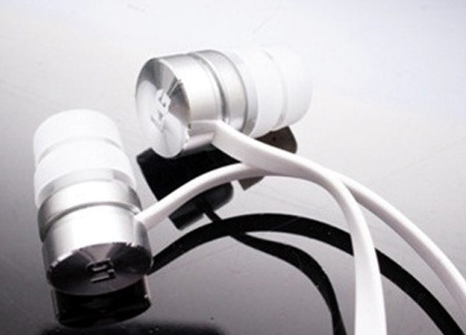
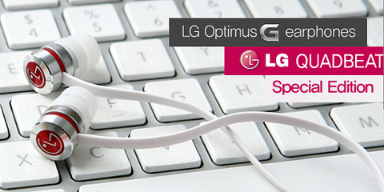
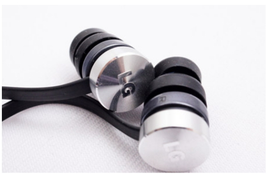
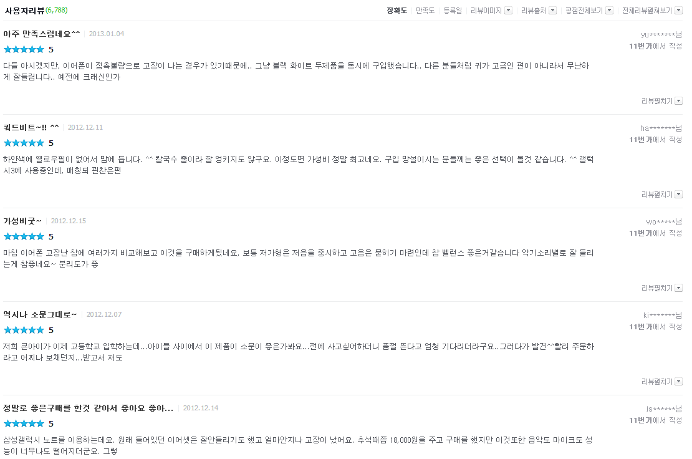
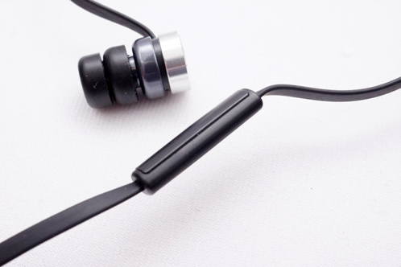

정말 아니러니한 이야기죠..

휴대폰보다 번들 이어폰이 인기라니!!

쿼드비트는 꼭 칼국수 처럼 생겼어요 +_+

면발이 꼬일것 같은 느낌이....ㄷㄷ

쿼드비트 스페셜 에디션(쿼드비트2)가 발표되었다 합니다.

저 LG마크는 어떻게 지워버릴수는 없나요?ㅋㅋ

뒤 마크만 없으면 심플해 보이고 좋을것 같은대 말이죠..

음... 뭐 이렇게 말이죠..(.........있는게 더 좋군)

호호... 고급스럽다!

저거 칼국수에 붙어있는 떡밥은 아니죠?ㅋㅋㅋㅋ

여기서 잠깐!

사용자 리뷰 한번 봅시다.

etc....

저거 너무 많은데요?

사용자 후기가 저렇다니... 역시 유명한 이어폰 입니다!

쿼드비트 스페셜 에디션에서는 버튼도 추가되었다 합니다.

선곡과 볼륨조절도 되게 하였다네요... 올ㅋ

옵지프로에 돌비 모바일 음장을 적용하여 쿼드비트2 와 놀라운 궁합을 보여줄 것이라 합니다. ㅎㅎ

기대기대!

혹시 좀 더 자세하게 비교해 보시고 싶으시다면,

<http://grsn.tistory.com/215>

를 참고해 주세요 저는 아직 안써봐서 비교가 안 되네요. ㅜㅜ
