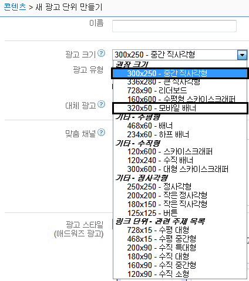
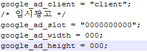
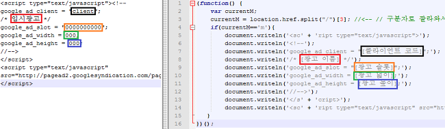
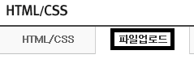
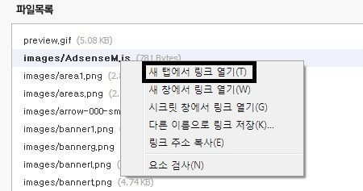
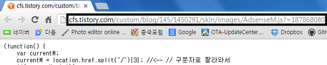
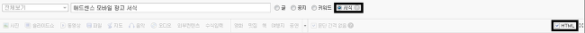
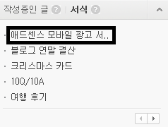

**티스토리의 플러그인 기능을 사용하세요.**

사용 금지

안녕하십니까?

이번에는 모바일 화면에서 구글 애드센스를 띄우는 방법을 연구해 보도록 하겠습니다

이 강좌와 비슷한 내용을 담고있는 강좌들 입니다 잘 봐주세요 ㅎㅎ

[2013/02/17 - [강좌/팁/티스토리 강좌] - [4편] 메인 페이지에 애드센스 광고를 넣어보자!](http://whdghks913.tistory.com/139)

[2013/02/12 - [강좌/팁/티스토리 강좌] - [3편] 구글 애드센스 광고에 테두리를 넣어보자!](http://whdghks913.tistory.com/126)

[2013/02/05 - [강좌/팁/티스토리 강좌] - [1편] 티스토리에 구글 애드센스 (Google Adsense)를 넣어보자](http://whdghks913.tistory.com/110)

모바일 화면에서 애드센스를 넣는 방법은 두가지 정도가 있습니다

**하나**는 모든 게시글에 구글 애드센스 광고를 넣는 방법입니다

이경우 게시글이 많으면 시간도 오래걸릴뿐만 아니라 애드센스 광고의 주소가 변경될경우 다시 작업해야 하는 어려움이 있습니다

<http://tistory.i-swear.com/> 이 사이트에 들어가셔서 애드센스 소스를 주입해 주시면 작업은 끝나게 됩니다

하지만 비 효율적이고 노가다가 필요합니다

그래서 이 강좌에서는 **자바 스크립트를 이용**해 광고를 띄어보도록 하겠습니다

먼저 게시글에 띄어질 애드센스 광고를 만들어 봐야 하지 않을까요?

이 파일을 받아주시길 바랍니다

[ AdsenseM.js](http://whdghks913.tistory.com/attachment/cfile6.uf@121AA7445111D9D2250478.js)

document.writeln('google\_ad\_client = "[클라이언트 코드]";');  
document.writeln('/\* [광고 이름] \*/');  
document.writeln('google\_ad\_slot = "[광고 슬롯]";');  
document.writeln('google\_ad\_width = [광고 넓이];');  
document.writeln('google\_ad\_height = [광고 높이];')

위 내용은 AdsenseM.js의 내용중 일부입니다

이내용을 우리의 광고에 맞게 수정해야 합니다

<https://www.google.com/adsense> 에 들어가 모바일용 광고를 생성해 봅시다

대부분은 [1편]과 흡사한 모습으로 진행됩니다

모바일용 광고의 크기는 대채로 300X250혹은 320X50의 크기를 선호합니다

둘중에 하나 골라서 저장해 주신다음 소스를 생성해 주세요

그럼 위 내용이 포함된 소스가 만들어 질겁니다

이제 자바스크립트를 체워야 합니다

다음 사진을 보시며 같은 색상끼리 연결해서 체워 주시면 됩니다

자바 스크립트가 완성 되었습니다 이걸 스킨에 포함시켜 업로드해야 합니다

관리자모드 - HTML/CSS 편집에 들어가 주세요

파일 업로드에 들어가 +추가를 누른뒤 방금 수정한 AdsenseM.js을 업로드해 주세요

업로드가 다 되었다면 이 파일의 링크를 확인해야 합니다

AdsenseM.js을 찾아 새탭에서 링크열기를 클릭해 주세요

(크롬 브라우저를 사용하면 링크 따기가 쉽습니다)

저 주소를 복사해 주세요 (참고로 주소는 블로그 마다 모두 다르니 직접 따셔야 합니다)

저 주소를 아래 코드에 넣습니다 (아래 코드가 게시글에 들어갈 코드입니다)

/skin/images/전까지만 복사해서 붙혀 넣으시면 되겠죠?

[ 코드.txt](http://whdghks913.tistory.com/attachment/cfile23.uf@16463C465111E06A336EC0.txt)

이제 게시글에 들어갈 코드가 완성되었습니다

직접 넣으시던지 아니면 <http://tistory.i-swear.com/>사이트를 이용하셔서 코드를 게시글안에 넣으시면 됩니다

그리고 이제부터 새로 게시글 작성할때도 저 코드를 넣어줘야만 하는대요

일일히 넣기 귀찮으니 "서식"을 이용해 봅시다

게시글 쓰기에 들어가 주세요

글쓰기 타입을 "서식"으로 바꿔주신다음 HTML에 체크 해주세요

그다음 아래 내용을 작성해 주신다음 저장해 주시면 됩니다

<TABLE width="100%">

<TBODY>

<TR>

<TD align=center>

[ 광고 코드 ]

</TD></TR></TBODY></TABLE>

[ 코드2.txt](http://whdghks913.tistory.com/attachment/cfile22.uf@2018C8455111E2B30737F4.txt)

광고 코드 란에는 위에서 만든 게시글에 들어갈 코드를 넣어주시면 완성됩니다 ㅎㅎ

(그냥 게시글에 들어갈 코드를 넣어도 되지만 제경우 그냥 넣으면 광고가 나오지 않아서 저런 코드를 사용하게 되었습니다)

이제 글을 저장해 주신다음 글을 쓸때 서식을 클릭해 주시기만 하시면 코드가 들어가게 됩니다

네모 박스를 클릭하게 되면 코드가 들어가 자동으로 글에 모바일 배너가 보이게 됩니다

아! 참고로 이 방법(자바 스크립트)으로 게시글을 작성하면 PC에서는 보이지 않고 모바일 에서만 광고가 보이게 됩니다

아시겠죠??

그럼 즐거운 애드센스 생활 하시기를 바라면서 글 마치겠습니다!~

출처: <http://studioxga.net/m/1387>
