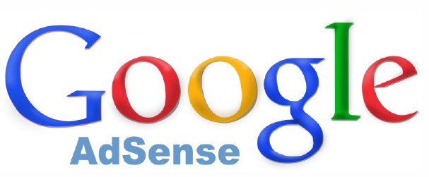
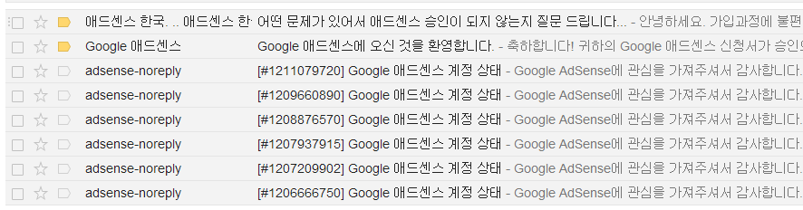
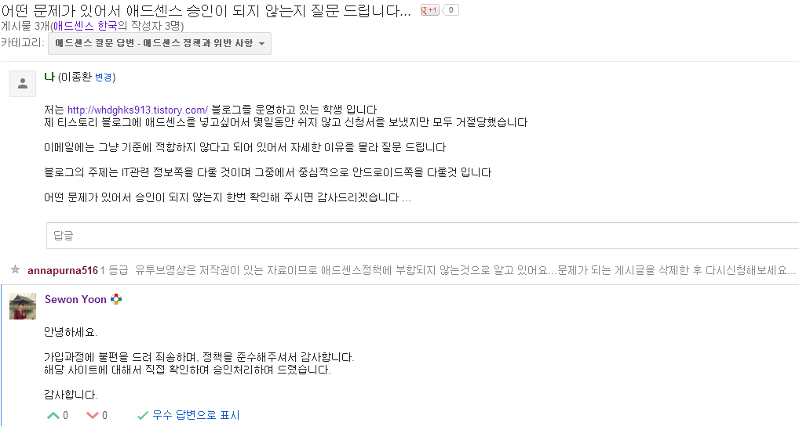
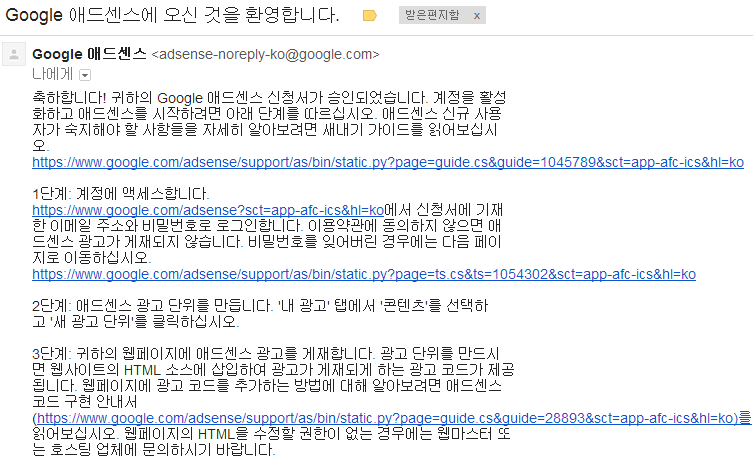

↑↑↑↑↑↑↑↑↑↑↑↑↑↑↑↑↑↑↑↑↑↑↑↑↑↑↑↑↑↑↑↑↑↑↑↑↑↑↑↑↑↑↑↑↑

여기 구글 광고가 보이시나요?ㅋㅋ

드디어 구글 애드센스의 허가가 떨어졌습니다~

구글 애드센스!! 정말 신청하기 힘들군요 ㄷㄷ

허허...

6일동안 빠꾸를 당해서...

구글 그룹스 애드센스팀에 문의를 넣어봤습니다

(혹시 저처럼 난감하신 분은 http://productforums.google.com/forum/#!forum/adsense-ko에 방문해 보세요)

위 사진처럼 문의를 넣어본 결과 드디어 답변이 왔습니다 +\_+

직접 확인하신다음 승인해 주셨네요 ㅎㅎ

드디어 바라던 메일이 왔습니다 ㅋㅅㅋ

어제 활성화 하고 제 블로그에 광고를 무자비 하게 넣었죠 ㅎㅎ

게시글 본문 위/하단/메인화면/모바일 게시글을 보시면 광고가 하나둘씩 있을겁니다 ㅎㅎ

모바일에서는 플래쉬가 있어야 나타나는지 어떤 기기에서는 나타나고 어떤 기기에서는 안나타나네요..

아무튼 오늘부터 정식으로 애드센스를 시작합니다 !!
