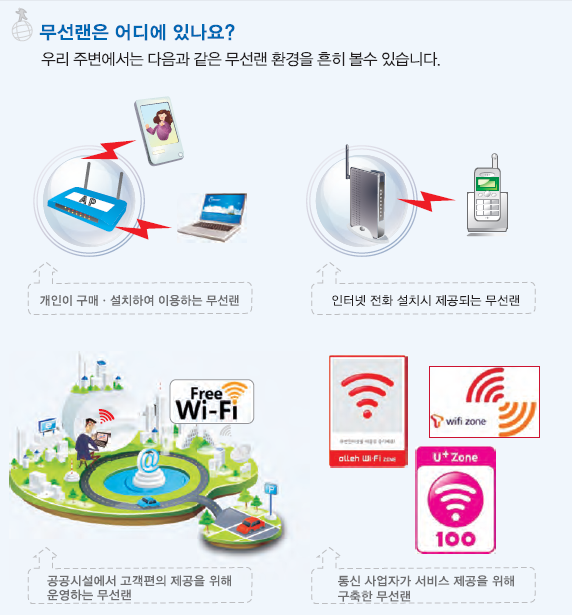
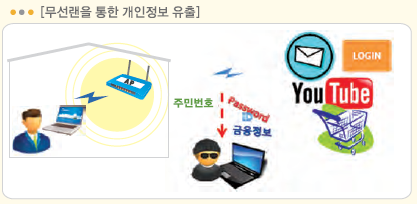
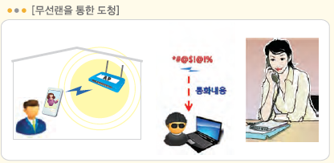
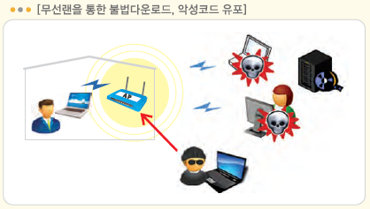
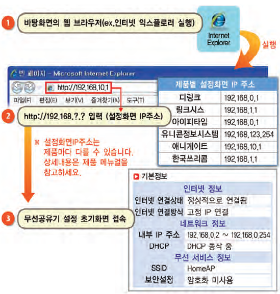
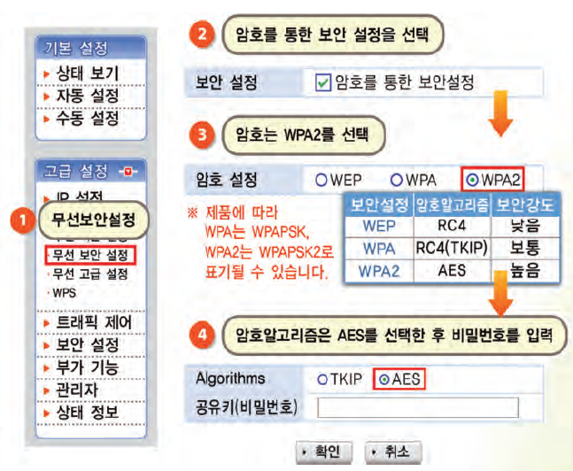

다들 집에 공유기 하나씩은 모두 있으신가요?

요즘 스마트폰과 노트북이 빠르게 보급되면서 WIFI를 지원하는 유무선 공유기를 사용하시는 집이 많이 늘어나고 있습니다.

WIFI를 지원하는 무선랜!

알고쓰면 득이되지만 모르고 쓰면 독이 되는 무선랜을 샅샅히 파헤쳐 보겠습니다.

무선랜은 뭘까요?

무선랜이란 무선접속장치(AP)가 설치된 곳의 일정 거리 안에서 무료로 인터넷을 할 수 있는 근거리 무선통신망(LAN)입니다. (출처: [지식백과](http://terms.naver.com/entry.nhn?cid=200000000&docId=1181143&mobile&categoryId=200000778))

무선랜은 우리 생활 곳곳에 분포되어 있습니다.

우리가 직접 구입해서 설치후 사용하는 무선랜이 있고, 스마트 홈패드나 인터넷 전화 등과 같이 인터넷 전화를 위해 설치할때 무선랜도 같이 설치되며, 일반 상점에서도 개방하는 경우가 있고, 통신 3사가 구축한 AP도 있습니다.

그렇다면 무선랜의 보안이 왜 문제가 될까요?

개방(Open)되어 있는 무선랜의 경우 나쁜 사람이 데이터가 담긴 패킷을 분석해서 정보를 가로챌 수 있습니다.

위 사진처럼 Open Wifi의 경우 개인정보 유출이 일어날수 있고, 인터넷 전화를 쓰는 경우 도청의 위험도 있습니다.

또한 해킹의 위험도 있어, 무선랜의 보안은 아주 중요하고 시급한 문제입니다.

이제 무선랜 보안을 어떻게 설정하는지 알아보겠습니다 .

(아래 사진은 참고만 하시고 자세한 내용은 공유기의 사용설명서를 읽어보신다음 진행해 주세요.)

위 사진처럼 공유기 설정 페이지에 진입합니다.

보통 자신의 ip주소를 주소창에 입력하면 진입이 가능합니다.

ip주소를 확인하는 방법은 시작 - 실행 - cmd - ipconfig을 입력하면 나오게 됩니다.

공유기 설정에 진입하면 무선 보안 설정을 찾으신 다음 암호와 보안타입을 설정해 주시면 됩니다.

닌텐도를 쓰신다면 보안설정을 WEP로 해야 정상적으로 연결이 될겁니다만, WEP는 암호를 거나마나의 보안 등급을 가지고 있고 해킹 툴도 존재하기 때문에 되도록 WPA2이상으로 설정해 주시길 바랍니다.

참고로 공유기 제조사에 따른 설정창 진입 주소를 적어두겠습니다.

iptime - [http://192.168.0.1](http://192.168.0.1/)

쿡허브(홈허브) - <http://172.30.1.254/> (유저) <http://172.30.1.254:8899/> (관리자)

Anygate - <http://192.168.10.1/>

(만약 위 주소로 접속이 안될경우 cmd에서 ipconfig를 입력한다음 게이트웨이 주소를 입력하면 접속이 될겁니다.)

이제 무선랜에 보안을 걸어두셨을거라 생각됩니다.

그런대 보안을 걸다보면 b/g/n혹은 b/g/n/a를 보셨을 거라 생각하는데요.

이것은 무선랜의 기술 표준입니다

b<g=a<n

이공식이 성립합니다.

여기서 가장 최신 기술표준과 가장 빠른 표준은 N모드입니다.

N모드는 유선랜의 절반 이상의 속도를 내기 때문에 되도록 이 모드를 사용하는게 정신건강에 좋겠죠?ㅎㅎ

그럼 모두 공유기 설정페이지에 접속하셔서 꼭꼭 무선랜에 보안을 걸어봐요~

얼굴도 모르는 사람이 내 무선랜에 접속해 이상한짓 하는거 싫으신 분 바로 바로 ㄱㄱㄱ

이 글의 사진은 [이 사이트](http://boho.or.kr/kor/data/guideView.jsp?p_bulletin_writing_sequence=695)의 첨부파일을 이용하였습니다.
