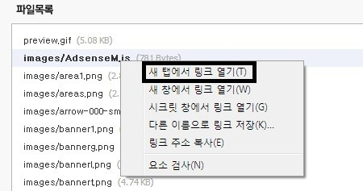
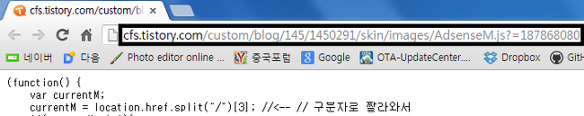
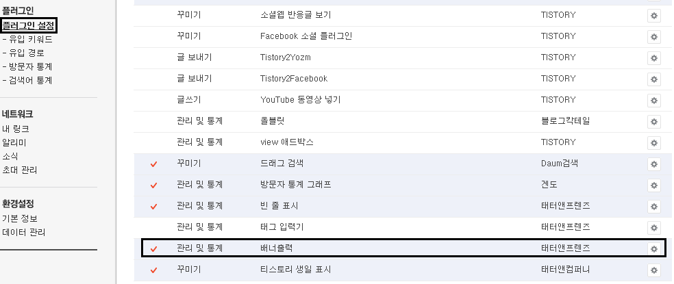
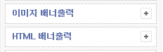
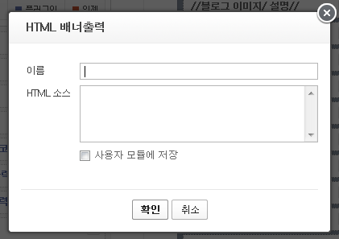

안녕하세요~

이 글에서는 티스토리 사이드바에 다음뷰 구독 버튼을 만들어 보도록 하겠습니다

관리자 메뉴에 들어가서 HTML/CSS 편집 - 파일 업로드를 한다음 아래 첨부파일을 풀어 모두 업로드 해주세요


 그다음 크롬등의 브라우저로 들어가서 마우스 오른쪽 - 새 탭에서 링크 열기를 클릭해 주세요



그럼 사이트 주소가 나올탠대 살며시 복사해 주시면 됩니다



(사진 재탕)

주소 보시면 ~/blog/145/1450291/skin~ 에서 숫자가 있을탠대요

이게 블로그 마다 모두 다릅니다 직접 따셔야 합니다

이 숫자를 아래 코드에 넣어주세요

```html
<A onmouseover='img4.src="http://cfs.tistory.com/custom/blog/000/0000000/skin/images/bmr-200.jpg"' onmouseout='img4.src="http://cfs.tistory.com/custom/blog/000/0000000/skin/images/bmr-200\_o.jpg"' href="http://v.daum.net/user/plus?blogurl=http://블로그주소.tistory.com" target=blank></A>
```

/000/0000000/에 자신의 블로그 코드를 넣어 주시면 되고 블로그주소에 자신의 블로그 주소를 기입해 주시면 됩니다


이제 플러그인 설정에 들어간다음 배너출력을 활성화 해주세요



그럼 사이드바에 배너출력이 생기게 됩니다



HTML 배너출력을 선택해 주신다음



아까 복사한 소스를 넣어주시면 됩니다


그럼 사이드바에 위 그림과 같은 아이콘이 나타나며 클릭할경우 자신의 블로그 주소를 구독하게 됩니다 ㅎㅎ