제 동생이 전에 쓰던 루미아 710...

테이크 HD로 바꾸면서 이 공기계는 제것이 되었는대요 +\_+

루미아 710이 윈도우 모바일 7.8 업데이트가 나왔다고 합니다

<http://www.nokia.com/kr-ko/support/product/lumia710/>

공식 지원 사이트 입니다

타일의 크기를 변경할수 있다등의 업데이트가 나왔습니다 ㅎㅎ 이게 7.8 업데이트라 하네요 ㅋ

(좀 7.8업뎃이라고 할것이지)

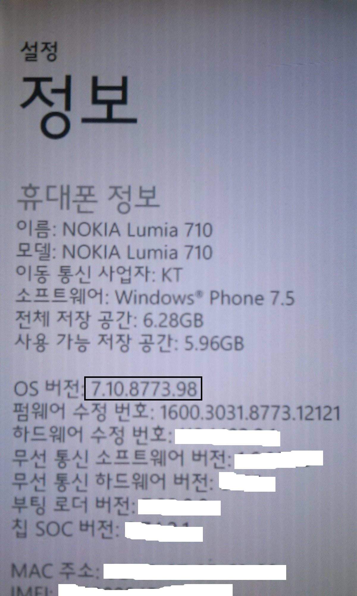

제 루미아 710의 OS버전입니다

7.10.8773.98이군요...

이제 루미아710을 강제로 업데이트 시켜 봅시다 ㅋㅋ

다들 Zune은 깔으셨다고 믿습니다

이건 이이폰의 아이툰즈 같은 역활을 하니 꼭 깔으셔야만 하는 프로그램이죠 ㅎㅎ

Zune을 실행하고 설정 - 전화 - 업데이트를 눌러 업데이트를 확인해 봅시다

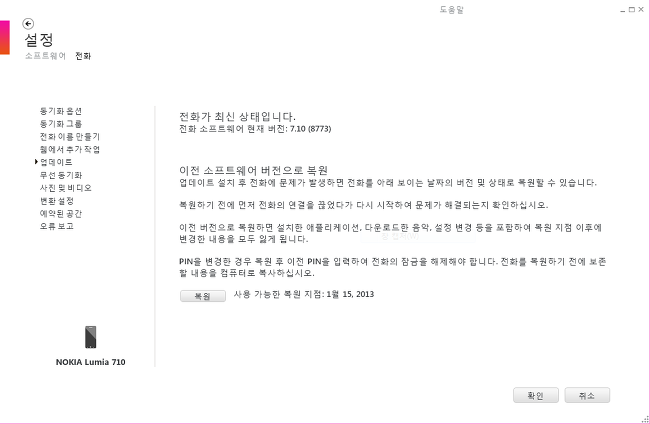

음? 분명 업뎃이 떠야 하는대 말이죠 ㄷㄷ

이런 *나쁜* 노키아가 지역별 순차적으로 업뎃을 뜨게 해뒀다 합니다

*(사용자도 많지 않고 뭐지 도대채 서버가 얼마나 작길래 ㅋ)*

여기서 물러서면 우리들이 아니죠 +\_+

강제로 뚤어버리겠습니다 ㅋㅋㅋㅋ

방법은 타이밍이 아주중요합니다

또한 한번에 바로 뜨는 경우가 드믈고 최소 2~3번에서 10이상 해야 뜨는 경우도 있습니다 인내심이 필요하죠...

Zune을 닫거나 또는 설정 - 업데이트 탭을 닫은다음 다시 설정 - 전화 - 업데이트 창에 들어갑시다

업데이트 확인을 하는대 몇초가 걸리는지 계산해 주세요

(대략 5초~10초정도일겁니다)

그다음 무선 동기화 탭들을 눌러 업데이트 탭을 빠져 나오고 다시 업데이트 탭으로 들어가 주세요

이때! 업데이트 확인중 ... 이라는 표시가 나온다음 위에서 계산한 업뎃 확인시간에서 1~2초를 빼준다음 그 초가 지나면 랜선(무선랜)을 뽑아주세요

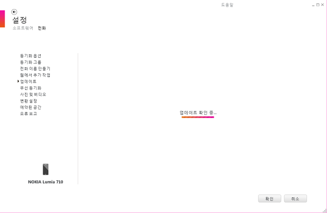

예를 들자면 업데이트가 없습니다 라는 창이 뜰때까지 5초가 걸렸습니다

업데이트 확인창을 닫은다음 다시 들어가서 "업데이트 확인 중..."이 뜨고 (5-2)초가 지난다음 랜선을 뽑아주시면 됩니다

그럼 "확인 중..."이 30초 정도 뜬다음 업데이트가 있습니다 라는 화면을 보실수 있으실겁니다

Tip!

윈도우 모바일 카페에 올라온 팁으론 저 확인 중... 게이지가 모두 체워지고 2초뒤에 랜선을 뽑으면 된다고 합니다(만 전 안되군요)

제 꼼수로는 업데이트 확인 중...이 뜬다음 (5-2)초가 지난후 랜선을 뽑고 10초 기다렸다가 다시 랜선을 5초동안 끼운다음 빼서 10초 기다리고 다시 5초넣는 방법(반복)을 생각했습니다 운이 좋았던지 되더라고요

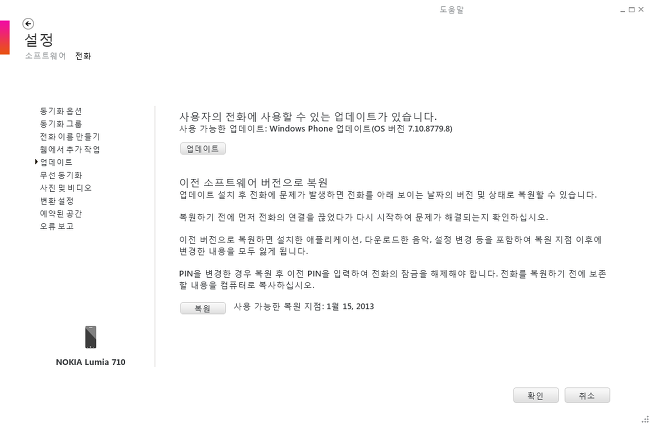

이제 업데이트가 생겼습니다!

꼭 이때 랜선을 다시 끼워주세요!!

그럼 "업데이트"버튼을 클릭해 업뎃을 시작하겠습니다

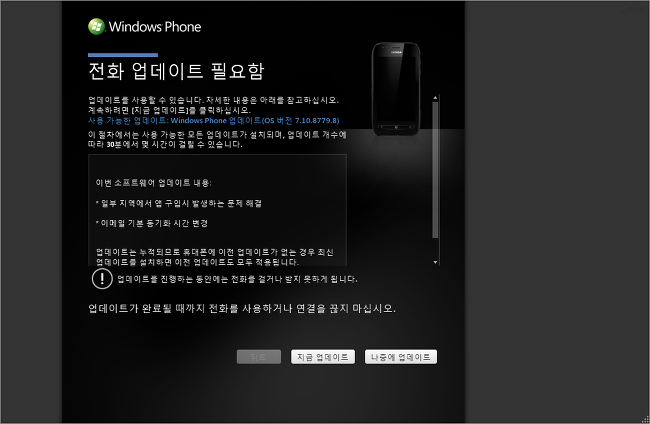

지금 업데이트를 눌러 바로 업데이트를 시작해 봅시다

나중에 업데이트를 누르시면 위 랜선 작업을 다시 하셔야 합니다 ;;

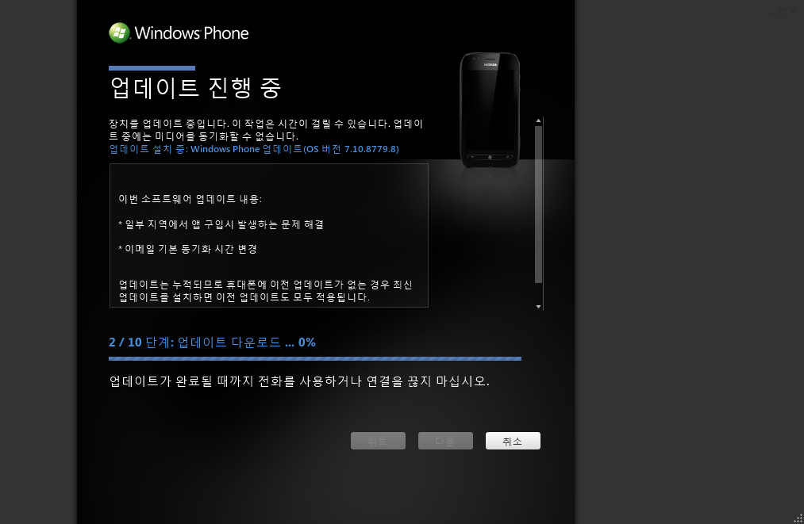

 업데이트 파일을 다운로드 받은뒤 시작됩니다

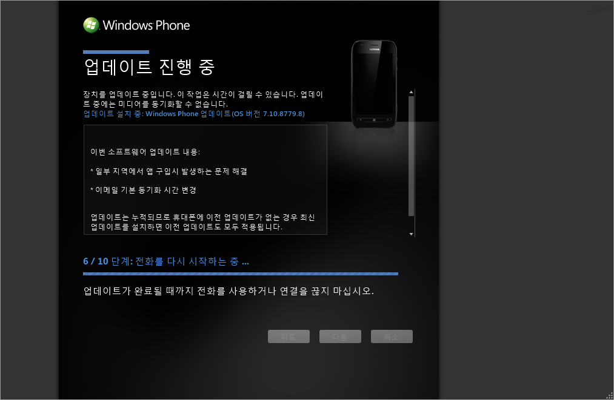

루미아 710을 다시 시작합니다

그럼 폰화면에는 아래 그림이 나타나게 됩니다

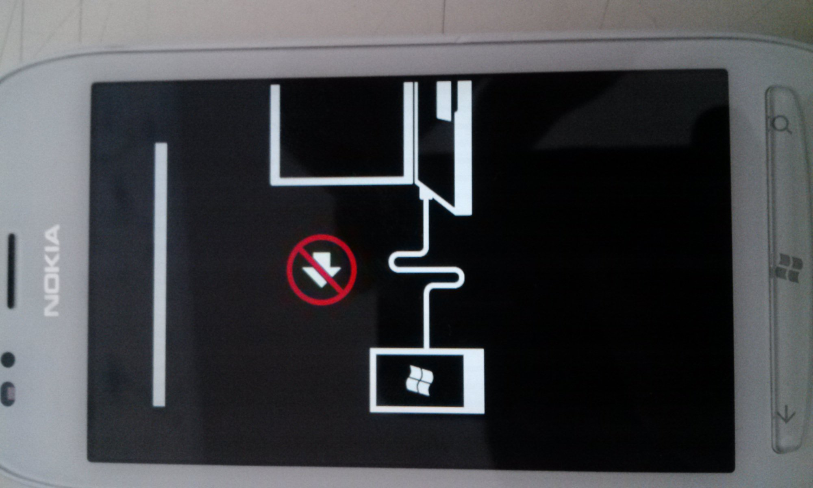

위 그림이 나타나면서 백업/업데이트 진행이 이루어 집니다

게이지가 모두 체워질경우 백업/업데이트가 완료되는 겁니다

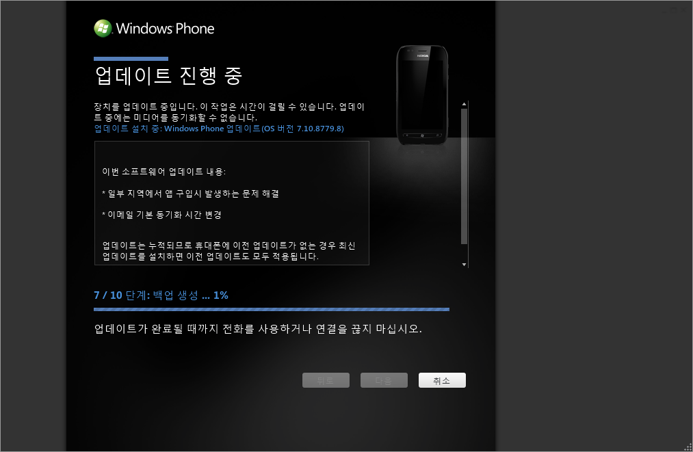

 백업을 진행한다음...

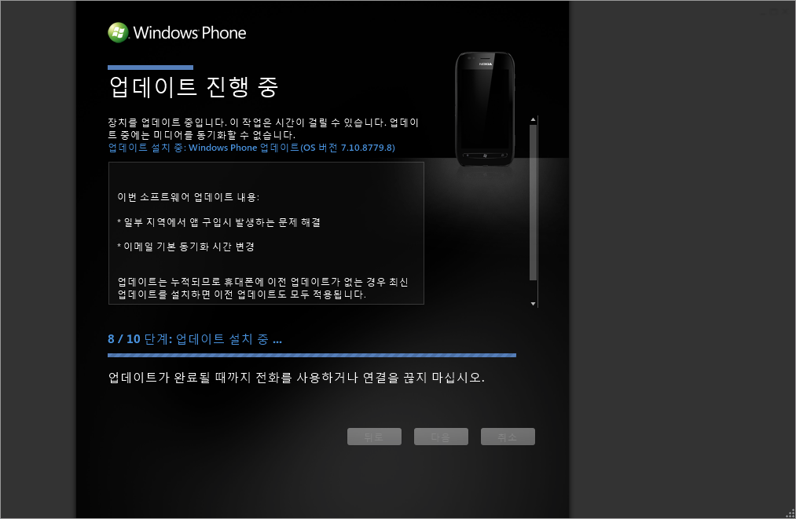

 업데이트를 설치합니다

그런대 이때 업데이트 실패가 발생할경우 위에서 본 루미아 710의 상태가 되었을때 컴퓨터에서 드라이버를 못잡는 경우 발생하게 됩니다

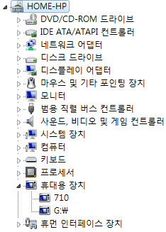

 휴대용 장치에 710또는 루미아 710이 정상적으로 있을경우 문제없이 설치됩니다

"!"가 있으신 경우 마우스 오른쪽 - 드라이버 업데이트를 눌러 드라이버를 선택해 주세요 (인터넷에서 찾기를 선택하시면 됩니다)

8단계를 지나 9단계에서는 710을 재부팅 합니다

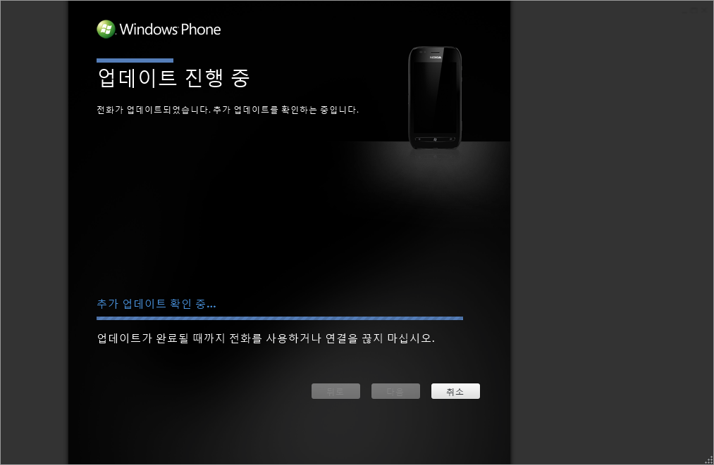

또다른 업데이트를 확인합니다

만약 업데이트가 있을경우 한번더 설치를 하게 됩니다

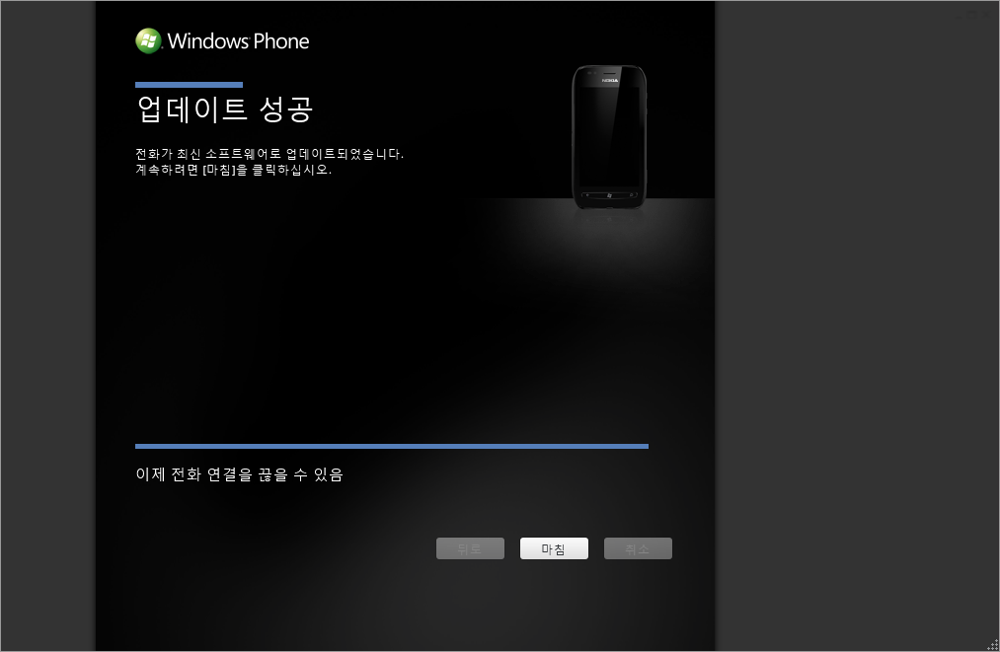

이제 업데이트를 성공하였습니다!

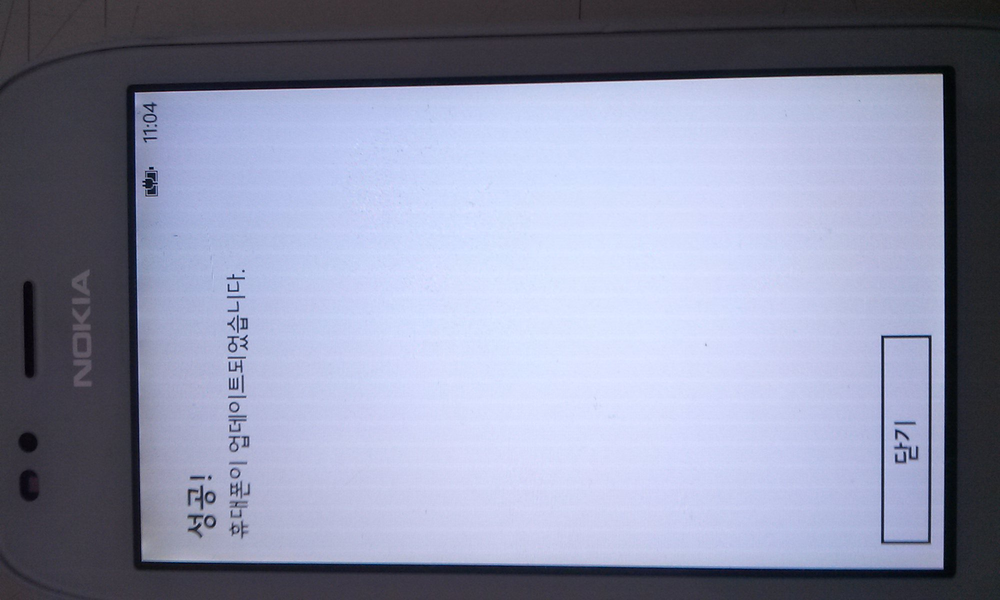

 이놈도 업데이트 됬다고 알려주는군요 ㅋㅋ

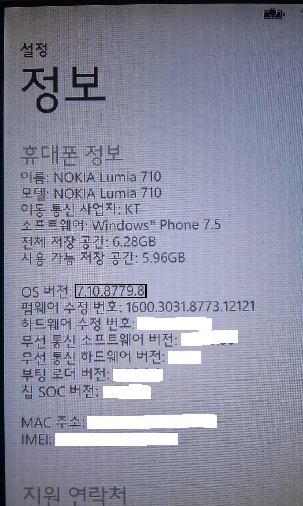

음.. 7.10.8779.8으로 업데이트 되었네요...

근대 아직도 윈도우 모바일 7.5입니다..ㅋㅋ

다시한번 이 게시글을 처음부터 해야되는 건가요?;;

다음에 시간나면 윈도우 7.8으로 업데이트 해야겠습니다~
