갤투 유저분 이 순간만을 기다리셨나요?

어제 젤리빈 업데이트가 나왔습니다!

다른 기종(갤럭시 노트, 갤럭시S2 HD LTE, 갤럭시S2 LTE, 갤럭시R등)도 연다라 나온다 하니 소식 한번 기다려 봐야 겠습니다 ㅋ

오랫동안 기다린 만큼 더욱 빠른 갤투가 되지 않을까요?

이제 젤리빈으로 업데이트 하는 순간이 다가왔습니다. 두둥

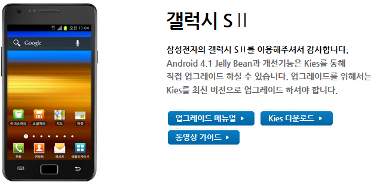

삼성 갤럭시 S2는 삼성 Kies를 통해서만 업데이트가 가능합니다

FOTA는 지원하지 않는대요 그 이유가 내장 파티션을 줄여야 하기 때문으로 생각해 봅니다

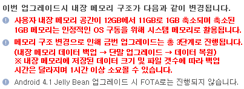

이번 업데이트에서 주의해야 할점을 보면 사용자가 사용할수 있는 내장 메모리 공간이 1GB가 축소된다는 점입니다

삼성는 이 1GB를 시스탬 파티션으로 잡아 젤리빈을 올릴수 있게 하였군요!

그래서 이번 업데이트에는 일단 데이터를 백업한다음 젤리빈 업데이트를 하고 데이터를 다시 복원하는 3단계의 과정을 거치게 됩니다 이때 데이터가 많으면 그만큼 시간도 많이 걸리겠죠?

필요없는건 지우고 업데이트 하면 시간을 절약할수 있을겁니다

그렇다면 젤리빈 업데이트를 하면 좋은점이 뭘까요?

**1. 안드로이드 플레폼 업데이트**

Android 4.0 Ice Cream Sandwich → Android 4.1 Jelly Bean 업데이트  
Home screens 또는 Application 간 이동시 Performance 개선  
어플 일부 사용성 개선

**2. Preload 어플**  
도움말 어플 추가  
Google+ 어플 추가  
+톡 어플 추가  
Play 북 어플 추가  
Play 무비 어플 추가

**3. Preload 어플 및 신규/개선 기능 탑재**  
이지모드, 차단모드 추가  
카메라 기능 개선 : 동영상 촬영 중 Pause 기능 등  
스마트 스테이 추가  
Pop-up play등 신규 기능 추가  
어플 및 기능 일부 사용성 개선

이렇게 많은 기능이 추가 됩니다

이번 업데이트는 중요하고 큰 업데이트만큼 중요한 주의사항이 있는대요

내장 메모리 2GB, 시스템 메모리 100MB 이상의 여유공간이 있어야 젤리빈 업데이트를 진행할 수 있습니다

그리고 안드로이드 판올림 업데이트 이니 홈화면의 아이콘 배열등의 데이터가 초기화 될수 있습니다 혹시 모르니 문자나 전화부는 꼭 백업을 해두시길 바랍니다

또한 젤리빈 업데이트후 어플의 호환성이 떨어질수 있습니다 마치 98 - XP - 7의 순서랄까요?ㅋ

그럴일은 없겠지만 혹시 지금 갤투 진저브레드를 쓰시고 계시다면 바로 젤리빈으로 넘어가지 않고 ICS을 거쳐 업데이트를 하게 되니 참고해 주세요 ㅎㅎ

마지막으로 방송통신위원회 정책변경으로 SMS발송시 발신번호를 조작/수정할수 없도록 패치가 되어있다고 합니다

그럼 본격적으로 업데이트를 시작해 보겠습니다!

(본문이 너무 기니 준비작업과 업데이트를 두가지로 요약했습니다)

[더보기]젤리빈 업데이트를 위한 준비작업

일단 삼성 Kies를 설치해야 합니다

<http://www.samsung.com/sec/support/pcApplication/kies/>

위 사이트에 접속하셔서 삼성kies를 다운받아 설치해 주세요

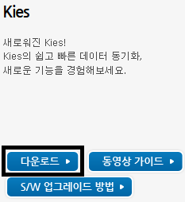

다운로드를 클릭해 삼성키스를 받아서 설치해 주시면 됩니다

그다음 패턴등의 화면 잠금을 해제하라고 합니다

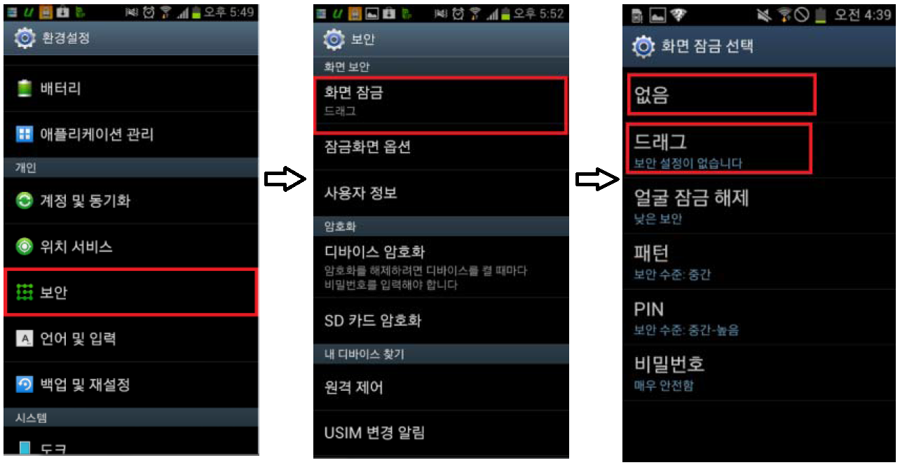

위 사진을 보시고 패턴을 해제해 주세요

또한 혹시 모를 경우를 대비해 배터리를 50%이상 충전해 주세요

저는 완벽 충전을 추천드립니다

외장 SD카드를 넣으신 분들은 JB업데이트때 혹시 모를 오류를 위해 SD카드를 제거해 주시길 바랍니다

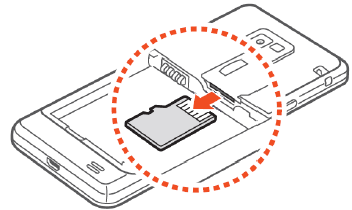

위 사진을 보시고 SD카드를 빼신다음 보관해 두시면 됩니다

그럼 젤리빈 업데이트를 위한 준비작업이 마쳐졌습니다!

[더보기]진짜로 젤리빈 업데이트를 해봅시다!

이제 진짜로 젤리빈 업데이트를 해봅시다 ㅋ

휴대폰을 컴퓨터에 연결해 주세요

연결하신다음 삼성Kies를 실행하시면 연결된 기기가 나타납니다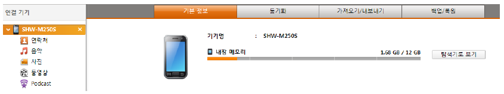

새로운 펌웨어가 있다는 알림창이 뜹니다

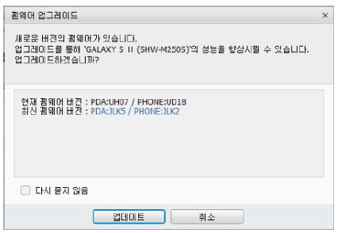

 업데이트를 클릭하시게 되면 데이터 백업을 하는 창이 나타납니다

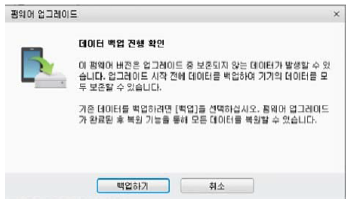

백업하기를 눌러 백업을 진행해 주세요

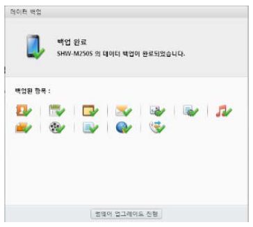

백업 완료창이 나타난다면 펌웨어 업데이트 진행을 클릭하여 다음으로 진행합시다

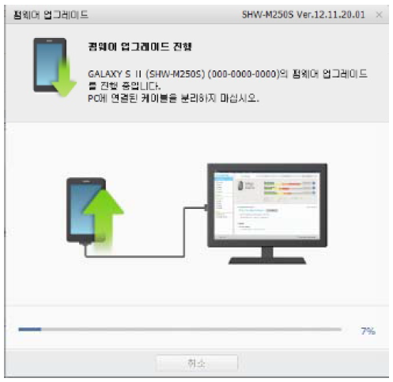

 파일을 받은다음 업데이트가 시작됩니다 완료창이 뜰때까지 절대로 USB를 뽑으시면 안됩니다

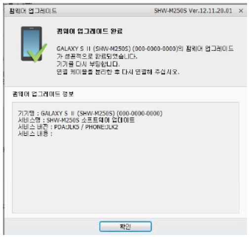

펌웨어 업데이트가 완료되었습니다!

이제 백업한 데이터를 복원하는 순서가 기다리고 있습니다...아아 ㄷㄷ

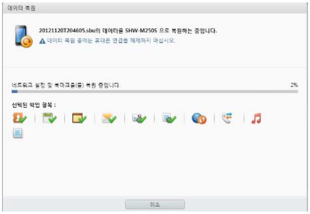

백업한 데이터를 복원하고 있습니다

완료될때까지 기다려 주세요...

이제 젤리빈 업데이트가 모두 완료되었습니다!

 설정 - 휴대전화 정보에 가시면 안드로이드 버전 4.1.1이 있을겁니다!

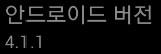

이제 무사히 갤럭시 S2의 젤리빈 업데이트를 마쳤습니다 ㅎㅎ

삼퍼런스라는 말이 있드시 삼성은 사후지원 하난 끝내주는듯 합니다ㅋ *(그러나 2016년 지금은...)*

그럼 포스팅은 이쯤에서 마치겠습니다.

꼭 젤리빈 업데이트 하셔서 뽐내시고 다니시길 바랍니다 ㅋㅋ

사진 출처: <http://down2.local.sec.samsung.com/uploadimg2/comLocal/jb/shw-m250s_jb_Manual.pdf>

(JB업데이트 사용자 메뉴얼)
