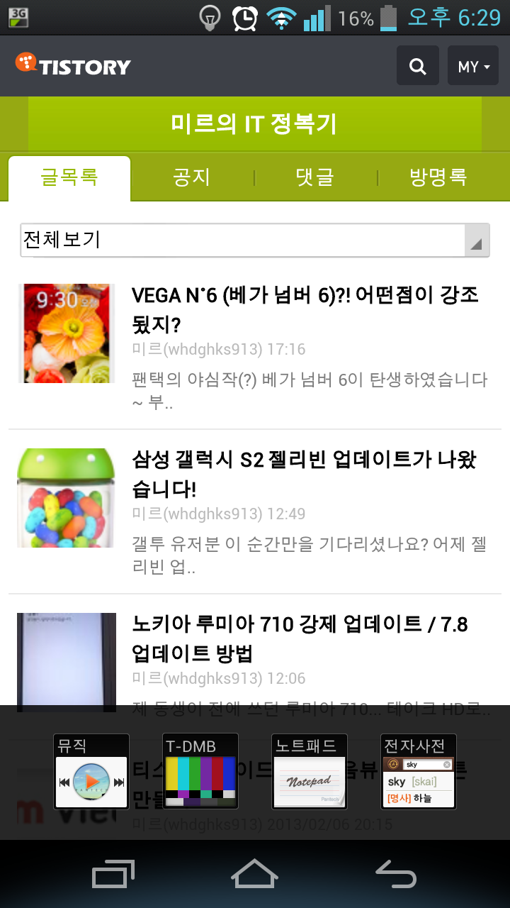
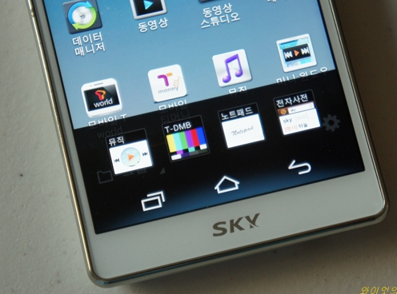
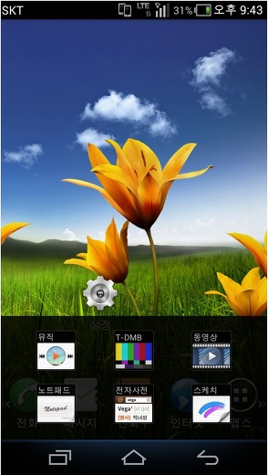
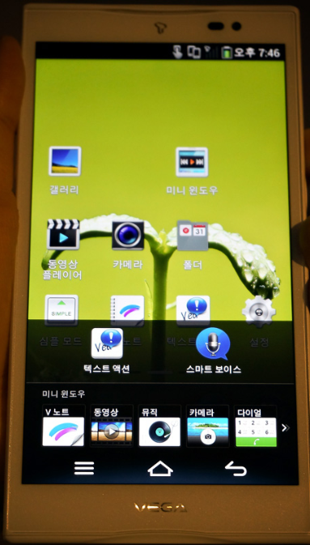
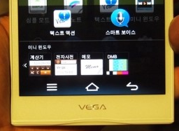
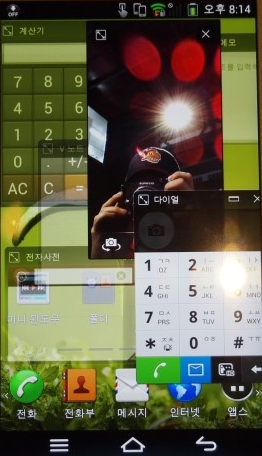

아까 베가 넘버 6를 포스팅 하면서 미니 윈도우에 대해 살펴보았습니다

[2013/02/07 - [전자 기기 포스팅] - VEGA N˚6 (베가 넘버 6)?! 어떤점이 강조됬지?](http://whdghks913.tistory.com/117)

미니 윈도우를 통해 팬택이 기능 업데이트를 어떻게 하는지 살짝 엿보도록 할까요?

미니 윈도우는 베가 S5(베스파)에서 처음으로 선보인 기능입니다

마이너 업데이트로 베가레이서2에도 지원되었습니다

제가 가지고 있는 베가 레이서2의 미니 윈도우 기능입니다

보시면 아시겠지만, 미니 윈도우 어플로 뮤직, DMB, 노트패드, 전자사전 총 4개를 사용할수 있고

순정 동영상 어플로 동영상 미니 윈도우 기능과 통화시 홈화면을 눌러 미니 윈도우를 만들수 있습니다

그러므로 베가레이서2에서 사용할수 있는 미니 윈도우의 갯수는 총6개라 해야 합니다

미니 윈도우를 처음 선보인 베가 S5의 경우는 어떨까요?

베스파의 미니윈도우 사진이 위 사진말고는 찾기 어렵군요.. (전체 스샷으로 구하고 싶었지만 올려져 있던게 없더군요)

베가레이서2와 마찬가지로 미니 윈도우 어플 자체에서 뮤직, DMB, 노트패드, 전자사전기능을 사용할수 있고

통화시 홈화면과 동영상어플로 미니 윈도우를 불러낼수 있습니다

그래서 베가 S5의 미니 윈도우 갯수는 총 6개라 할수 있습니다

미니 윈도우를 좀더 강화한 베가 R3는 어떨까요?

베가 R3의 미니 윈도우 사진을 보면 뮤직, DMB, 동영상, 노트패드, 전자사전, 스케치로 미니 윈도우 어플에서 사용할수 있는 기능은 총 6가지 입니다

그리고 전 기종에도 있드시 통화시 홈화면을 누르게 되면 나타나는 미니 윈도우도 탑제되어 있을거라 생각됩니다

(통화시 미니윈도우에 대해서는 써보지 않았고 검색에도 잘 나오지 않아 정확하게 이렇다 할수 없습니다만 저번 기기에 모두 탑제되었고 이런 기능을 빼서 넣을 팬택이 아니기 때문에 들어 있다고 생각하겠습니다)

그러므로 베가 R3에서 사용할수 있는 미니 윈도우는 총 7개정도라 할수 있습니다

R3에서의 미니윈도우는 동영상과 스케치가 추가되어 제공되는 점이 저번 제품과 다르게 느껴지는 점입니다

그렇다면 아까 포스팅한 베가 넘버 6는 어떨까요...?

스크린샷으로 올리신 분이 없어 기기 사진으로 대채하였습니다

베가 넘버 6의 미니 윈도우를 보시면 V노트, 동영상, 뮤직, 카메라, 다이얼, 계산기, 전자사전, 메모, DMB로 총9개 입니다

또한 통화시 미니 윈도우 까지 생각해 본다면 베가 넘버 6에서 사용할수 있는 미니 윈도우의 개수는 무려 10개나 됩니다

그리고 베가 넘버6의 미니윈도우는 아래 사진처럼 동시에 여러개의 윈도우를 띄울수도 있습니다

분명 이기능은 전 기기인 R3까지는 지원되지 않았던 기능입니다

베가 넘버6전기종까지는 다른 미니윈도우 창을 열면 기존 창은 사라져 버리지만 베넘6에서는 동시에 작업할수 있다는 겁니다

여기서 알수 있는것은 뭘까요?

미니윈도우의 시작인 S5, 마이너 업뎃으로 지원받은 VR2, 약간의 기능이 더 추가된 R3, 더욱더 다양한 기능과 멀티태스킹을 지원하는 No6

이것을 보면 미니 윈도우라는 하나의 기능이 어떻게 변해갔는지 알수 있습니다

또한 팬택은 이 기능의 업데이트를 위해 3개(VR2까지 4개)의 제품을 사용해 기능을 발전시키고 있다는 겁니다

미니 윈도우의 시작인 S5나 VR2에는 미니 윈도우 추가외 어떠한 기능추가/외형변화도 없었습니다

분명 이 기능은 크기 조절까지 된다면 편리한 기능입니다

하지만 아무리 좋아도 한 기기에만 적용된다면 어떻게 될까요?

"그럼 신제품을 사던가"라는 말씀이 나오실수도 있을겁니다

갤럭시 S3의 스마트 스테이등의 기능을 갤럭시 S2 젤리빈 업데이트에서 지원을 하였습니다

그런대 베가(팬택)는 이런 기능들을 신제품에게만 쏟아붓고 있습니다

지금 베가 넘버 6를 사시면 위의 좋은 기능을 모두 맛보실수 있을겁니다

하지만 몇달뒤 팬택은 더욱더 발전된 미니 윈도우(크기조절까지 되게하겠죠?)를 또다른 신제품에만 적용해서 판매한다면 어떠겠습니까?

폰을 바꾼지 몇달도 안되서 또 다시 바꿀수는 없는 노릇일탠대 말이죠..

제가 팬택(베가)에게 원하는건 이런 기능와 마이너 업데이트를 신제품에게만 쏟아붓지 마시고 기존 제품에게도 부어주셨으면 하는 점입니다

물론 잘알고 있습니다 신제품 하나 찍어내는게 기존제품 업데이트 하는것보다 돈과 시간이 절약된다는점을요

하지만 기존제품을 사용하고 있으신 분들께 최대의 만족을 드려서 다음에도 우리 회사 제품을 사주세요 라는 인식을 갖게 만드는게 더 좋지 않을까요?

이제 R3와 S5, VR2의 젤리빈 업데이트 날짜가 다가오고 있습니다

좋은 기술을 신제품에게만 쏟지 마시고 기존제품 생각도 해주시길 바랍니다

이번 젤리빈 기대하겠습니다 많은 신기술이 적용되기를 기대하겠습니다
