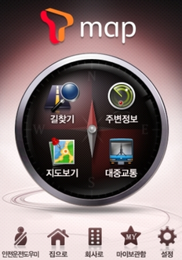
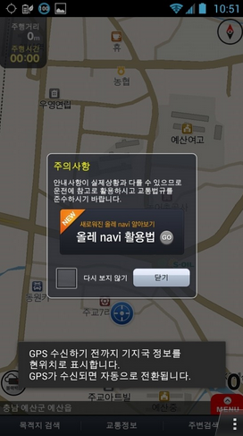
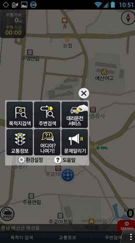
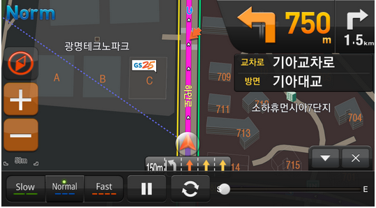
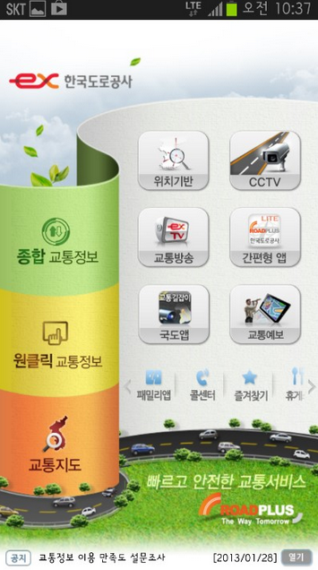
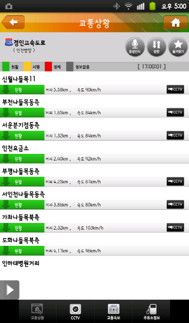
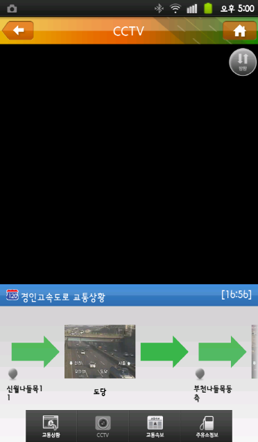

이제 내일이면 설날이 옵니다 ㅎㅎ

다들 그리운 고향으로 떠나는 일이 남이있겠죠?ㅋ

다들 새뱃돈 많이 챙기시길 바래요 ㅋㅋ *(그리고 그 돈의 일부를 제게 기부해 주시는 겁니다?)*

그런대 여기서 잠깐!

고향에 내려가려면 많은 차량이 고속도로에 몰려 극심한 정체가 발생하게 됩니다...

하지만 우리가 누굽니까? 스마트~ 한 유저가 아닙니까?

막히지 않는 고속도로를 찾아 단시간에 고향으로 내려가는 우리들이 되어야 겠죠?

이 글에서는 대표적인 실시간 길안내 네비게이션 3개와 고속도로 교통정보를 보여주는 어플 하나를 소개하겠습니다

먼저 T Map입니다

다들 아시죠?

SKT의 스마트폰을 쓰시고 계신다면 한번 깔아 이용해 보시는건 어떨까요?

실시간으로 경로를 찾아 막히지 않는곳으로 유인(?)해 줍니다 ㅋㅋ

그리고 오차가 몇분정도 잇지만 도착 예정 시간을 계산해서 보여주는 기능도 가지고 있습니다 ㅎㅎ

이 기능에 대한 CF도 있었는대 기억하시나요?ㅋ

[YouTube 영상: https://www.youtube.com/watch?v=plxPf26obNM](https://www.youtube.com/watch?v=plxPf26obNM)

한번 보시면서 기억을 대새김 해보는것도 좋을듯 합니다 ㅎㅎ

그리고 KT의 올레 나비도 있습니다

KT분들은 기본적으로 깔려 있을듯 하는대요 ㅋ

위 사진과 같은 모양을 하고 있습니다

스마트폰을 네비로 사용하려면 거치대 하나쯤은 있어야 편한건 아시죠 다들?

가로 모드로 전환하면 화면도 가로로 전환되고 더욱 보기 편해진다는 사실!

올레 나비의 기능이라면 어디야? 나여기! 기능을 꼽을수 있을탠대요

이 기능은 올레 나비 사용자 끼리 위치를 공유할수 있는 기능입니다

주변에 KT만 쓰시고 올레 나비를 쓰신다면 활용해 보시는것도 좋을듯 합니다 ㅋㅋ

티맵과 올레 나비를 검색해보니 유튜브에 Tmap VS 올레내비를 비교하는(?) 동영상이 있길래 가져와 보겠습니다..ㅎㅎ

[YouTube 영상: https://www.youtube.com/watch?v=W6yNunW9hOg](https://www.youtube.com/watch?v=W6yNunW9hOg)

(너무 길어서 전부 보진 못했네요..)

U+에서도 네비게이션 서비스를 하고 있습니다 *(아시는분이 계실지 몰라..)*

U+ Navi인대요 자료가 위 두 네비보다 적은건 사실입니다..

숫자가 큼직하군요 ㅎㅎ

... 만져보질 않아서 좋은지는 잘 모르겠습니다..;;

작은 화면에서 숫자가 크게 나와 운전시 잘보일것 같습니다 ㅎㅎ

지금까지 네비게이션 어플을 살펴봤습니다

이제 고속도로의 상황을 자세하게 알수있는 어플을 하나 소개하려 합니다

이름하여 "고속도로 교통정보"입니다

이렇게 디자인이 심플하게 생겼습니다 ㅋㅋ

한국도로공사에서 만든 어플이기 때문에 실시간으로 정확한 정보를 얻을수 있을거라 생각됩니다

안드로이드 마켓에 "고속도로 교통정보"라 검색하시면 한국 도로 공사가 만든 어플이 있습니다

그 어플이 바로 위 사진에 있는 어플입니다 ㅎㅎ

어디가 막히는지 실시간으로 나타내서 보여줍니다

무제한 요금제이신 분들은 CCTV도 마음것 보실수 있으실 겁니다 ㅋ

무제한이 아니시라면 자제해서 CCTV를 보셔야 과금을 막을수 있습니다 ㅎㅎ

설명절이 내일로 다가온 오늘!

빨리 고향에 가기 위해 과속하다 망하는건 한순간 입니다...

제한 속도 유지해 가시면서 좋은 명절 되시길 바랍니다 ㅎㅎ
