GUI 프로그램을 포스팅했습니다 : [[SmartPhone/Android] - Apk Easy Tool - Apk GUI 디컴파일 도구](/archive/itmir/2020/672)

안녕하세요

이번에는 apk manager을 사용하기에 앞서 필수로 선행되어야 하는 java설치를 해보도록 하겠습니다

먼저 http://www.oracle.com/technetwork/java/javase/downloads/jdk7-downloads-1880260.html

이 사이트에 방문해 주세요

(만약 링크가 변경되었다면 오라클 사이트에서 JAVA SE를 찾아 다운로드 하시면 됩니다)

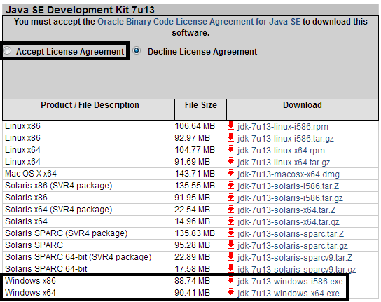

위와 같은 화면이 나타나게 됩니다

위의 Accept License Agreement에 체크하여 약관에 동의해 주신다음

Windows x86 또는 x64를 선택해서 받으시면 됩니다

x86은 컴퓨터가 32비트일때, x64는 컴퓨터가 64비트일때 받으셔야 합니다

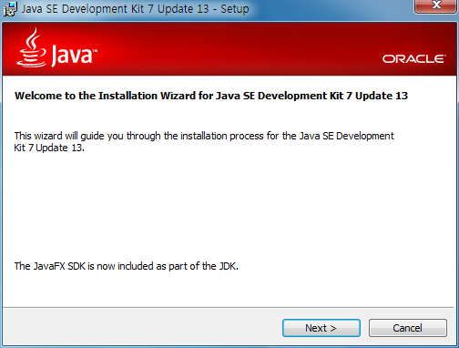

설치때 나오는 모든 화면을 닫지말고 Next 해주세요

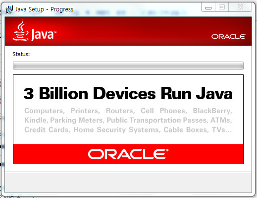

3백만 기기에서 자바가 실행되고 있다군요...

이제 설치가 완료되었습니다 Apa manager을 압축풀어 주세요

압축푼 폴더안에 많은 폴더가 있습니다

간략하게 설명해 드리자면

other - apk manager에 필요한 파일이 담겨있습니다

place-apk-here-for-modding - (디)컴파일할 apk를 넣는곳입니다

place-apk-here-for-signing - 일괄사인할 apk를 넣는곳입니다

place-apk-here-to-batch-optimize - 일괄 최적화를 할 apk를 넣는곳입니다

place-ogg-here - ogg최적화를 할수 있습니다

projects - 디컴파일된 apk가 있습니다

그럼 우리는 place-apk-here-for-modding에 디컴파일할 apk를 넣어야 겠죠?

그전에 먼저 apk를 빼오는 방법부터 연구해 보도록 하겠습니다

루트익스플로러를 실행하신다음 system에 들어가 주세요

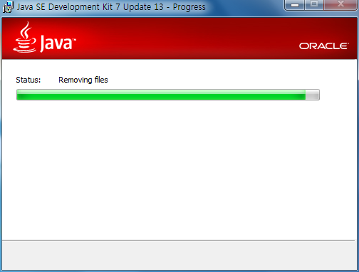

위 버튼을 눌러 R/W로 바꿔주신다음 진행해 주세요

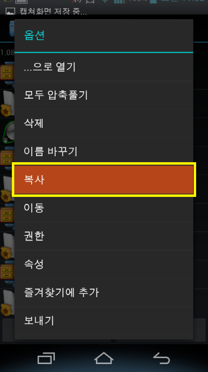

가져올 apk를 꾹 눌러 꼭!!!!!!! "복사"를 선택해 주세요

"이동"하면 망합니다

자 이제 붙여넣기가 생겼으니 sdcard로 이동해 주세요

전 framework를 가져오겠습니다

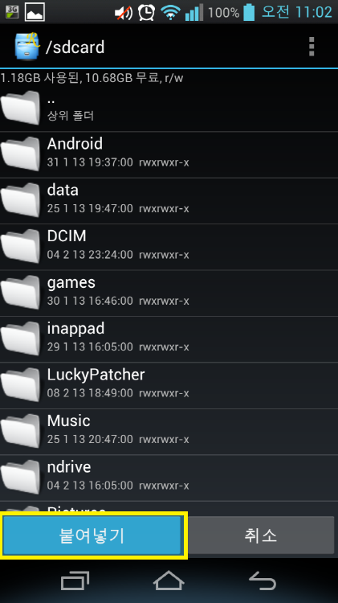

sdcard에 들어온다음 붙여넣기를 하시면 됩니다

다른 시스탬 어플도 이와 같은 방법으로 하시면 됩니다

가져오신 apk를 place-apk-here-for-modding폴더에 넣으신후 Script.bat를 실행해 주세요

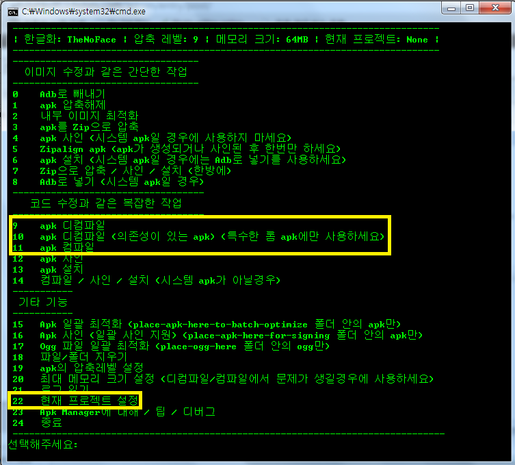

우리가 주로 사용하는 메뉴는 9번, 10번, 11번, 22번 입니다

22번을 누르신다음 작업할 apk를 선택해 주세요

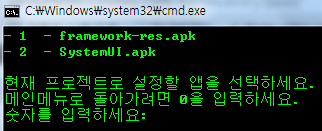

작업할 apk의 숫자를 눌러주시면 됩니다

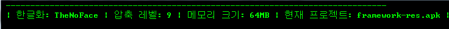

그럼 현재 프로젝트에 선택한 apk의 이름이 떠있게 됩니다

9번을 눌러서 디컴파일 해주세요

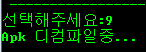

디컴파일이 완료되면 projects 폴더에 apk폴더가 생깁니다

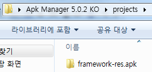

이렇게 말이죠 ㅋㅋ

이제 이걸 *닥치고* 수정하신다음 컴파일 해주세요

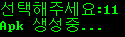

apk가 컴파일 되고 있습니다

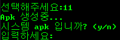

강좌등에 별도의 말이 없다면 n을 입력해 주시면 됩니다

정상적으로 컴파일 되었다면 place-apk-here-for-modding폴더에 unsigned(apk이름).apk파일이 있어야 합니다

시스탬 어플이라면 수정한 목록을 가져와 원본에 덮어씌우기 하시면 되고요

설치 어플이라면 12번 버튼으로 사인해 주시면 됩니다

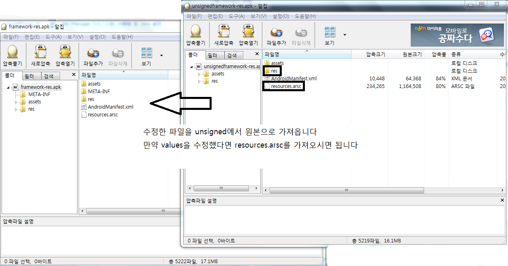

unsigned에서 수정한 파일을 원본 파일으로 가져와 주시면 됩니다

이제 어떻게 다시 집어넣을까요?

sdcard에 apk를 넣은다음 아까처럼 복사해 주셔서 system에 붙혀넣기 해주세요

그다음 권한을 주시면 됩니다

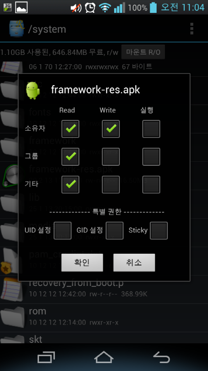

apk를 꾹 누르신다음 권한을 터치하셔서 위 사진같은 모양으로 주시면 되는대요

저런 모양의 권한을 644 퍼미션 이라 합니다 꼭 기억해 주세요~

그다음 다시 system에 있는 apk를 원래 있던 곳에 넣어주시면 작업은 끝나게 됩니다

이제야 강좌가 끝나게 되는군요...

유용하게 사용하셨으면 합니다