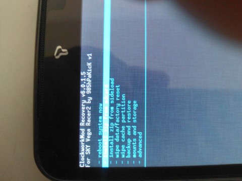
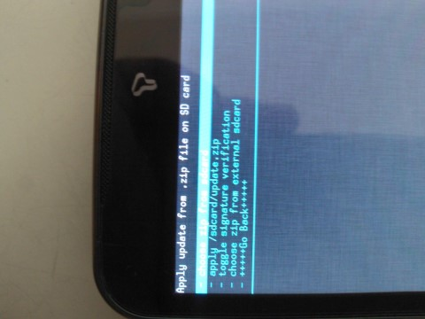
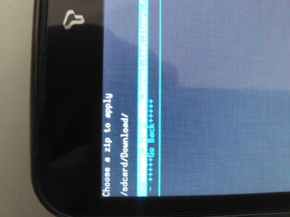
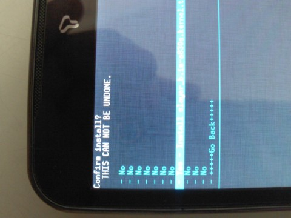

안녕하세요.

베가레이서2의 경우 IO데이터 베이스 문제가 심각합니다..

안투투로 측정하면 IO점수가 정상은 500점 이상이 나와야 하지만 비정상인 경우 50정도 나오게 됩니다.

이런 문제는 아래 커널 패치로 해결이 가능합니다.

공장 초기화 또는 센터 초기화로 해결하는 방법은 일시적인 방법입니다.

아직 문제가 나타나지 않은 분들도 예방차원에서 하시는 것을 추천드립니다.

기준은 1.38 버전입니다. (SKT 1.34에서 테스트 결과 성공)

벽돌의 가능성을 대비해 백업해 두시길 바랍니다.

참고로 시크릿뷰와 DMB가 안된다고 합니다. (만 DMB는 제 경우 잘 됬고 시크릿 뷰는 반응하지 않았습니다.)

---

이하 목록은 커널에 들어간 패치 목록 입니다.

Linaro optimisations  
NEON optimizations  
SIO scheduler  
Added a lot of governors  
Stock freq, no OC.  
FIXED IO issue. Improved overall IO performance.

---

그럼 패치 방법을 포스팅 하도록 하겠습니다.

기기에 맞는 파일을 받아 sdcard에 넣어주세요.

LG U+ (IM-A830L) / KT (IM-A830K) : IM-A830L(K) IO fix by slayer\_b

SKT (IM-A830S) : IM-A830S IO fix by slayer\_b

그다음 CWM 리커버리에 진입하신다음 받으신 파일을 설치해 주시면 됩니다.

전원끔 - 볼륨위 - 전원키를 누르시면 진입이 가능합니다.

리커버리는 hPa님의 CWM 리커버리를 이용해 주시면 됩니다.

install zip from sdcard를 선택해 주신 다음

choose zip from sdcard를 선택해 주세요.

다운받은 zip을 선택해 주신다음,

Yes를 선택해서 눌러주시면 됩니다 ㅎㅎ

모두 설치가 완료되었다면 재부팅 하신다음 벽돌이 되셨는지 확인해 주시면... ㅎㅎ

설치 하신다음 정상 이용이 가능 하신 분은 덧글로 어떤 기종 성공 여부와 스카이 스테이션 버전을 알려주시면 감사드리겠습니다. ㅎㅎ

github commit : <https://github.com/AlexBokhankovich/IM-A830S_kernel> by 토깽이