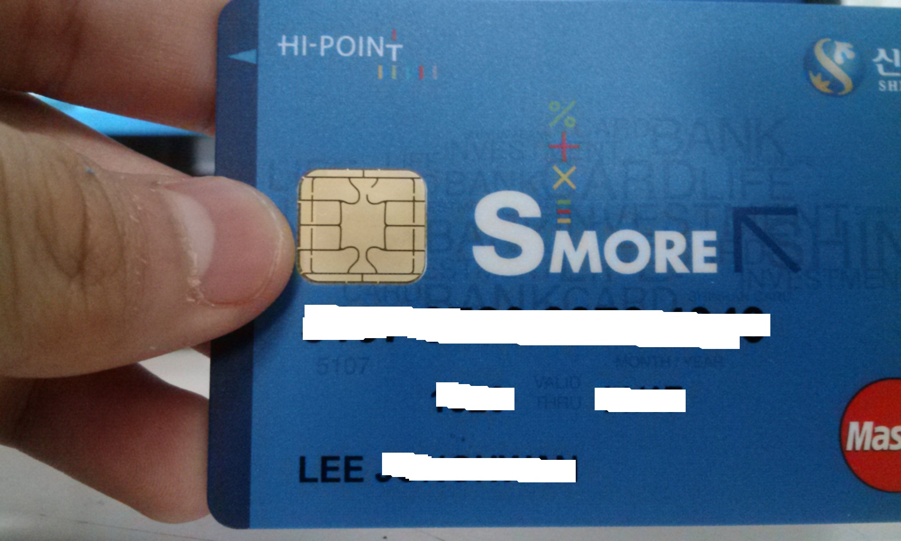
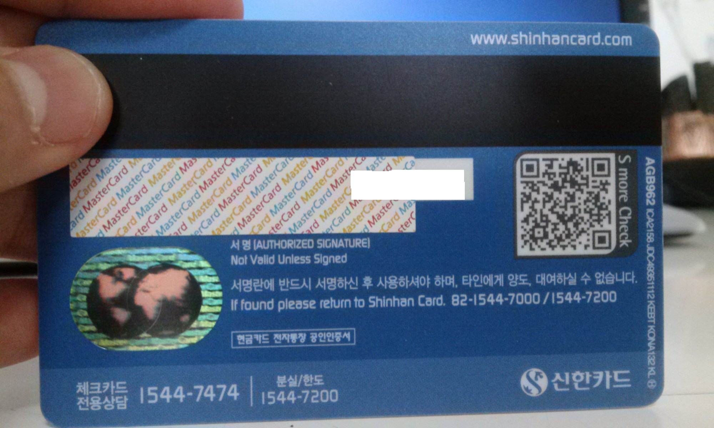

저번주 수요일부터 하려 했지만 등본 떼는 시간과 엄마께서 일나가시는 시간이 겹쳐서 -_-

그래서 오늘 등본 뽑아서 겨우 발급받고 왔습니다. ㅇㅅㅇ

전에 쓰던 입출금 카드는 MS(마그네틱 카드)여서 이제 기계에서 사용하지 못하게 되었기에...

IC카드로 얼릉 옮겨 왔지요. ㅎㅎ

혹시 마그네틱 카드를 쓰시고 계신 분들이 있다면 얼릉 IC카드로 오세요. ㅎㅎ

전에 쓰던 MS(마이크로 소프트 같..)카드가 카드 복제의 위험이 아주 높아 위험한 관계로,

복사가 아주 힘들고 어렵고 불가능한 IC카드로 옮겨온 것입니다. ㅎㅎ

이렇게 발급받은 카드가 아름답군요(?)

IC카드는 저렇게 금색의 반짝반짝 빛나는 유심칩(?)같은게 들어있습니다. ㅋㅋ

저게 없으시면 마그네틱 카드로 생각되니 꼭 카드 재발급 받으시길 바랍니다. ㅎㅎ

한번 기계에 넣어보시고 제한 표시가 나타나면 재발급을..

하하 아름답군요ㅎㅎ

저기에 아빠처럼 서명을 해야지!ㅋㅋ

IC 카드로 안 바꾸신 분들은 꼭 바꾸셔서 새로운 기분을 만끽하시길 바랍니다. ㅎㅎ
