한 친구가 컴을 *(때수건으로)* 밀어버리고 싶다 해서 저랑 제 친구랑 같이 그 친구네 집에 가서 컴을 *(때수건으로)* 밀어주고 왔습니다 << 드립 이해 좀 ㅋㅋ >>

XP와 7을 모두 설치해 보았지만 8은 오늘이 처음설치입니다. ㅋㅋ

긴장되는 마음으로 클릭을..

(비스타는 설치할 마음도, 시디도 없습니다 ㄷ;;)

먼저 필요한 파일받고 울트라 iso로 구우려고 했는데 안됨..

네로 툴을 받아 다시 굽기 시도... 성공했습니다! ㅋㅋ

Nero라는 프로그램 다들 아시나요? cd굽기 프로그램입니다. ( <http://www.nero.com/kor/downloads/> ) 우리들은 체험판을 가지고 했지요 ㅎㅎ

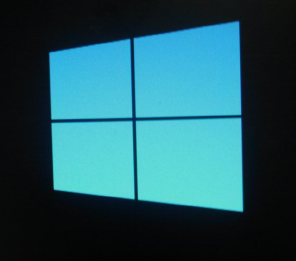

Windows8의 로고는 이렇게 심플합니다.

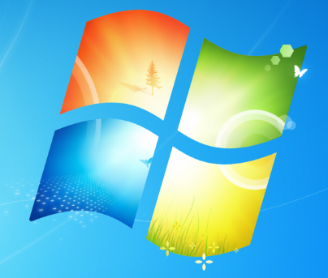

Windows7의 로고보다 뭔가 심플한 느낌일까요?

아무튼 cd굽는대 30분 자료를 D드라이브로 옮기는데 또 30분...

그래서 1시간 이상 준비 작업의 시간이 소요되었습니다.

다들 아시다싶이 CD로 설치하는 방법은 바이오스에 들어가서 부팅 순서를 변경하는 방법이 있습니다.

하지만 요즘 나오는 모든 컴퓨터에는 임시 부트 기능, 즉 부트 메뉴 기능이 있습니다.

F12등의 키를 눌러 이번 한 번만 어떤 기기로 부팅할 수 있게 만든 기능인데요.

컴퓨터를 킬 때 아래쪽에 하얀색 글씨로 어떤 키를 눌러 진입하는지 알 수 있습니다.

아무튼 부트메뉴로 CD로 부팅해서 파티션을 포맷하고 설치를 하였습니다.

느낌상 Windows8은 설치 시간이 매우 빠른 듯 합니다. ㅎㅎ

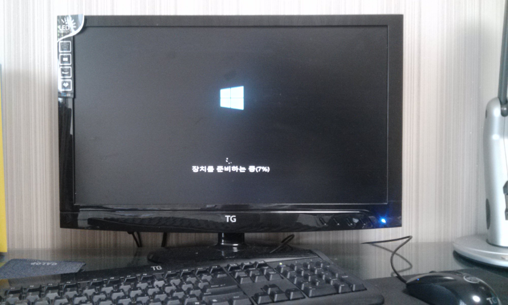

장치를 준비하는중입니다...

뭔가 심플해 보이죠 ㅋㅋ

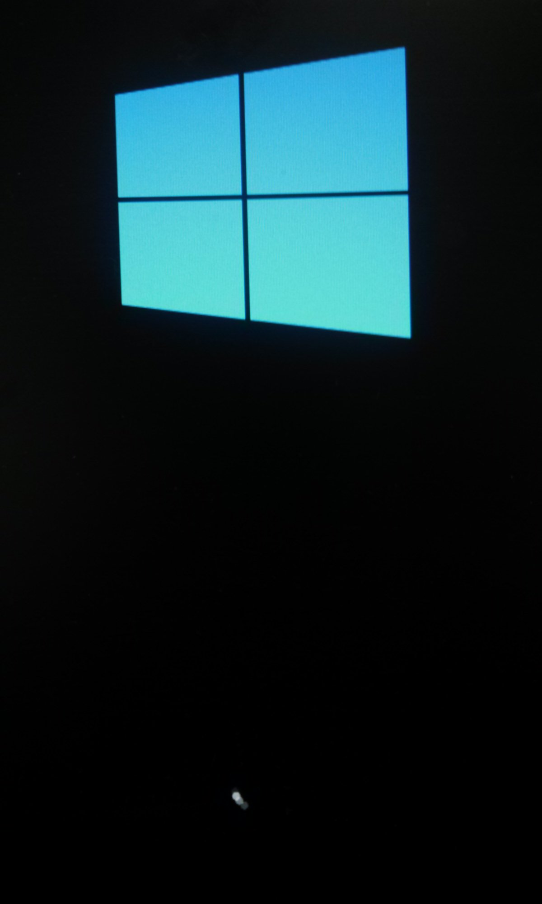

촛점을 맞춰서 찍었습니다. ㅋㅋ

저 심플한 로고... 익숙하진 않지만 어울리진...흠..

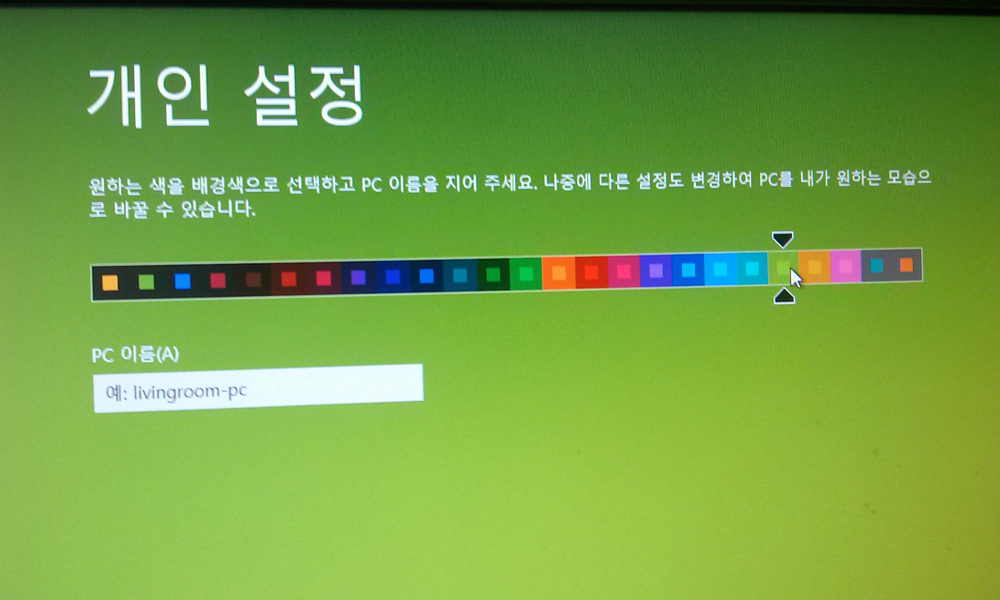

개인설정 탭에서는 색을 결정할수 있어요.

색을 고르면, 시작 탭이나 이런 경우의 색을 결정하게 됩니다. ㅎㅎ

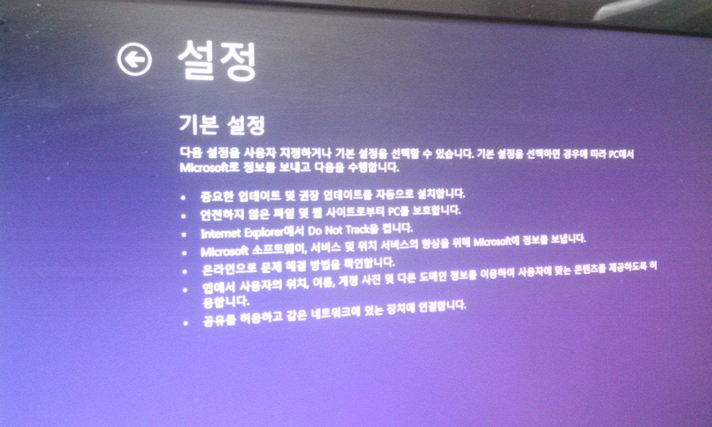

기본설정 탭입니다.

그냥 생략하셔도 됩니다.

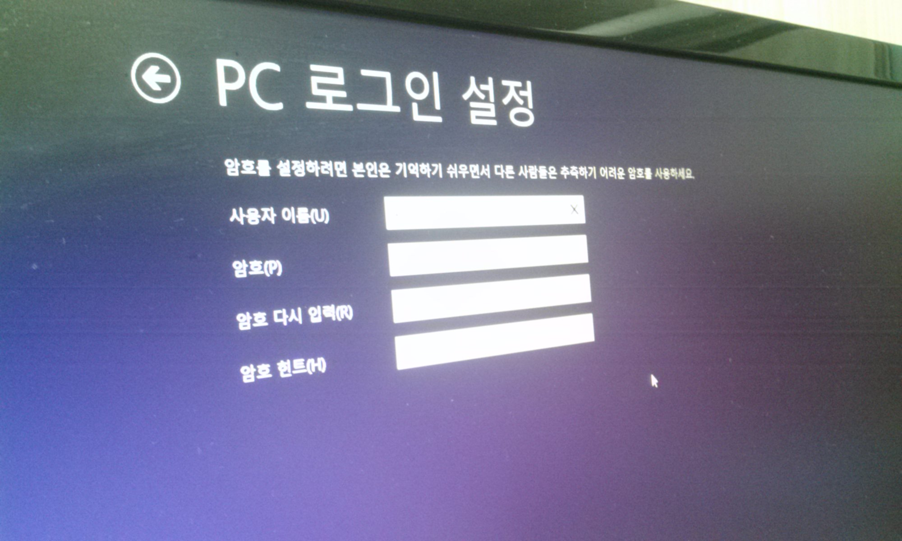

암호를 입력해 주세요.

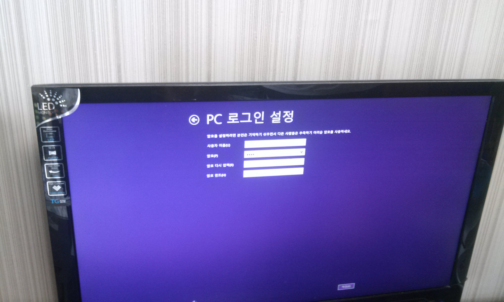

PC 로그인 설정을 멀리서 찍었습니다. ㅎㅎ

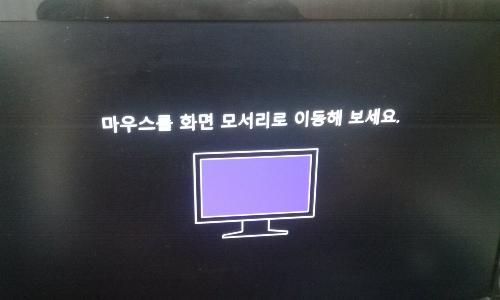

윈도우8부터 튜토리얼이 생겼습니다. ㅋㅋㅋㅋㅋㅋㅋ

익숙하지 않으신 분들을 위한? ㅎㅎ

튜토리얼을 띄우면서 windows는 추가 준비를 합니다.

예를 들면

win7에서 바탕화면 준비중... 화면이 나올때, win8에서는 튜토리얼을 보여주며 뒤에서 작업하는 셈이죠.

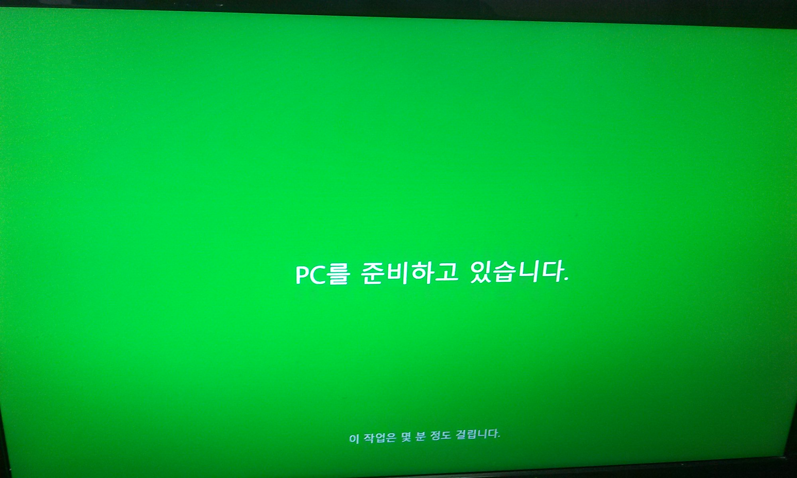

PC를 준비하고 있습니다.

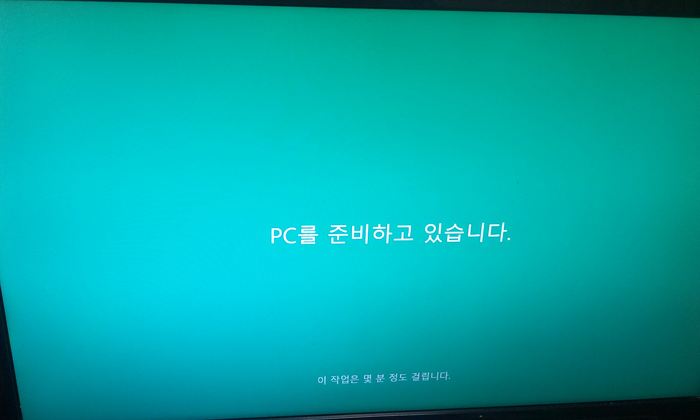

PC를 준비하고 있습니다. - 복사본

색이 변하면서 준비를 하고 있습니다. ㅋㅋ

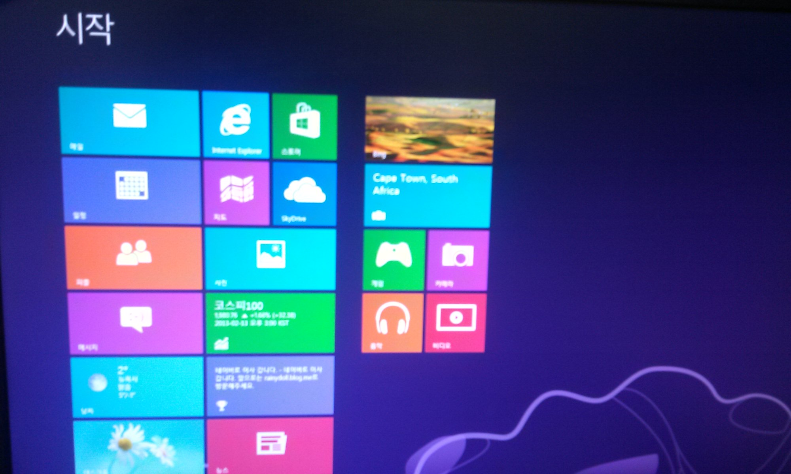

자 이제 UI를 볼수 있습니다. ㅎㅎㅎㅎㅎㅎ

완전 좋군?

제 넷북에 깔고 싶지만 usb가 없군요... cd드라이브도 내장되어 있지 않아서.. 아아아아아아악

친구의 컴을 빌려서 체험해봤습니다.

확실히 포맷해서 그런지 부드럽네요. ㅎㅎㅎㅎㅎ

정말 좋아요 속도도 그렇고 모든게 좋군요. ㅋㅋㅋ

이제 언젠간 써야할 윈8이기에 먼저 써보는 것도 좋을 듯 합니다...ㅋㅅㅋ

불편한 게 있다면 약간 태블릿을 위한 OS같은 느낌이 드네요.

시작을 들어가는것도 힘들고..

터치 모니터를 쓰지 않는다면 불편하다 생각됩니다. ㅋㅋ

그럼 이쯤해서 windows8후기(?) 체험(?) 설치(?)를 마치겠습니다
