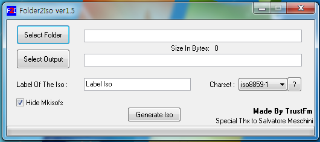
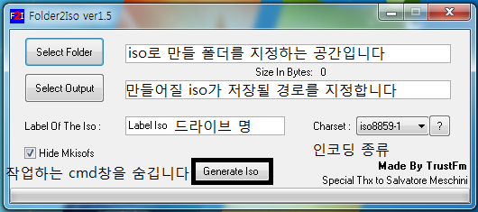
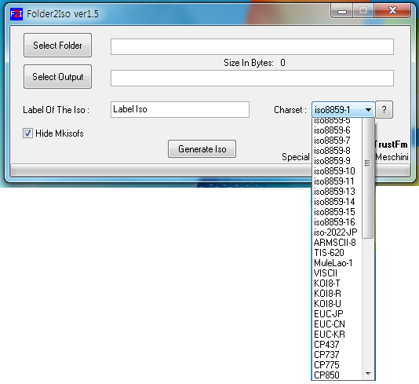

**Folder2Iso**

설치 파일이 담긴 폴더를 iso로 만들어야 하는 경우가 발생하기도 합니다.

이럴때 사용하는 프로그램 Folder2 Iso 입니다.

경로를 모두 설정한다음, Generate iso를 클릭해 주시면 ISO파일이 완성되어 나타나게 됩니다.

[공식 사이트 바로가기](http://www.trustfm.net/divx/SoftwareFolder2Iso.php)

간단한 설명을 붙히면,

Select Folder : 작업할 파일이 담긴 폴더를 지정해 줍니다.

Select Output : 만들어지는 iso파일이 어디에 생성될지를 결정해 줍니다.

Label Of The iso : 데몬등의 가상 드라이브 프로그램에서 만들어진 iso파일을 읽을때 표시되는 드라이브 명입니다.

Charset : 인코딩 종류를 설정하는듯 합니다 종류에 따라 한글 파일 이름이 깨집니다.

Hide Mkisofs : iso를 만들때 나타나는 cmd창을 나타나지 않도록 설정합니다.

Generate iso : iso로 변환을 시작합니다.

인코딩 종류를 CP949로 해야 한글이 안깨집니다. 참고하세요. ㅎㅎ