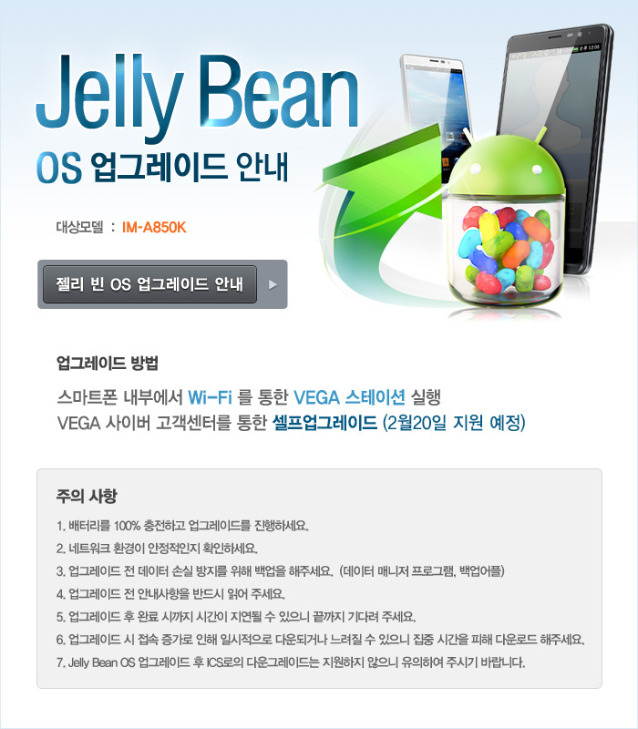
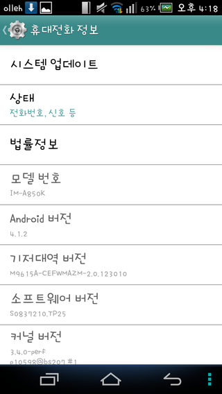
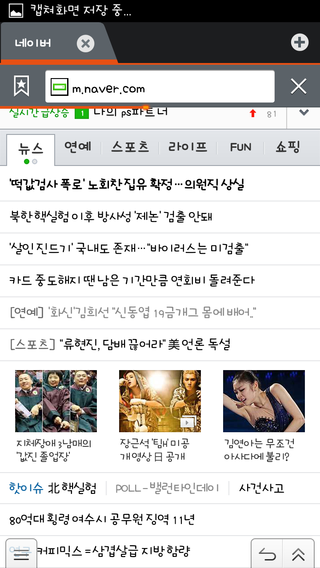
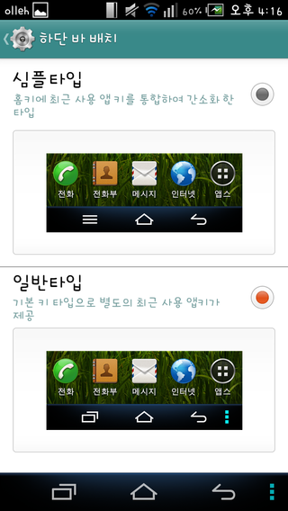
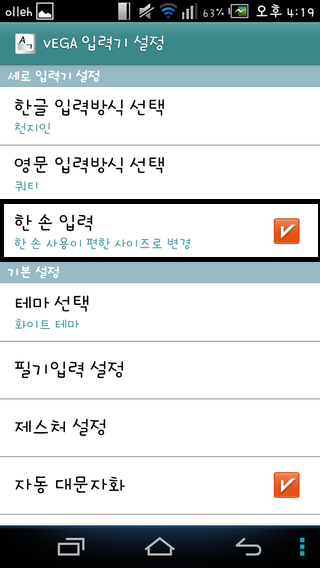
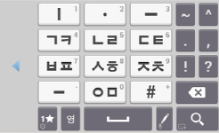

오늘 날짜로 업그레이드가 시작된듯 합니다 ㅋㅋ

베가 r3의 젤리빈 업데이트가 시작되었습니다 이제 업데이트를 하셔야죠?...ㅎㅎ

호호 진짜 젤리빈이 왔군요 ㅋㅋ

하지만 IM-A850K, 즉 베가 R3 KT 모델만 업그레이드가 시작되었군요..

지금은 WIFI를 통한 업그레이드만 가능하다 합니다

이말은 Vega 스테이션 (구 스카이 스테이션)에 들어가면 KT모델만 젤리빈 업데이트를 내려 받아 설치가 가능하단 뜻이 되지요..

(update.zip이 있을경우 젤리빈 루팅이 뚤릴 확률이 올라갑니다(?))

그럼 한번 젤리빈의 UI를 집중 탐구 해보도록 하겠습니다.

젤리빈 업데이트가 되어 Android 버전이 4.1.2버전으로 올라갔습니다 ㅋ

순정 인터넷 어플의 소프트키 숨김 기능에서 전에는 뒤로가기/소프트키 표시 키만 있었다면 업데이트 후에는 메뉴 버튼도 추가되었습니다

또한 하단바 배치라는 기능으로 소트프키의 배열을 바꿀수 있는 기능도 추가된듯 합니다

베가 넘버6과 비슷한 기능도 추가되었는대요

한손으로 입력할수 있는 키패트 배열이 추가되었습니다

위 사진처럼 한손 입력에 체크하시게 되면

한손 입력에 중점을둔 키보드 배열로 바뀌게 됩니다 ㅋㅋ

업그레이드 시간은 10~15분 이상 걸린다 합니다

또한 첫 부팅시 모든 OS업데이트가 그렇드시 어플리케이션 최적화 작업으로 시간이 많이 소요됩니다

조금 기다려 주시면 젤리빈을 만나실수 있으실 겁니다

Jelly Bean 업데이트가 시작된 베가 R3! 빨리 만나보세요 ㅎㅎ

(이미지 출처 : http://cafe.naver.com/iroid/1964864

가입이 안되어 있어 허락을 받지 못했습니다 문제가 된다면 사진을 삭제하도록 하겠습니다)
