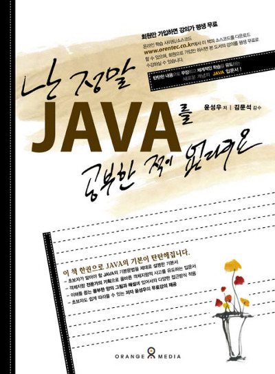
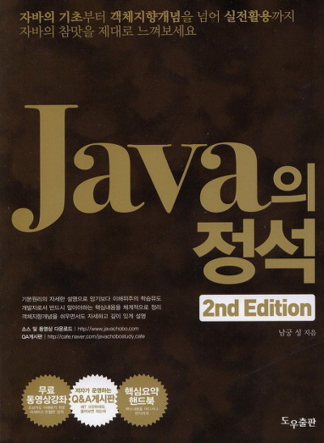
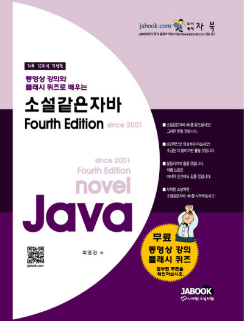

java를 공부하려 마음먹고 찾아본 책들

대부분 3개의 책을 추천하시더라고요

그래서 3대 책(?)을 더욱 활용할수 있는 사이트를 소개하려 합니다

먼저 "난 정말 JAVA를 공부한 적이 없다구요"

윤성우 저자  오렌지미디어

이 책의 참고 사이트는 <http://www.orentec.co.kr> 입니다

오렌지 미디어 사이트에서 무료로 동영상 강의를 들을수 있습니다

특이하게도 난 정말 JAVA를 공부한 적이 없다구요 책만 평생 무료로 강의를 제공하고 있습니다

다른 윤성우 저자께서 지으신 책은 쿠폰으로 1년동안만 강의를 들을수 있습니다

회원가입만 하면 누구나 볼 수 있으니 꼭 한번 들어보세요 ㅎㅎ

또한 <http://cafe.naver.com/cstudyjava> 카페를 직접 운영하신다고 합니다

두번째로 "JAVA의 정석"

남궁성 저자 도우출판

먼저 남궁성 저자께서 직접 운영하시고 계신 네이버 카페 <http://cafe.naver.com/javachobostudy>

또한 java의 정석 사이트인 <http://www.javachobo.com/>

카페에서 동영상 강의와 QnA를 할수 있으며 사이트에서 웹하드로 이동해 강의를 받을수 있습니다

마지막으로 "소설같은 자바"

최영관 저자 자북

1권~4권까지 나왔다고 하며 숫자가 올라갈때마다 전 버전의 부족함을 체우고 보충하여 나온다 하므로 최근것만 사서 봐도 된다 합니다

<http://www.jabook.com/>

소설 같은 java를 인터넷에서 볼수 있는 사이트입니다

그럼 추천 사이트 소개를 마치겠습니다~
