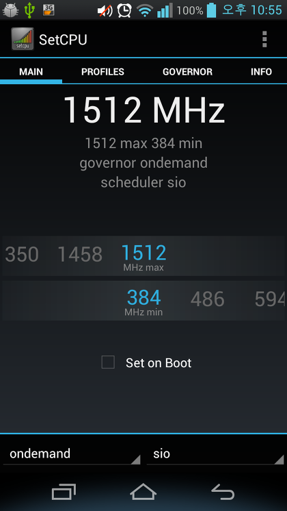
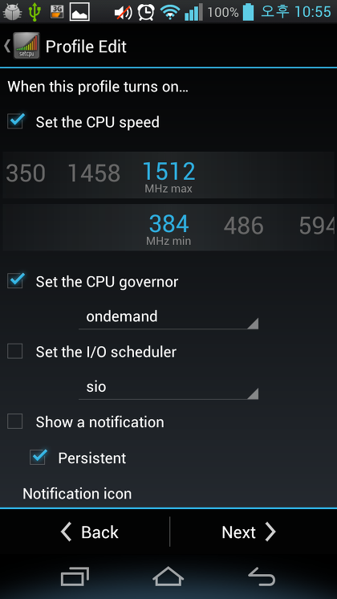
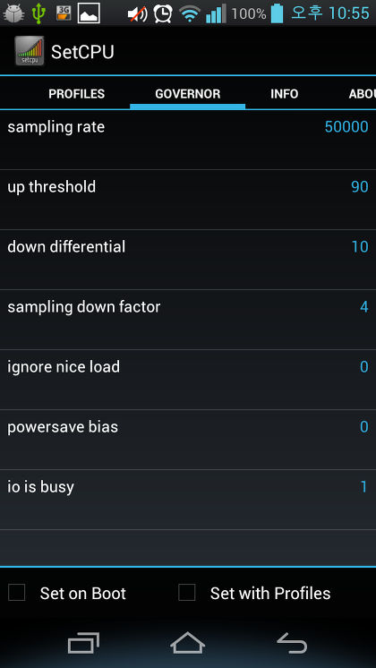
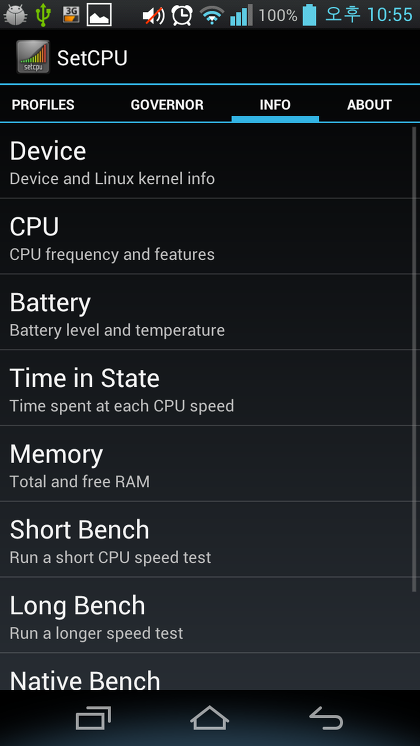

안녕하세요

After Rooting 강좌의 두번째 시간이 다가왔습니다 ㅋ

이번시간에는 SetCPU라는 어플을 이용하여 스마트폰의 CPU를 조절해 보도록 하겠습니다.

SetCPU의 첫 모습입니다 ㅋ

슬라이더를 양옆으로 밀어서 클럭을 조절할수 있습니다

또한 아래에서는 가버너와 IO스케쥴러를 조절할수도 있습니다

Setcpu의 프로파일 기능입니다

이것은 만약 스마트폰이 ~ 상황에 처하게 되면

클럭을 ~로 조절한다 라는 기능이라 생각하시면 될듯 합니다

Profile을 설정할수 있습니다

최대/최소 클럭과 가버너, io scheduler를 결정할수 있습니다

가버너 추가 설정(?) 부분인데요

ondemand등의 가버너는 저렇게 추가로 상세 설정을 설정할수 있습니다

기타 스마트폰의 info를 확인할수도 있습니다

위 사진처럼 cpu를 조절할수도, 확인할수도 있습니다

또한 오버클럭을 할때 테그라크 커널등으로 오버클럭을 한다음 이 어플으로 cpu를 조절하며 씁니다

루팅을 하셨다면 꼭 한번씩 설치해봐야 할 어플이 아닐까요?ㅋ

참고로 SetCpu.apk는 유로 어플이며 무료 어플으로는 Antutu CPU master이라는 어플이 있습니다
