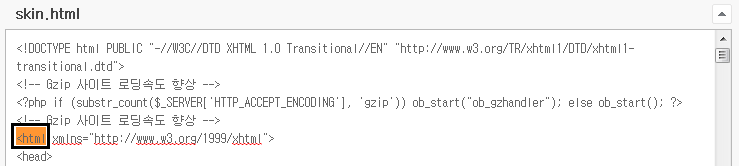
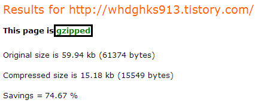

이 팁은 적용되지 않습니다

티스토리 스킨에서는 php의 적용을 허락하지 않아 gzip압축 코드를 붙히나 마나 입니다

티스토리는 css, html등을 자체에서 압축합니다

안녕하세요 ㅋ

"티스토리 강좌" 게시판에 티스토리 블로그에 관한 팁과 강좌를 찾게 된다면 게속 포스팅 할수 있도록 노력하겠습니다(?)ㅋ

이번에는 티스토리의 로딩속도를 개선해 보는 시간인대요

요즘들어 너무 느려진 티스토리 블로그..

그래서 한번 개선해 보도록 하겠습니다

방법은 간단합니다 ㅋㅋ

<?php if (substr_count($_SERVER['HTTP_ACCEPT_ENCODING'], 'gzip')) ob_start("ob_gzhandler"); else ob_start(); ?>

위 코드를 복사한다음

관리자 모드 - HTML/CSS 편집에 들어가 `<html>` 위에 넣어주시면 됩니다

[gzip 코드.txt](./files/gzip 코드.txt)

위 사진처럼 <html 위에 넣어주시면 끝입니다 ㅋ

한번 테스트 해볼까요?

http://aruljohn.com/gziptest.php

위 사이트에 접속해 주세요

사이트는 gzip이 잘되었는지 확인할수 있는 사이트 입니다

저렇게 주소를 넣어주신다음 Check compression을 클릭해 주시면

This Page is **Gzipped**

라 뜨며 gzip이 완료된것을 확인할수 있습니다

원본 사이즈는 59.94 kb이었던것을 15.18 kb로 압축했다고 하네요 ㅋㅋㅋ

페이지 로딩시간을 측정할수 있는 사이트 http://webwait.com/ 에 접속해서 접속 시간을 확인해 볼수도 있습니다

꼭 한번 적용해 주세요 ㅎㅎㅋㅋ

---

## 첨부파일

- [gzip 코드.txt](./files/gzip 코드.txt)
