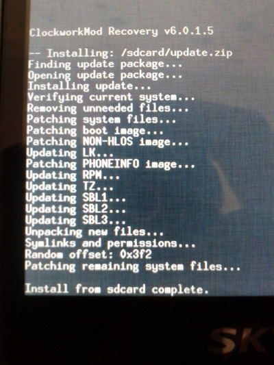

어쩌다가 보니 베가레이서2 펌웨어가 최신 버전 1.40버전이 아닌 1.34버전으로 내려오게 되는바람에..

이때다 해서 업뎃집을 뽑았습니다

그런다음 CWM을 깔아서 적용ㅋㅋㅋㅋㅋㅋㅋㅋㅋㅋ

ㅋㅋㅋㅋㅋㅋㅋㅋㅋㅋㅋㅋㅋㅋㅋㅋㅋㅋㅋㅋㅋㅋㅋㅋㅋㅋㅋㅋㅋㅋㅋㅋㅋㅋㅋㅋㅋㅋㅋㅋㅋㅋㅋㅋㅋㅋㅋㅋㅋㅋㅋㅋㅋㅋㅋㅋ

위 사진처럼 적용했습니다 ㅋㅋㅋㅋㅋㅋㅋㅋㅋㅋ

문제되는 updater-script구문은 지웠고요 ㅋㅋㅋㅋㅋㅋㅋㅋㅋㅋ
