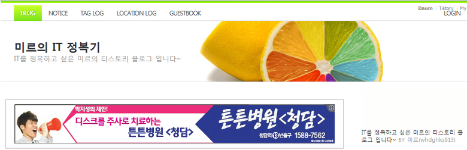
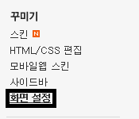
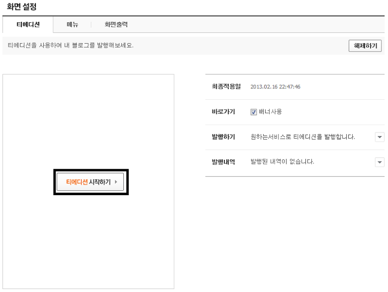
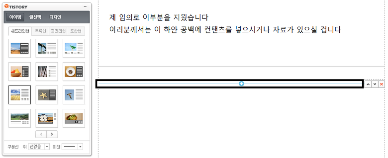
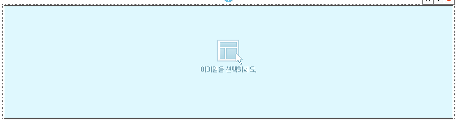
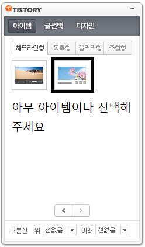
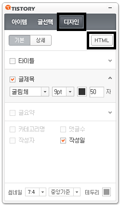
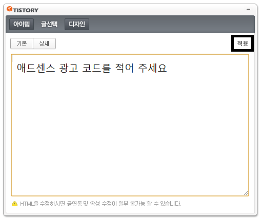

안녕하세요

애드센스 관련 강좌가 벌써 총 4편이나 나오게 되었습니다

그만큼 애드센스 관련해서 작업할수 있는게 많다는 뜻이겠죠?

기존 강좌를 한번 읽어보시는게 작업하시는대 수월하실듯 합니다

[2013/02/12 - [강좌/팁/티스토리 강좌] - [3편] 구글 애드센스 광고에 테두리를 넣어보자!](/archive/itmir/2013/126)

[2013/02/06 - [강좌/팁/티스토리 강좌] - [2편] 모바일 티스토리에 구글 애드센스 (Google Adsense)를 넣어보자](/archive/itmir/2013/111)

[2013/02/05 - [강좌/팁/티스토리 강좌] - [1편] 티스토리에 구글 애드센스 (Google Adsense)를 넣어보자](/archive/itmir/2013/110)

이번에는 티스토리의 메인 페이지에 애드센스를 넣어보도록 하겠습니다

제 메인화면을 한번 볼까요?

위 사진을 보시면 아시다싶이 제 메인화면에는 두개의 광고가 게재되어 있습니다

이 포스팅에는 이렇게 광고를 게재하는 방법을 알아보도록 하겠습니다

먼저 티에디션을 설정하셔야 합니다

관리자 메뉴에 들어간다음 꾸미기-화면 설정에 들어가게 되면 티에디션을 설정할수 있는 화면이 나타나게 됩니다

티에디션을 설정해 주세요

그다음 시작해 주시면 됩니다

"티에디션 시작하기" 버튼을 눌러 주세요

그럼 티에디션을 설정하는 화면이 나타나게 됩니다

자신이 직접 메인화면을 꾸밀수 있습니다

모두 꾸미신다음 광고를 넣을 적당한 위치에 있는 (+)버튼을 눌러주세요

그럼 아이템을 선택하세요 라는 글씨를 볼수 있습니다

옆에 있는 티에디션 리모컨으로 아이템을 아무거나 선택해 주세요

아무거나 클릭해 주시면 됩니다

선택 하셨으면 디자인 탭을 누른다음 HTML을 클릭해 주세요

그럼 html코드가 엄청나게 기록되어 있을겁니다

코드를 모두 지워주세요 (컨드롤키+A를 누르시면 전체선택이 가능합니다)

그다음 빈칸에 애드센스 광고 코드를 넣어주신다음 적용 버튼을 눌러주시면 됩니다

마지막으로 오른쪽 상단의 적용하기를 누르신다음 메인 페이지로 돌아오시면 끝나게 됩니다

이렇게 티에디션을 이용한 메인 페이지에 구글 애드센스 광고 달기를 알아보았습니다 ㅎㅎ

모두 애드센스 많이 이용해서 부자되시길 ㅋ

참고로 이 강좌는 ZERY님의 압박(???)으로 작성되었습니다 ㅋㅋ