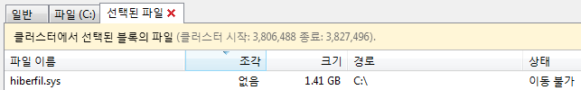
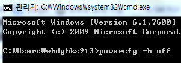

컴퓨터를 사용하다 보면 많은 분들이 하드디스크의 파티션을 나눠 효율적으로 사용하길 원할겁니다.

대부분 C드라이브와 D드라이브를 나눠 사용할탠데요.

제가 권장하는 C드라이브의 크기는 80GB입니다.

전 100GB를 C드라이브에 할당해서 사용하고 있고요.

컴퓨터를 많이 쓰다보면 조각모음을 해야 하는 경우가 있습니다.

조각모음을 하다 Hiberfil.sys 이라는 파일을 발견했는데요.

이 파일은 뭘까요?

저렇게 Hiberfil.sys파일이 1.41GB의 크기로 이동불가 상태로 있습니다..

이 파일은 바로 최대 절전모드 파일입니다.

윈도우를 쓰다보면 최대 절전모드를 보실수 있습니다.

시작-종료 [>] 버튼을 누르면 최대 절전모드를 볼 수 있습니다.

만약 그냥 절전만 있다면 하이브리드 절전이 실행되고 있다는 뜻입니다.

이부분에 대해서는 나중에 포스팅할 기회가 있을겁니다.

아무튼 이 최대절전 모드는 메모리(RAM)에 있는 자료를 하드디스크에 저장한다음 완전종료를 하는것 입니다.

다시 킬때는 저장한 파일에 있는 자료를 램에 다시 넣는 방식이죠.

이때 사용하는 파일이 바로 Hiberfil.sys 파일입니다.

대부분 최대 절전모드를 사용한다면 자신의 램크기와 비슷한 Hiberfil.sys파일이 C:\에 있습니다.

이렇게 위 사진처럼 말이죠 ㅋ

하지만 이 기능을 사용하지 않는다면 하드디스크 공간만 차치하게 됩니다.

어떻게 하면 이 기능을 끌수 있을까요?

powercfg -h off

위 구문을 cmd창에 입력해 주시면 됩니다.

그렇다면 다시 이 기능을 키려면 어떻게 할까요?

powercfg -h on

을 입력해 주시면 활성화 됩니다. ㅋㅋ

SSD처럼 용량이 작은 컴퓨터라면 이런 기능은 꺼줘야 용량을 확보할수 있습니다.

최대 절전모드를 사용하지 않는 컴퓨터라면 이 기능을 꺼줘서 하드디스크 공간을 확보할수 있도록 합시다!
