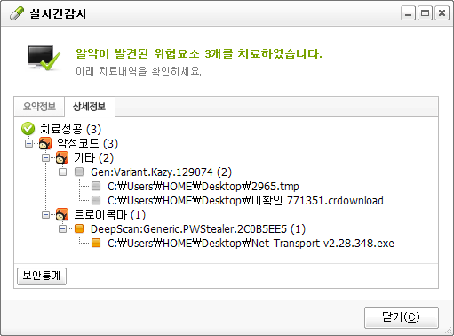
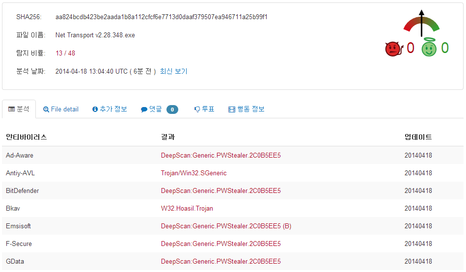
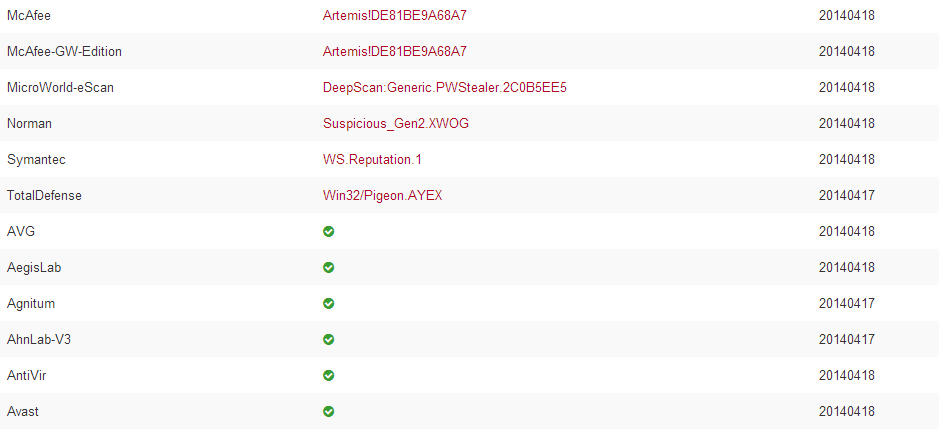

mms라 해서 SMS와 비슷한 문자 발송의 종류 MMS와 혼동해서 들어오시는 분들이 안 계시길 바랄께요. ㅋㅋ

mms://~/ 으로 구성된 movie/file등을 다운로드 받으려고 하는대 다운로드가 안 될때 아래 방법을 사용해 보세요.

Net Transport으로 다운로드를 실행한다.

mms://를 rtsp://로 바꾼다음 시도한다.

제경우 rtsp://로 바꾼다음 다운로드를 시도하니 정상적으로 다운로드가 이루어 졌습니다. ㅋ

유용한 팁이 되었으면 하네요. ㅎ

hide

혹시 몰라 Net Transport v2.28.348을 올려두겠습니다.

포터블 파일 입니다~

첨부된 파일이 바이러스로 탐지된다는 덧글이 있어 알약 확인 결과 아래와 같은 결과가 나타났습니다.

그러나 이 파일은 V3에서 탐지가 안되는 파일이었습니다.

진단명 : DeepScan:Generic.PWStealer.2C0B5EE5

바이러스 검사 사이트에서 파일을 검사해본 결과 일부 백신에서 바이러스로 검사하는것을 찾을수 있습니다.

<https://www.virustotal.com/ko/file/aa824bcdb423be2aada1b8a112cfcf6e7713d0daaf379507ea946711a25b99f1/analysis/1397826280/>

다음(Daum)의 악성코드 탐지에도 탐지되지 않았습니다. (악성코드로 판명되면 메일이 날라오고, 다운로드 제한됩니다.)

그러나 일부 백신에서 바이러스로 탐지되는 파일을 올려둘수는 없어 파일을 삭제 처리 했습니다.

불편을 끼쳐드려 죄송합니다.
