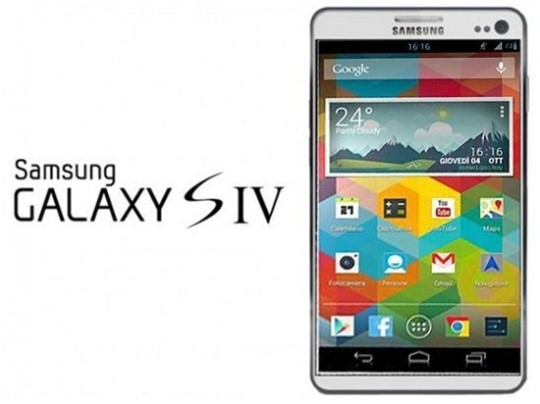
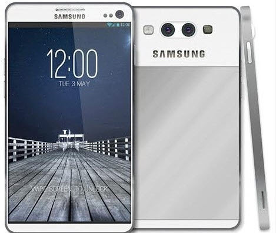
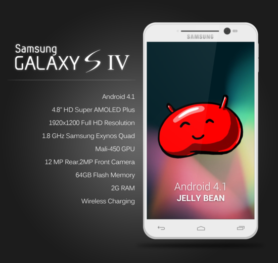
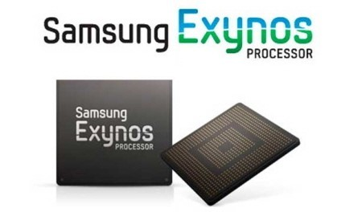
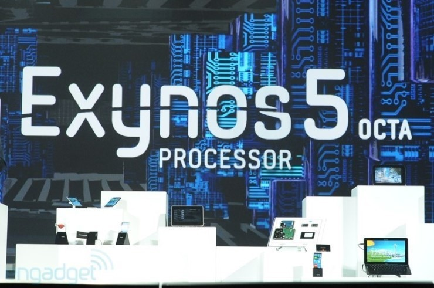

갤럭시로 안드로이드의 대박(?)을 가져온 삼섬이 Galaxy시리즈의 4번째 작품, Galaxy S4의 출시를 앞두고 있다고 합니다

(앞두고 있다 해도 반올림 해서 약 한달의 시간을 기다려야 하겠죠?)

Samsung Galaxy S IV (루머 사진)

지금까지 나온 루머에 따르면 S4는 위 사진의 디자인 일수도 있다 합니다

물론 루머이니 100%를 믿으시면 안된다 생각됩니다

이렇게 갤럭시 노트와 비슷한(?) 디자인으로 출시 될수도 있다는 루머도 돌고 있는대요

디자인이 어떻게 생겼든 빨리 보고싶긴 합니다 ㅋ

저 2개의 카메라는 옵티머스 3D의 디자인을 연상시키는군요

(혹시 3D를 지원하는건 아닌지...?)

아직 S4의 정식 디자인이 발표되지 않아서 모든 디자인은 루머라는것에 촛점을 맞춰 글을 읽어주시길 바랍니다

예상 스펙(과 디자인이 또다른 루머)입니다

위 사진을 보면 젤리빈이 탑제되어서 출시될것 같으며 4.8 HD 아몰레드 액정을 탑제하고 쿼드코어를 탑제한다 되어있습니다

하지만 CPU의 경우 옥타코어가 탑제될 가능성이 더욱 신뢰할수 있을거라 생각됩니다

또한 무선 충전도 지원하게 되지 않을까? 라는 생각이 드는군요

개인적으론 아몰레드의 번인은 좀 심각한것 같아요 ㅋ

삼성 갤럭시 기종(일부 기종 제외)에 들어가 있는 Exynos CPU!

이번에는 Exynos 5 Octa 를 장착하고 나올 가능성이 있어보입니다

(사실 옥타코어까지 장착할 필요가 있을까? 라는 의문도 드는군요 쿼드코어 정도면 충분하지 않나요?)

많은 루머와 소문/추측을 낳고 있는 갤럭시 S4가 다음달 3월14일 공개될 것으로 알려졌는데요.

18일쯤 외신(샘모바일 등)에 따르면 삼성전자가 다음달 14일 갤럭시S4를 공개할 계획이라고 합니다.

Galaxy S4 빨리 한국에도 도착하였으면 하네요 ㅋㅋㅋ

(미국에 먼저 출시하지 말고 우리나라 먼저 출시하란 말이야!)
