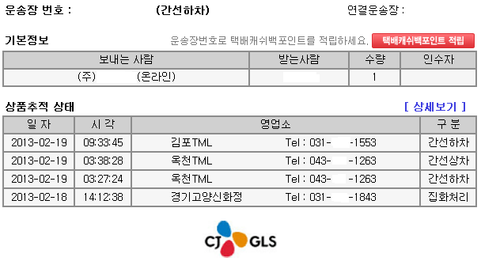
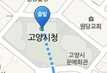
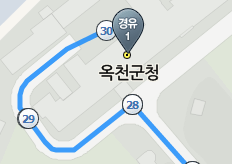
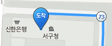
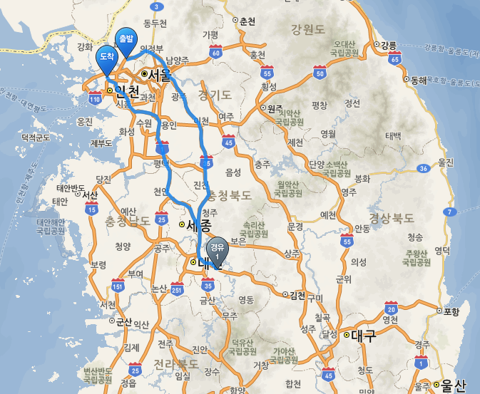
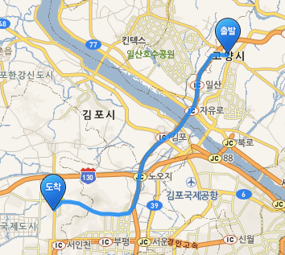

인터넷에서 책을 하나 구매했습니다.

빨리 왔으면 하는군요.

날짜는 일요일날 저녁에 구매했습니다 ㅋㅅㅋ

어제 집하처리되서 오늘 옥천 TML에 들어갔군요. ㄷㄷ

다행히도(?) 빨리 빠져나온듯 합니다.

(중요 개인정보는 제거하였습니다.)

배송 추적을 해보면 오늘 새벽 3시에 옥천 터미널에 들어갔군요 ㅋ

다행히 11분정도 지난다음 간선 상차가 되었습니다.

오늘 아홉시에 김포에 들어갔네요 그럼 언제 오는지 나원..

여기서 옥천 TML에 대해 알아봅시다.

옥천 터미널(TML)의 위치는 충청북도라고 합니다. ㅋㅋㅋㅋㅋㅋㅋㅋ

(참고 : [클릭](http://kin.naver.com/qna/detail.nhn?d1id=8&dirId=81302&docId=104119132&qb=7Lap7LKt67aB64+EIOyYpeyynOq1sCBUTUw=&enc=utf8&section=kin&rank=2&search_sort=0&spq=0&sp=1&pid=Rf7zQc5Y7vCsss%2FD6N4sssssssZ-040858&sid=USLyiXJvLBoAAC3zaR4))

그리고 집화 처리된 곳이 경기 고양시입니다.

배송 받을곳은 인천이고요.

그럼 저 택배상자가 어떤 경로로 오는지 한번 네이버 지도로 검색해 보겠습니다.

(시청/군청을 기준으로 설정하였습니다.)

출발지는 경기 고양시입니다.

출발지가 시청은 아니지만 정확한 출발 위치를 몰라 고양시청으로 지정하였습니다.

경유지는 옥천입니다 옥천TML이 충청북도에 있다기에 이렇게 설정하였습니다.

마지막으로 도착은 제가 사는곳 인천으로 설정하였습니다.

전체 화면을 볼까요?

ㅋㅋㅋㅋㅋㅋㅋㅋㅋㅋㅋㅋㅋㅋㅋㅋㅋㅋㅋㅋㅋㅋㅋㅋㅋㅋㅋㅋㅋㅋㅋㅋㅋㅋㅋㅋㅋㅋㅋㅋㅋㅋㅋㅋㅋㅋㅋㅋㅋㅋㅋㅋㅋㅋㅋㅋㅋㅋㅋㅋㅋㅋㅋㅋ

지방을 거쳐 다시 올라옵니다 이런ㅋㅋㅋㅋㅋㅋㅋㅋㅋㅋㅋㅋㅋㅋㅋㅋㅋㅋㅋㅋㅋㅋㅋㅋㅋㅋㅋㅋㅋㅋㅋㅋㅋㅋㅋㅋ

그러니 배달 속도가 이러죠..

수도권에서 보낸 택배가 옥천 지방으로 내려간다음 또다시 올라오는 케이스라는ㅋㅋㅋㅋ

이렇게 직진으로 오면 얼마나 좋을까요?

빠르게 올수 있을탠대...

그렇다면 왜 CJ택배는 모든 택배를 옥천으로 끓어 모으는 걸까요?

돈을 절약하기 위함이라 생각됩니다.

마지막 사진처럼 곧장 가려면 많은 차가 필요합니다.

왜냐하면 전국으로 택배가 날라가기(?)때문이죠.

그러나 한곳에서 모두 모인다음 다시 분산되면 지점당 차가 많이 필요하지 않습니다.

모두 모인다음 어디로 가는지 확인해서 맞는 차에 실어주면 그차는 옥천에서 다시 원래 있던 곳으로 돌아가게 되는거죠.

이런 시스탬으로 운영되는듯 합니다.

그래서 옥천에서 많이 모인 택배가 정상적으로 처리되지 않을경우 몇일씩 숙성되서(?) 나오는 경우가 허다하고,

그러므로 마의 옥천TML, 택배 블랙홀 이란 별명이 붙혀지게 되었죠. ㅋㅋㅋㅋㅋㅋ

그래서 설날등 명절에는 이렇게 택배가 바빠지는거군요. ㅋ

전국의 모든 택배가 한곳으로 모인다니...

미국도 이런 시스탬을 가지고 있다 합니다.

땅덩어리가 워낙 넓어서.. 모든 택배를 모은다음 다시 분산하는 방식이죠. ㅋ

아무튼 좀 빨리좀 왔으면 합니다. ㅠ
