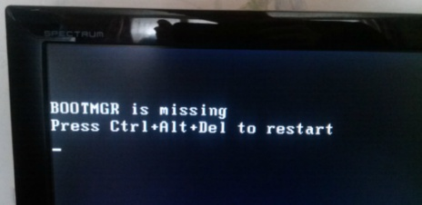
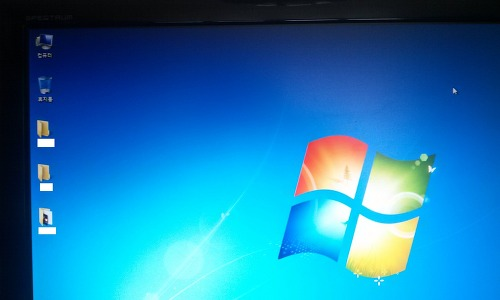

오늘 컴퓨터 정리를 뙇 하려고 C드라이브에 들어갔더니 헉!

깐적이 없는 기린(?)툴바 부터 안쓰던 게임이 마구자비로 깔려있길래 파일 정리와 프로그램 정리를 좀 하였습니다.

그중 C:\bootmgr.bat이라는 파일이 있길래 그냥 Del...

그다음 재부팅때 이런 문구가 뜨는군요. ㄷㄷ

BOOTMGR is missing  
Press Ctrl+Alt+Del to restart

ㄷㄷㄷㄷㄷㄷㄷㄷㄷㄷㄷㄷㄷㄷ 이제 컴퓨터는 ㅅㄱ가 된겁니다. ㄷㄷㄷㄷㄷㄷㄷㄷㄷㄷㄷㄷㄷㄷㄷ

그래서 복구를 해야겠지요?

잠깐 이유를 확인해 보면 예약 파티션에 들어있는 부팅파일을 지워서 위 사진과 같은 결과가 초래된다고 합니다.

bootmgr.bat의 역활에 대해 알아보면 "부트섹터에 위치하여 BCD(Boot Configuration Data)를 읽어서 OS를 선택할수 있게 해주는 역할을 한다"라고 합니다.

우린 몰라도 되죠. ㅋㅋㅋㅋ

복구 방법은 windows7을 설치했던 CD/USB를 넣어 bootmgr을 넣어주면 된다 합니다.

그래서 전 컴을 키자마자 F11(F12)를 눌렀습니다.

그때 생각난 하나.. 바이오스는 Del키였던것 같은데, F11이 왜 작동하지................

그래도 그냥 진행하니 HP컴퓨터의 복구 관리자 메뉴가 뜨는군요. ㅋㅋ

그래서 일단 재부팅을 하였습니다

그다음 다시 USB/CD를 넣고 부트메뉴가 뜨도록 눌렀는대... 타이밍을 놓쳤어요 Fail....ㅋㅋㅋㅋㅋㅋㅋ

근대 정상적으로 부팅이 되네요?!

부팅이 됐습니다 ㅇㅅㅇ?!!!

C를 확인해 보니 bootmgr파일은 없더군요...

이게 뭔일인지...ㅋㅋㅋㅋㅋㅋㅋㅋㅋ

아무튼 복구 끝!!!!!!(?)

하지만 진짜로 다급하신 분들을 위해 복구법을 아래에 더 쓰도록 하겠습니다.

설치 CD를 넣으신다음 처음 나타나는 화면에서 왼쪽 아래에 있는 **"컴퓨터 복구(R)"**을 눌러 주신다음,

**"시동 복구"**를 클릭해 주세요

자동으로 문제가 해결되었다면 정상적으로 재부팅이 이루어 질 것입니다. ㅎㅎ

제가 복구가 되는 바람에(?) 사진이 없군요.

원래는 기뻐해야 정상인데 지금은 기쁘진 않네요 왜그럴까요?ㅋㅋ 포스팅해야하는데 ㅋㅋㅋ

아무튼 오늘의 교훈은 수상한거 함부로 지우지 말자! 입니다 ㅋㅋㅋㅋㅋㅋㅋㅋㅋㅋㅋㅋㅋㅋㅋㅋㅋㅋㅋ
