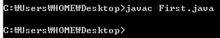
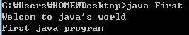

이 게시판은 제가 책과 강의로 배운 내용을 한 번 더 되짚어 보기 위한 게시판입니다.

또한 java를 참고하실 분들도 한번 둘러보실 수 있는 게시판이 되도록 만들고 싶습니다.

기본적인 JAVA SE설치와 PATH설정은 생략하도록 하겠습니다 (언젠가 포스팅을 할 기회가 있을겁니다.)

첫 번째 프로그램을 만들어 보자!

메모장이나 노트패드 ++을 사용하여 간단한 java프로그램을 만들어 보도록 하겠습니다.

(저는 메모장보단 노트패드++를 추천합니다.)

```java
class First {
 public static void main(String[] args) {
  System.out.println("Welcom to java's world");
  System.out.println("First java program");
 }
}
```

그 다음 파일 이름과 확장자를 각각 First와 .java로 지정해 주세요.

[First.java](./file/First.java)

아직 저도 정확한 용어의 뜻을 배우지 않은 상태이기 때문에 천천히 알아가겠습니다.

여기서 위 소스를 설명하자면 class 옆에 있는 **First**는 그 클래스의 이름입니다.

컴파일을 하면 클래스의 이름대로 [class이름].class 이렇게 나오지요.

그다음 main은 메소드(다른 언어에선 '함수'라고도 함)의 이름입니다.

java프로그램은 클래스와 메소드로 이루어져 있는데요. 이 영역은 괄호 { } 으로 구분됩니다.

System.out.println()은 일단 기본적인 내용만 살펴보자면, 괄호 안의 내용을 출력하라! 라는 일종의 명령입니다.

조금 더 자세히 살펴보면 간단하지만 복잡한 내용이 담겨 있으므로 지금은 넘어가겠습니다.

이제 cmd(명령프롬프트)창을 열어 파일이 저장된 위치로 이동해 주세요.

cd (폴더명)

을 입력하여 폴더를 이동할 수 있습니다.

예를 들어, 지금 "C:\Users\whdghks913>"에 있다고 가정해보겠습니다.

C:\Users\whdghks913 폴더 속에는 Desktop 폴더를 비롯한 여러 폴더와 파일이 있습니다.

이때, C:\Users\whdghks913\Desktop으로 이동하기 위해서는

cd Desktop

을 입력하시면 됩니다.

상위 폴더로 가시려면

cd ..

을 입력해주세요.

그 다음 .java파일을 class파일로 컴파일 해야 합니다.

> javac First.java

위 명령어로 java파일이 class파일로 컴파일 됩니다.

위 java 소스는 문제가 없는 상태이기 때문에 오류가 뜨지 않아야 합니다.

오류가 뜬다면 오타가 난 것이니 조심해 주세요.

오류가 뜨지 않는다면 아래처럼 나와야 합니다.



이렇게 말이죠.

이제 C:\Users\whdghks913\Desktop폴더에는 First.java파일뿐만아니라 First.class라는 파일도 생성되어 있을 겁니다.

이 파일을 마지막으로 java.exe로 실행시키면 우리가 설정한 코드가 실행되는 것이지요

> java First

여기서 중요한건 class파일을 실행할 때는 확장자를 붙이면 안된다는 겁니다.

java First.class라고 입력하면 오류가 발생합니다.



우리들이 입력한 문장이 나타났군요. ㅎㅎ

여기서 우리가 알 수 있는 것은 무엇일까요?

자바 프로그램을 실행하면  main 메소드 안에 있는 구문이 위에서 아래로 실행됩니다.

위에서 설명한 것처럼 클래스의 이름과 컴파일할 때 생성되는 파일의 이름은 같습니다.

System.out.println은 우리가 표현하고자 하는 문구를 출력합니다. 또한 출력이 끝나게 되면 행을 바꿉니다. (행을 바꾸지 않으려면 ln을 빼시면 됩니다. 자세한 내용은 package를 공부하시고 다시 돌아와서 확인해보세요.)

모든 구문 끝에는 세미클론 ;을 붙혀야 합니다.

이렇게 기초적인 내용을 마치게 되었습니다.

이제 마지막으로 System.out.println에 대해 좀 더 알아보도록 하겠습니다.

> System.out.println(2);
>
> System.out.println(7.77);
>
> System.out.println("6+5="+8);
>
> System.out.println(8+2);

위 구문을 컴파일해서 실행시키면,

2

7.77

6+5=8

10

이런 결과가 나타나게 됩니다.

여기서도 알 수 있는 건,

숫자는 ""가 없어도 표현이 됩니다.

소수점이 있어도 표현이 됩니다.

""으로 감싼 부분은 그대로 표현이 되며 이어서 표현하고 싶은 것은 + 기호로 이어 표현이 가능합니다.

8+2를 ""으로 묶지 않으면 덧셈이 됩니다 그러므로 +는 덧셈 기호입니다.

위 사실들을 자연스럽게 아실 수 있습니다.

왜 숫자는 큰따옴표 ""로 묶지 않아도 될까?라는 의문이 드셨다면, 메소드의 매개변수를 배우시고 다시 돌아와서 의문을 해결해보세요.

이제 java의 기초적인 내용을 마치게 되었습니다.

java는 위 내용보다 훨씬 쉽습니다.

제가 설명을 못해서 그러므로...ㅠ

이해해 주시길 바라며 오렌지 미디어 사이트 <http://orentec.co.kr/> 에서 회원가입시 평생 무료로 java강의를 볼 수 있으니 한번 보시는 것도 도움이 될 것이라고 생각됩니다. ㅎㅎ

---

## 첨부파일

- [First.java](./files/First.java)
