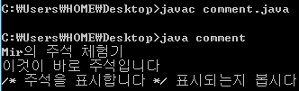
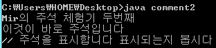
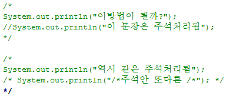

C언어 등 모든 언어에는 주석이 있다고 알고 있습니다.

참고로 쉘 스크립트(.sh)에도 #으로 주석을 표시합니다.

그리고 HTML에서는 <!-- -->으로 표현한다고 합니다.

java에서도 당연히 주석이 존재하는데요.

java에서는 주석을 어떻게 표현하는지 알아보도록 하겠습니다.

먼저 /\* , \*/ 주석이 있습니다.

이 주석은 블록 단위로 주석을 설정할 수 있습니다.

다음 소스를 확인해 보면서 주석을 체험해 봅시다.

```java
/*
파일의 이름: comment.java
만든이: 미르(whdghks913)
만든날짜:2013-02-20 */
class comment {
public static void main(String[] args){
  System.out.println("Mir의 주석 체험기");
  System.out.println("이것이 바로 주석입니다"); /* 주석을 표시합니다 */
  System.out.println(" /* 주석을 표시합니다 */ 표시되는지 봅시다");
  }
}
```

[comment.java

다운로드](./file/comment.java)

위 소스를 보면 /\* \*/ 주석이 삽입되어 있습니다.

그럼 이 java파일을 컴파일 하고 실행시켜보겠습니다.



처음 class위에 있는 파일 정보 부분은 나타나지 않았습니다.

또한 System.out.println의 마지막에 있던 주석도 표시되지 않았습니다.

아에 완전히 저 부분은 무시가 되는 겁니다.

여기서 알 수 있는 점은 주석은 위치에 관계없이 어디에나 넣을 수 있다는 점입니다.

그러므로 자신이 코멘트를 넣고 싶은 모든 위치에 넣으면 주석처리가 될 수 있다는 뜻이지요.

그러나 마지막 System.out.println을 보면 /\* \*/으로 감쌌지만 표시가 된 것을 볼 수 있습니다.

이처럼 아무리 /\* \*/(주석기호)로 감쌌다고 해도 큰따음표 ""안에 있는 주석은 그냥 표시가 된다는 점을 확인할 수 있습니다.

두 번째로 // 주석이 있습니다.

이 주석은 /\* \*/주석처럼 한 블록을 주석 처리 하지 않고 //이 있는 그 한 행만 주석 처리 한다는 점이 차이입니다.

소스로 직접 확인해 보겠습니다.

```java
//파일의 이름: comment.java
//만든이: 미르(whdghks913)
//만든날짜:2013-02-20
class comment2{
  public static void main(String[] args) {
    System.out.println("Mir의 주석 체험기 두번째!");
    System.out.println("이것이 바로 주석입니다"); // 주석을 표시합니다
    System.out.println("// 주석을 표시합니다 표시되는지 봅시다");
  }
}
```

[comment2.java

다운로드](./file/comment2.java)

마찬가지로 // 주석을 넣어 파일을 작성하였습니다.

javac명령어로 컴파일한 다음 실행시켜 보겠습니다.



위 /\* \*/주석을 넣었을 때와 마찬가지로 같은 결과가 나타났습니다.

//을 넣은 주석은 컴파일 되지도 않고 System.out.println의 끝에 넣은 // 주석도 표시 되지 않는군요. ㅎ

그러나 위와 마찬가지로 큰따음표 "" 안에 넣은 주석은 그대로 표시된다는 점을 알 수 있습니다.

위 두 개의 주석 기호를 통해 알 수 있는 점을 정리해 보자면,

1. 주석 기호는 /\*, \*/와 //이 있다.

2. 주석은 기본적으로는 어디에나 넣을 수 있다..

3. 그러나 큰 따옴표 "" 안에 있는 주석은 그대로 나타나며 주석의 역할을 하지 못한다.

이 세 개를 알 수 있습니다.

여기서 주석을 사용할 때 한 가지 잘못된 점을 짚어보도록 하겠습니다.

```java
class Nocomment {
public static void main(String[] args) {
  /*
    System.out.println("이방법이 될까?");
    //System.out.println("이 문장은 주석처리됨");
  */
  /*
    System.out.println("역시 같은 주석처리됨");
    /* System.out.println("/*주석안 또다른 /*"); */
  */
}
}
```

위 소스를 보면 첫 번째 /\* \*/주석에서 블록 단위 주석안에 행 단위 주석을 넣은 모습을 볼 수 있습니다.

그리고 두 번째 /\* \*/주석을 보면 블록 단위 주석안에 또 다른 블록 단위 주석을 넣은 모습입니다.

언뜻 보면 둘 다 맞는 사용법이라 컴파일 오류가 나지 않을 거라 생각됩니다.

그러나 정작 컴파일 해보면 오류가 발생합니다.

두 번째 블록 단위 주석에서 오류가 발생하지요.

/\*이 들어가게 되면 그 순간부터 주석으로 인식됩니다 그리고 쭉 진행하다 처음으로 나타나는 \*/까지를 주석으로 인식해 버립니다.

그러므로 마지막 \*/은 주석이 시작하는 /\*을 찾지 못한다는 오류가 발생하게 되는 것 입니다.

노트패드 ++을 보면 주석의 색이 달라져 한번에 확인하기 쉽습니다.



주석은 녹색으로 표시됩니다.

그러나 마지막 \*/을 보면 녹색으로 표시되지 않고 일반 구문 색인 검정색으로 표현되는 것을 알 수 있습니다.

그러므로 마지막의 \*/이 짝을 찾을 수 없다고 울어서 오류가 발생하게 되는 것 이지요.

여기서 알 수 있는 사실은 블록 단위 주석(/\* \*/)안에 행 단위 주석(//)을 넣을 수 있으나.

블록 단위 주석 안에 또 다른 블록 단위 주석을 넣을 수는 없다는 사실입니다.

이렇게 java의 주석에 대해 알아봤습니다.

(강좌 형식으로 작성했는데 이 글을 읽으시는 분이 계실지 모르겠네요.. ㅠㅠ)

---

## 첨부파일

- [comment.java](./files/comment.java)
- [comment2.java](./files/comment2.java)
