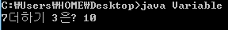

변수는 수학의 미지수와 비슷한 개념이라 생각하시면 됩니다.

한 문장으로 정리하면 "필요한 데이터를 저장하고 그 데이터를 불러오는데 쓰이는 메모리 공간" 이라고 정리가 가능하지 않을까요?

우리가 데이터를 저장/사용하기 위해서는 메모리 공간을 사용할 수 있게 할당해야 하고,

또한 저장한 데이터를 불러올 수 있어야 합니다.

이 두 가지를 모두 해결할 수 있는 것이 "변수"라는 존재입니다.

변수에는 몇 가지 종류가 있습니다 처음부터 다 설명하면 저도 이 글을 읽는 분들도 힘드니 하나하나 설명하겠습니다.

만약에 "제가 10이라는 숫자를 저장할거야! 그리고 저장한 메모리 공간의 이름을 number이라 할 거야!"라고 한다면 소스에 하나만 입력하면 됩니다.

> int number

ㅋㅋㅋㅋㅋㅋㅋㅋㅋㅋㅋㅋㅋㅋㅋㅋㅋㅋㅋ

완전 간단하죠?

이렇게 우리는 변수의 종류를 선택하고 그 변수에 이름을 지정할 수 있습니다.

여기서는 int가 변수의 종류(정확히는 자료형)를 뜻하고 number은 할당된 메모리 공간에 지정된 이름이 됩니다.

이렇게 변수가 선언 (각주: 컴파일러(javac가 되겠죠?)에게 어떤 행동을 하라는 것을 알리는 행위를 뜻합니다)되게 된다면 메모리의 공간이 할당되게 되고 접근을 위한 이름이 지정되는 겁니다.

그럼 한번 소스를 통해 알아보도록 하겠습니다.

```java
class Variable {
  public static void main(String[] args) {
    int number;
    number=7;
    int number2=3;
    int number3=number+number2;
    System.out.println("7더하기 3은? " + number3);
  }
}
```

[Variable.java](./files/Variable.java)

위 소스를 보겠습니다.

main메소드의 안을 잘 봐주세요.

int number를 선언했습니다.

그러므로 number이란 이름을 가진 메모리 공간이 할당된 것이죠.

그리고 그 다음 줄을 보면,

number=7;

이것은 number의 값을 7으로 바꾸라는 뜻입니다.

int number로 선언하게 되면 number는 int의 기본값인 0으로 설정되는데, 이를 7으로 지정한다! 라는 의미를 담고 있습니다.

마찬가지로 int number2=3;을 보면 number2라는 이름의 변수를 할당하는 동시에 3이란 값을 넣으라는 뜻이 됩니다.

이렇게 변수는 선언과 동시에 값을 넣어줄 수도 있고, 선언 후 나중에 필요할 때 값을 넣어줄 수도 있습니다.

마지막으로 System.out.println을 보면 "7더하기 3은? " + number3 이 있습니다.

이것은 큰 따옴표 안의 7더하기 3은? 을 표시한 다음 number의 값을 이어서 표시하란 뜻이 됩니다.

여기서 중요한 것은 number의 값을 이어서 표시한다는 사실입니다.

number라는 글자가 표시되는게 아니라는 거죠..!

한번 이 소스 파일을 컴파일한 다음 실행해 보겠습니다.



int 변수가 선언되고 System.out.println의 내용이 표시되었습니다.

이렇게 변수를 선언하고 초기화 (각주: 값을 처음으로 저장하는 행위를 뜻합니다) 하며 값을 표시하는 방법을 알아봤습니다.

int처럼 변수에 저장할 데이터의 종류와 크기를 설정하는 키워드를 자료형이라 합니다.

자료형은 여러 종류가 있습니다.

정수만 저장할 수 있는 자료형인 int, 실수만 저장할 수 있는 자료형인 double등이 있습니다.

한번 표로 정리해 보도록 하겠습니다.

|  |  |  |
| --- | --- | --- |
| 자료형 | 표현가능 | 메모리의 크기 |
| boolean | 참/거짓 | 1 byte |
| char | 문자 | 2 byte |
| byte | 정수 | 1 byte |
| short | 2 byte |
| int | 4 byte |
| long | 8 byte |
| float | 실수 | 4 byte |
| double | 8 byte |

이렇게 정리할 수 있습니다.

이처럼 java에서는 정수, 실수, 문자, 참/거짓의 총 4가지를 표시할 수 있는 자료형을 제공하고 있습니다.

위에서 int자료형을 사용한 것 처럼 위 표의 자료형도 같은 방법으로 사용하시면 됩니다.

그렇다면 여기서 드는 의문!

정수와 실수를 표현하는 자료형이 왜 여러 개 일까?

그건 바로 메모리의 크기가 다르며 또한 값의 표현 범위도 다르기 때문입니다.

일반적으로 정수 표현에는 int, 실수 표현에는 double을 사용합니다.

그리고 문자를 표현하는 char자료형은 한 글자만 저장이 가능합니다.

char han='한';

이렇게 한 글자씩 저장해야 합니다.

글자는 작은 따음표로 묶어주시면 되고요.

char charr=0xAE30

이렇게 유니코드를 직접 넣어도 됩니다 0x를 붙인 다음 유니코드를 입력해 주시면 되지요.

참고로 AE30은 "기"의 유니코드 문자입니다.

또한 boolean 자료형은 true와 false만 저장이 가능합니다.

java에서는 진실, 거짓이라는 두 가지를 정수, 문자, 실수와 같게 생각하지 않고 하나의 "자료"라고 생각합니다.

true와 false만 저장이 가능하지만 연산자를 집어넣어 연산의 결과로 T/F를 저장하게 할 수도 있습니다.

(아직 연산자를 배우지 않았으므로 아직까지는 모르셔도 됩니다.)

이제 변수와 자료형의 기본적 내용은 마쳤습니다.

그럼 변수의 이름에 들어가면 안되는 것을 살펴보겠습니다.

(변수의 이름이란 int number에서 number를 뜻합니다)

1. 변수의 이름은 숫자로 표현할 수 없습니다.

2. _와$외 특수 문자는 사용할 수 없습니다.

3. java에서 사용하는 예약 키워드(int, double등)는 사용할 수 없습니다.

이 세 가지의 제약을 지키면 변수의 이름을 짓는데는 문제가 없을 거라 생각됩니다.

이것으로 변수와 자료형에 대해 알아보고, 또한 변수를 선언할 수 있는 방법과 저장된 데이터를 읽어오는 방법에 대해 살펴보았습니다.

---

## 첨부파일

- [Variable.java](./files/Variable.java)
