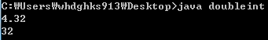

상수라는 용어는 이 강좌에서 처음 등장한 것이 아닙니다.

우리들은 전 강좌에서 상수를 사용했습니다.

> int no1=7777;
>
> ini no2=4+5;

전 강좌에서 자주 본 구문들입니다.

위 구문에도 상수가 존재하는데요. 7777과 4와 5 총 3개의 상수가 등장하였습니다.

이처럼 상수는 처음 등장한 개념이 아닙니다.

그렇다면 왜 이름이 상수일까요? 변수도 있는데 말이죠..

이유는 변수처럼 메모리 공간에 할당되어 저장은 되지만 변수처럼 한번 정하면 값을 이리저리 바꾸지 못하기 때문입니다.

이름이 주어지지 않기 때문에 값을 변경할 수도 없습니다.

그리고 상수는 필요가 없어지게 되면 바로 제거 됩니다.

메모리 공간에 남아있는 변수와는 다른 상수만의 특징이 되겠습니다.

그렇다면 상수는 어떻게 메모리 공간에 저장이 될까요?

전 강좌에서 정수를 저장할 때는 int자료형을, 실수를 저장할 때는 double자료형으로 작업한다고 했습니다.

그러므로 java는 모든 정수형 상수를 int 자료형으로 메모리 공간에 저장합니다.

마찬가지로 모든 실수형 상수를 double 자료형으로 저장하겠죠?

그럼 여기서 문제를 하나 내보도록 하겠습니다.

10000000000은 어떻게 메모리 공간에 저장할까요?

전 강좌에서 언급을 하진 않았지만 int형의 값 표현 범위는 -2147483648 ~ 2147483648 까지의 숫자만 저장할 수 있습니다.

그러므로 10000000000은 int형에는 저장할 수 없는 너무 큰 숫자인 것이지요.

값의 표현 범위를 넘어서기 때문에 우리는 int보다 표현 범위가 넓은 long형 변수에 저장해야 합니다.

만약 int형에 저 숫자를 넣게 되면 바로 오류가 발생하며 프로그램이 중지될 것입니다.

> long number=10000000000;

이렇게 변수 선언을 하면 정상적으로 컴파일이 될까요?

아닙니다 10000000000은 long변수에 넣을 수 있음에도 컴파일러는 오류를 뿜는군요.

그 이유를 간단히 설명해 드리자면 java는 별도의 표시가 없으면 무조건 정수는 int형, 실수는 double으로 표현한다는 것입니다.

그래서 long형 변수를 선언했음에도 불구하고 java는 int형에 넣으려 하는 것 이지요.

이런 이유로 '이 숫자를 long형 변수에 넣을 것 이다'라는 별도의 문구를 넣어줘야 합니다.

> long number=10000000000L;

이렇게 숫자 마지막에 접미사 L을 넣어주시면 컴파일 에러가 발생하지 않습니다.

이 접미사 L은 소문자로 써도 되며 이 정수를 long형 변수로 표현하겠습니다. 라는 뜻이 됩니다.

마찬가지로 float변수에도 위와 같은 문제가 발생하게 됩니다.

> float number=5.73;

이런 구문이 있는 java파일을 컴파일 해보면 또 문제가 발생합니다.

5.73은 float에도 저장될 수 있는 값인데 말이죠..

이 경우에도 java는 무조건 실수는 double으로 표현하려 하기 때문에 오류가 발생하는 것 입니다.

> float number=5.73F;

이렇게 float변수에도 마지막에 F를 넣어서 이 실수를 float에 넣겠다는 표시를 해야만 오류가 없이 진행됩니다.

이때 F도 소문자로 표현해도 가능합니다.

한번 소스를 보며 정리해 보도록 하겠습니다.

```java
class doubleint {
  public static void main(String[] args)
  {
    double n1=4.32;
    float n2=3.65f;
    long n3=10000000000L;
    long n4=32;

    System.out.println(n1);
    System.out.println(n4);
  }
}
```

[doubleint.java](./files/doubleint.java)

소스를 보게 되면 float 변수의 마지막에 f를 붙이는 것을 알 수 있습니다.

또한 long n3에서도 L을 붙여 long형 변수로 표시할 거라는 것을 알려주고 있습니다.



이렇게 말이죠. ㅋㅋ

(System.out.println을 귀찮아서 많이 안 만들었습니다.)

여기서 long n4=32를 보면 변수(long)와 변수를 초기화 하는 상수의 자료형(int)가 일치하지 않는 것을 볼 수 있습니다.

하지만 컴파일과 실행은 정상적으로 됩니다.

왜 그럴까요? 오류가 발생해야 할 텐데..

그 이유는 나중에 자동 형 변환 이라는 것을 배우게 되면 이해하실 수 있으실 겁니다.

지금은 int형 자료형이 자동으로 long으로 변환되었다는것만 알아두세요. ㅎㅎ

이렇게 상수에 대해 알아보고 상수를 저장하는 방법이 자동으로 바뀌며 어떤 경우는 접미사를 붙여야 된다는 점을 알게 되었습니다.

원래는 이어서 아래에 자료형의 변환에 대해 알아봐야 하지만 강좌가 길어지는 바람에 다음 편에서 포스팅 하도록 하겠습니다. ㅎㅎ

그럼 오늘은 이만 ~

---

## 첨부파일

- [doubleint.java](./files/doubleint.java)
