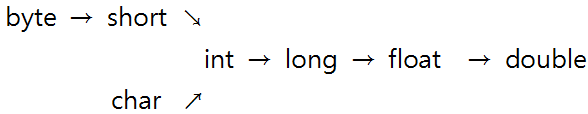

전 강좌 상수에 이어 강좌를 계속 진행 하도록 하겠습니다.

제목과 마찬가지로 자료형은 언제든지 필요에 따라, 연산을 위해 변환될 수 있습니다.

간단한 예를 들어 설명해 보도록 하겠습니다.

> short mir1=7;
>
> short mir2=6;
>
> short mir=mir1+mir2;

이런 코드가 있습니다.

위 소스에 나오는 상수는 아래와 같이 저장이 됩니다.

7 = 00000000 00000111

6 = 00000000 00000110

short형 변수에 저장되었기 때문에 2바이트로 저장이 됩니다.

하지만 cpu는 int형 변수만 계산할 수 있기 때문에 java는 자동으로 short형 변수를 int형 변수로 형 변환을 하게 됩니다.

7 = 00000000 00000000 00000000 00000111

6 = 00000000 00000000 00000000 00000110

이렇게 변환이 됩니다.

"그냥 0만 붙이면 되네요. ㅋㅋㅋㅋㅋㅋㅋㅋ 아주 쉽네 ㅋㅋㅋㅋㅋㅋㅋㅋㅋㅋㅋ"

라고 생각하실 수 있는대 이건 잘못된 생각입니다.

short와 int는 모두 정수를 표현하며 바이트 크기 차이만 있기 때문에 간단하게 변환이 이루어 집니다.

하지만 int형의 1과 float형의 1.0은 완전 다르게 표현이 됩니다.

1   = 00000000 00000000 00000000 00000001

1.0 = 00111111 10000000 00000000 00000000

이렇게 완전 다르게 표현이 되는겁니다.

그러므로 정수 1이 실수 1.0으로 형 변환 된다면 전혀 다른 비트로 구성되어 저장되는 것이지요.

여기서 형 변환이란? 값의 표현 방법을 바꾼다는 뜻입니다.

java에서는 두 가지의 형 변환이 존재하는데요.

먼저 연산을 위해 자동으로 변환되는 형 변환과, 우리가 직접 형 변환하는 두 가지 형 변환입니다.

그렇다면 형변환은 왜 해야 할까요?

이것을 살펴보기 위해 덧셈을 한번 해봅시다.

> 00000000 00000000 00000000 00000111 /\* 7 \*/
>
> 00000000 00000000 00000000 00000110 /\* 6 \*/
>
> +-----------------------------------
>
> 00000000 00000000 00000000 00001101 /\* 13 \*/

이렇게 CPU에서 연산이 이루어 집니다.

그렇다면 정수와 실수의 계산은 이렇게 이루어 질까요?

위에서 살펴본 int형의 1과 float형의 1.0을 가지고 더해보겠습니다.

>   00000000 00000000 00000000 00000001    /\* int형 1 \*/
>
>   00111111 10000000 00000000 00000000    /\* float형 1.0 \*/
>
> +----------------------------------
>
>   ???????? ???????? ???????? ????????

자료의 표현 방식이 다르니 계산도 불가능한 것 이지요.

1+1.0을 계산하기 위해서는 자료의 표현 방식을 일치 시켜 계산해야만 합니다.

이때 자료의 표현 방식을 일치 시키는 작업이 "형 변환"인 것 이지요.

이렇게 형변환이 이루어 지는 원인에 대해 알아봤습니다.

그럼 언제 자동으로 형변환이 이루어 질까요?

> double number=60;

위 구문을 보면 60은 int형 실수 입니다.

하지만 우리는 double형에 int형 데이터를 집어넣으려고 하고 있죠.

이때 자동 형 변환이 이루어 집니다.

그러므로 60이 60.0으로 변환된 다음 double 변수에 들어가는 거죠.

이렇게 java에서는 데이터의 손실이 전혀 발생하지 않는 경우나, 그 손실이 일부, 약간일 경우만 자동 형 변환을 하게 됩니다.

아래는 자동 형 변환의 규칙입니다.



위 순서대로 자동으로 형변환이 이루어 집니다.

단 화살표의 역순으로는 자동으로 이루어 지지 않습니다.

(long에서 float로 화살표가 있는 이유는 float는 오차를 포함하며 실수를 표현하기 때문에 값의 표현 범위가 더 많기 때문입니다.)

화살표 방향으로 자동으로 형 변환이 이루어 집니다. 그러므로 short형 변수는 int, long등으로 변환될 수 있는 것 이지요.

마지막으로 모든 데이터는 double까지 변환이 가능합니다.

한번 조금의 소스를 보며 응용해 보도록 하겠습니다.

> double num=20+3.2f;

이런 코드가 있습니다.

num변수에 값을 저장하기 위해 20+3.2f를 계산해야 합니다.

그런대 20은 int형이고 3.2f는 float형 입니다.

그러므로 자동 형 변환 규칙에 따라 int형 변수는 float변수로 형 변환이 이루어집니다.

20.0f+3.2f가 되는 것이지요.

그래서 23.2f가 만들어 졌습니다 이제 이걸 num에 저장하려 보니까.

변수의 자료형이 double형입니다.

마지막으로 float형 변수는 또다시 double형 변수로 변환되어 저장되는 것이지요.

이렇게 java에서 자동으로 이루어 지는 형 변환에 대해 알아봤습니다.

이제는 우리가 임의적으로 형 변환을 하는 방법에 대해 알아보겠습니다.

> long num=9999999999999L;
>
> int mir=(int)num;

위 코드를 보면 long형 변수 num을 int형 변수 mir에 저장하라는 뜻이 됩니다.

이처럼 자동 형 변환에 어긋나지만 형 변환이 필요한 상황에는 (자료형)을 앞에 넣어줘서 형 변환이 이루어졌다는 표시를 남길 수 있습니다.

그런대 long형 값을 int형에 넣는게 가능할까요?

가능합니다. 하지만 long은 8바이트고 int는 4바이트인 만큼 변환될 때는 4바이트가 짤려나가고 남은 4바이트가 저장이 됩니다.

즉 데이터의 손상이 발생합니다.

반대로 int형을 long으로 형변환 하려면,

int num=84;

long num2=(long)num;

이렇게 코드를 짜주시면 되지요.

물론 부족한 4바이트는 0으로 채워집니다.

그럼 형 변환을 이용해서 문자의 유니코드 값을 표현하는 소스를 만들어 보도록 하겠습니다.

```java
class Hangultest
{
public static void main(String[] args)
{
char hangul1='미';
char hangul2='르';
char hangul3='M';
int hangul4=(int)hangul3;
char hangul5=0x77;
System.out.println("이 소스를 만든사람은? "+hangul1+hangul2);
System.out.println("알파벳 M의 유니코드 문자는? "+hangul4);
System.out.println("유니코드 77은? "+hangul5);
}
}
```

[Hangultest.java](./file/Hangultest.java)

위 사진처럼 소스를 짜봤습니다.

char에 문자를 저장하려면 작은 따옴표로 감싸야 합니다.

그리고 int hangul4=(int)hangul3을 보면 hangul3을 int형 변수로 변환하여 hangul4에 저장하라고 표현하고 있습니다.

이때는 자동 형 변환 규칙에 따라 char → int 이므로 형 변환 표시 (int)가 없어도 자동으로 형 변환이 이루어 집니다.

참고로 char에 한글 등을 저장할 때는 UTF-8이 아닌 ANSI로 저장해야 컴파일 오류가 발생하지 않았습니다.

그 이유는 기본 인코딩이 MSM949으로 지정되어서 UTF-8은 컴파일 되지 않기 때문입니다.  
컴파일 하려면 javac -encoding utf-8 클래스명.java으로 하시면 됩니다.

이렇게 해서 자료형의 자동 변환/임의 변환에 대해 살펴봤습니다.

책으로 볼 때는 쉬운데 직접 체험하고 소스를 제가 짜보니 꽤 힘드네요...

시간이 남으면 틈틈이 복습 겸 써야겠습니다 ~

---

## 첨부파일

- [Hangultest.java](./files/Hangultest.java)
