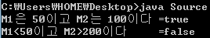
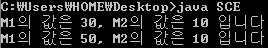

저번 시간에 살펴본 연산자에 이어 이번에도 연산자의 나머지를 설명하려 합니다.

연산자는 저번에 살펴본 것처럼 java에서 계산을 하도록 표현해 주는 기호라 생각하시면 됩니다.

이번 강좌까지 이항 연산자에 대한 설명을 모두 마칠 수 있도록 노력하겠습니다. ㅎㅎ

그럼 본격적으로 글을 시작하겠습니다.

이번에 살펴볼 연산자는 관계 연산자 입니다.

표로 정리해 보겠습니다.

|  |  |  |
| --- | --- | --- |
| 연산자 | 연산자 기능 | 결합방향 |
| < | EX) M < N  M이 N보다 작다 | → |
| > | EX) M > N  M이 N보다 크다 | → |
| <= | EX) M <= N  M이 N보다 작거나 같다 | → |
| >= | EX) M >= N  M이 N보다 크거나 같다 | → |
| == | EX) M == N  M이랑 N이 같다 | → |
| != | EX) M != N  M이랑 N이 다르다 | → |

이렇게 구분할 수 있습니다.

여기서 헷갈리시면 안되는데요.

<=와 >=는 복합 대입 연산자가 아닌가? 라고 생각하실 수도 있지만,

<=와 >=는 관계 연산자며 <<=와 >>=가 복합 대입 연산자입니다. 주의하세요.

부등호 다들 많이 보셨을 겁니다.

기능을 딱히 말하지 않아도 다들 짐작 하실 것입니다.

==가 자바에서 같다(equal)를 의미합니다 =은 대입을 의미하고요.

나머지는 딱히 혼동되지 않을 거라 생각됩니다.

이 관계 연산자는 연산의 결과로 정수/실수를 반환하지 않습니다.

다른 +, %같은 연산자는 수(int)를 반환하죠.

그러나 관계 연산자는 참과 거짓, 즉 true와 false를 반환합니다.

처음에 자료형 배울 때 boolean을 배웠죠?

이 boolean에 들어갈 참과 거짓만을 반환합니다.

예를 들면,

> number1==number2

이런 구문이 있다면.

number1과 number2가 같다면 true를, 다르다면 false를 반환하게 되지요.

이렇게 T(true)와 F(false)를 반환해서 어디에 써먹을까 궁금하신 분들은 다음/다다음 강좌쯤에 if~else를 배우실 때 아실 수 있을겁니다.

이렇게 true와 false는 자바 프로그램을 짜는데 매우 편리하며 정말로 유용하고 좋은 용도로 사용됩니다.

또한 이렇게 T와 F를 반환하는 연산자가 더 있습니다.

이름은 논리 연산자라 부르고 있습니다.

이 연산자는 조금 특이해서 헷갈리기 아주 쉽습니다. 저도 계속 헷갈리는군요.. ㅠ

마찬가지로 표로 정리해 보겠습니다.

|  |  |  |
| --- | --- | --- |
| 연산자 | 연산자 기능 | 결합 방향 |
| && | EX) A && B  A와 B모두 참이면 true를 반환한다 | → |
| || | EX) A || B  A와 B둘중 하나라도 참이면 true를 반환한다 | → |
| ! | EX) !A  A가 참이면 false를, 거짓이면 true를 반환한다 | ← |

이런 특징의 연산자도 존재합니다.

&&은 양옆 모든 피 연산자가 참이어야 true를, 하나라도 거짓이면 false를 반환하며,

||은 양 옆의 둘 중 하나라도 참이면 true를, 모두 거짓이면 false를 반환합니다.

마지막으로 !은 참이면 거짓을, 거짓이면 참을 반환하는 청개구리(?)연산자 입니다.

(참고로 !연산자는 단항 연산자 입니다, 이항 연산자가 아닙니다.)

그럼 소스파일을 보며 확인해 보도록 하겠습니다.

```java
class Source
{
  public static void main(String[] args)
  {
    int M1=50, M2=100;

    boolean MM1=(M1==50 && M2==100);
    boolean MM2=(M1<50 || M2>200);

    System.out.println("M1은 50이고 M2는 100이다 ="+MM1);
    System.out.println("M1<50이고 M2>200이다     ="+MM2);
  }
}
```

[Source.java](./files/Source.java)



이런 결과가 나타납니다.

boolean자료형으로 참과 거짓을 저장한 다음 표시하는 소스입니다.

M1이 50이고 M2가 100이므로 둘 다 진실이므로 &&연산에 의해 true가 나오며,

M1<50, M2>200이 모두 거짓이므로 ||연산에 의해 false가 나타납니다.

이제 이항 연산자에 대한 설명이 끝나가고 있습니다.

마지막으로 Short-Circuit Evaluation (SCE)에 대해 알아보겠습니다.

영어죠.. 한글로 바꾸고 싶어도 정해진 표현이 없는 현실입니다.

그래서 제 나름대로 뜻을 풀어 봤는데요.

"빠른 연산을 위해 태어난 계산 방식"

아무튼 이게 뭔지 살펴보겠습니다.

```java
class SCE
{
  public static void main(String[] args)
  {
    int M1=10, M2=10;
    boolean sce;

    sce=(M1+=20)<0 && (M2+=30)>50;
    System.out.println("M1의 값은 "+M1+", M2의 값은 "+M2+" 입니다");

    sce=(M1+=20)>0 || (M2+=30)>50;
    System.out.println("M1의 값은 "+M1+", M2의 값은 "+M2+" 입니다");
  }
}
```

[SCE.java](./files/SCE.java)

출력 결과를 예상하자면 첫번째 println에서는 M1은 30, M2는 50이 되어야 합니다.

두 번째 println에선 M1은 50, M2는 80이 되어야 하고요.

하지만 출력 결과를 보면 값은 다르게 나타납니다.



M1의 값은 모두 정상이지만 M2는 값이 변하지 않았습니다.

이 말은 &&와 ||의 오른쪽이 연산 되지 않았다는 뜻입니다.

이런 계산 방식이 SCE입니다.

&&은 왼쪽 피 연산자가 false면 오른쪽이 참이든 거짓이든 무조건 출력 결과가 false입니다.

또한 ||도 왼쪽이 true면 오른쪽이 참이든, 거짓이든 무조건 true가 되는 것이지요.

이렇게 오른쪽을 연산하던지 안하던지 결과 값이 이미 나올 수 있는 경우에는 연산 속도를 위해 java는 오른쪽 연산을 하지 않습니다.

이렇게 빠른 연산을 위해서 오른쪽 값에 상관없이 연산의 결과가 나오는 경우에 연산을 하지 않는 것이 SCE입니다.

이것이 SCE가 주는 장점이자 단점입니다.

그러므로 우리는 위 코드와 같은 문구를 사용해서는 안되는 거지요..

이렇게 이항 연산자에 대해 알아봤습니다.

다음에는 단항 연산자와 비트 연산자에 대해 알아보겠습니다~

---

## 첨부파일

- [SCE.java](./files/SCE.java)
- [Source.java](./files/Source.java)
