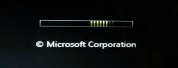
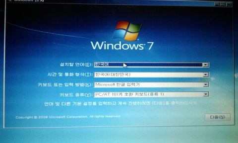
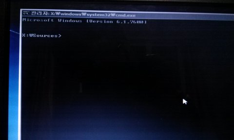
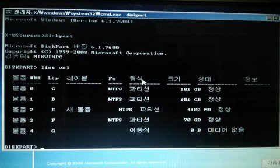
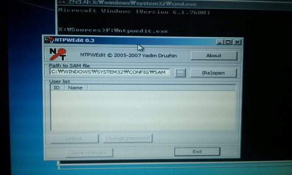
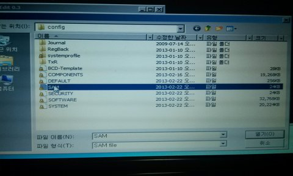
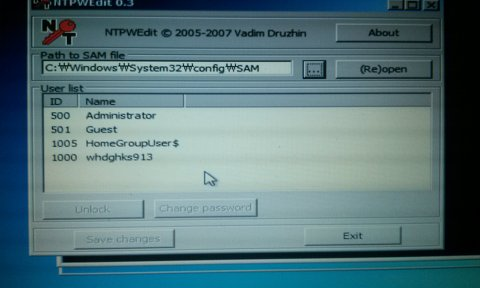
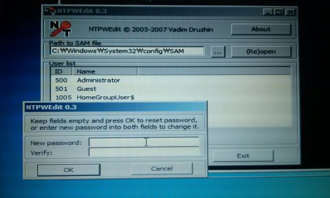
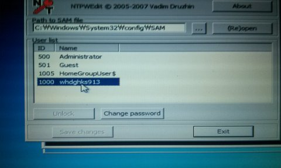

다들 윈도우 잘쓰시고 계시나요?

윈도우를 쓰다 가장 어이 없는일.. 바로 로그온(로그인)암호를 잊어버리는 일입니다.

잊어버렸다고 혹시 윈도우 재설치를 하시진 않으신가요?

이럴때 쓰는 정말 좋은 프로그램이 있습니다.

바로 ntpwed입니다.

이 프로그램으로 윈도우의 암호를 변경/제거할수 있습니다.

(하지만 **암호 해독은 불가능** 한점 알아두세요ㅋㅋ)

원리를 설명하자면,

C:\WINDOWS\SYSTEM32\CONFIG\SAM파일이 윈도우 암호를 저장하고 있습니다.

ntpwed 프로그램으로 SAM파일을 수정해서 로그인 암호를 변경할 수 있는겁니다.

그러나 윈도우를 돌리고 있을때는 이 파일이 사용 중이기 때문에 접근과 변경이 불가능합니다.

그러므로 부팅 CD혹은 부팅 USB를 이용하여 프로그램을 실행한 후 접근하는 방법을 사용하는 경우가 대다수입니다.

일단 이 프로그램을 사용하기 위한 환경이 갖춰져야 합니다.

> 1. 윈도우 설치 CD/USB에 ntpwed프로그램이 들어있는경우
>
> 2. 응급 복구 모드으로 부팅해서 접근할수 있는 경우  
> 3. 하드디스크는 같은데 다른파티션에 설치된 윈도우로 부팅할수 있는경우

이 세 가지 중에서 만족하는 경우로 접속하시면 됩니다.

그냥 ntpwed프로그램을 실행할 수만 있으면 됩니다.

그러므로 저는 윈도우7 설치 USB를 이용하여 암호를 제거해 보도록 하겠습니다.

(필수로 USB등에 ntpwed 프로그램을 넣어주셔야 합니다.)

부트 메뉴/바이오스등으로 USB(CD)로 부팅해 주세요.

윈도우 설치 CD로 진입하는 화면입니다.

이런 화면이 뜨실겁니다.

이때 **Shift키**와 **F10**을 눌러 명령 프롬프트를 실행해 주세요.

이렇게 명령 프롬프트가 나타났습니다.

이제 ntpwed프로그램을 실행해야 합니다.

명령 프롬프트로 프로그램을 실행해야 합니다.

EX) (파티션 경로):\ntpwed.exe

지금 연결된 파티션을 확인해 보겠습니다.

**diskpart**를 입력하신다음 **list vol**을 또다시 입력하시면 연결된 파티션이 나타납니다.

ntpwed프로그램이 들어있는 디스크를 찾아 주세요.

제경우 F 디스크에 들어있습니다.

명령 프롬프트에 **F:\ntpwed.exe** 이런씩으로 프로그램이 있는 경로를 입력해 주시면 프로그램이 실행됩니다.

처음 프로그램을 실행하면 아무것도 안뜨게 됩니다. (Re)open을 눌러보세요.

그래도 나타나지 않을경우 [...]을 눌러 파일을 찾아봅시다.

대소문자를 구분하지 말고 C:\WINDOWS\SYSTEM32\CONFIG에 들어가 SAM을 열어주시면 됩니다.

그럼 유저 정보가 나타나게 되는데요.

편집하고자 하는 계정을 클릭하여 Change password를 클릭해 주시면 됩니다.

새로운 비밀번호를 입력해 주신다음 OK를 눌러주시면 됩니다.

말씀드린것 처럼 변경은 가능하지만 암호 해독은 불가능합니다.

이렇게 변경이 끝났습니다.

또한 Administrator계정의 비활성화/활성화도 가능합니다.

모든 작업이 끝났다면 Exit버튼을 눌러 닫으신다음 재부팅 하시면 됩니다.

그럼 모두 암호를 뚫기 바라며 글 마치도록 하겠습니다. ㅋㅋ

[ntpwed04.zip](https://github.com/itmir913/archive/releases/download/itmir-attachments/ntpwed04.zip)

04버전으로 64비트 버전이 포함되어 있습니다

---

## 첨부파일

- [ntpwed04.zip](https://github.com/itmir913/archive/releases/download/itmir-attachments/ntpwed04.zip) `109 KB`
