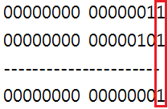
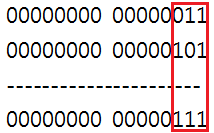
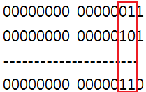
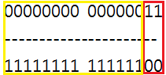

이번 강좌가 비트 연산자를 끝내는 강좌와 동시에 연산자를 끝내는 강좌일 듯 합니다.

잘 따라와 주세요!

비트 연산자란? 비트 단위로 연산하는 연산자입니다.

비트는 뭘까요?

"정보량의 최소 기본 단위. 1비트는 이진수 체계(0, 1)의 한 자리로, 8비트는 1바이트이다."

네이버 국어사전 결과입니다.

여기서 비트 연산자를 사용하려면 무조건 피 연산자가 정수여야 합니다.

실수를 가지고 비트 연산을 하는 게 의미도 없고, 실수는 값의 표현 체제가 정수랑 완전 다르기 때문입니다.

아무튼 비트 연산자에 대해 살펴보겠습니다.

|  |  |  |
| --- | --- | --- |
| 연산자 기호 | 연산자 기능 | 결합 방향 |
| & | 비트단위로 &(AND)연산을 합니다 | → |
| | | 비트단위로 |(OR)연산을 합니다 | → |
| ^ | 비트단위로 ^(XOR)연산을 합니다 | → |
| ~ | 피 연산자의 모든 비트를 반전시켜 나온 결과를 정수로 묶어 반환합니다 | ← |

이런 연산자로 비트 연산을 하게 됩니다.

어디서 많이 본 연산자 아닌가요? 논리 연산자의 기호와 비슷합니다.

비트 연산자는 비트 단위로 연산을 하며 연산 된 결과를 묶어서 하나의 정수로 계산한 다음 결과를 반환하게 됩니다.

그럼 하나하나 특징을 살펴보도록 하겠습니다.

&연산자는 &&연산자와 비슷합니다.

두 피 연산자(정수)의 비트를 비교하여 비트가 모두 1일 때만 1을 반환하는 연산자 입니다.

위 그림을 보시면 이해가 쉬우실겁니다.

이렇게 피 연산자의 비트를 비교해서 모두 1일때만 1을 반환하게 됩니다.

|연산자는 ||연산자와 비슷한데요.

둘 중 하나만 1이 있어도 1을 반환합니다.

이렇게 말이죠.

하나라도 1이 있으면 1을 반환하게 되지요.

^연산자는 두 비트가 다를 경우 1을 반환합니다.

이렇게 두 비트가 모두 다를때만 1을 반환하는 연산자 입니다.

마지막으로 ~연산자는 모든 비트를 반전 시킵니다.

이렇게 1은 빨간 선처럼 0으로, 0은 노란 선처럼 1로 반전 시키는 연산자 입니다.

이렇게 해서 비트 연산자에 대한 설명은 마쳤습니다.

이제 비트 쉬프트 연산자에 대해 알아보겠습니다.

여기서 쉬프트란 키보드의 (Shift)와 같은 단어입니다. ㅋㅋ

이 연산자도 비트 연산자와 같이 피 연산자가 모두 정수여야 합니다.

|  |  |
| --- | --- |
| 연산자 기호 | 연산자 기능 |
| << | 피 연산자의 비트열을 왼쪽(←)으로 이동  이동에 따른 빈공간은 0으로 체움 |
| >> | 피 연산자의 비트열을 오른쪽(→)으로 이동  이동에 따른 빈공간은 양수일경우 0으로, 음수일경우 1으로 체움 |
| >>> | 피 연산자의 비트열을 오른쪽(→)으로 이동  이동에 따른 빈공간을 모두 0으로 체움 |

그럼 예제를 통해 살펴보겠습니다.

> System.out.println(2 << 1); //4출력
>
> System.out.println(2 << 2); //8출력
>
> System.out.println(2 << 3); //16출력
>
> System.out.println(4 >> 1); //2출력
>
> System.out.println(4 >> 2); //1출력

실행 결과를 보게 되면(주석 참조) << 연산자의 실행 결과 2의 비트가 1칸씩 왼쪽으로 이동해서 2의 n배가 되는 모습을 볼 수 있습니다.

또한 >> 연산자의 실행 결과로 4의 비트가 1칸씩 오른쪽으로 이동해서 2의 n승으로 나눠지는 모습을 확인할 수 있습니다.

그러므로 비트가 왼쪽으로 n칸씩 가게 되면 그 정수에 2의 n승을 곱한 것과 마찬가지며

비트가 오른쪽으로 n칸씩 가게 되면 그 정수에 2의 n승으로 나눈 것과 마찬가지란 뜻이 됩니다.

그러므로 2배, 3배한 결과를 얻을 수 있습니다.

여기서 >>>연산자는 부호를 결정하는 MSB를 0으로 지워버릴 수 있기 때문에 음수에 >>>연산자를 사용하게 되면 전혀 다른 값이 나올 수 있으니 주의하세요.

이렇게 비트 연산자에 대한 설명이 끝났습니다.

연산자 부분은 소스 예)로 확인하지 않고 설명만 해도 된다고 생각했기 때문에 예제 소스의 양이 적을겁니다.

(전혀 귀찮아서가 아닙니다.)

다음 강의부터는 if ~ else등 프로그램의 실행 흐름을 제어하는 명령어를 배우게 됩니다.

저도 이제 책을 보며 좀 더 배워나가야 하고 이해가 점점 어려워 지기 때문에 강의의 흐름을 잡기 위해 노력하겠습니다.

그러므로 조금 시간이 걸릴 수 있으며 예제를 많이 사용하여 저도 이해하고 여러분도 이해할 수 있도록 글을 써보겠습니다. ㅎㅎ

그럼 이번 비트 연산자 강좌와 연산자 전체를 마치겠습니다.
