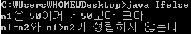

좀 늦어진 감이 없진 않군요.

요즘 반 배치다 뭐다 해서 java를 공부하지 못한 관계로...

그래서 빨리 쓰겠습니다.

이번에는 저번 강좌에서 얘기 한 것과 같이 좀 재미있습니다. ㅋㅋ

다들 영문법을 배우셨을거라고 생각하는데요 if절에 대한 부분도 배우셨을거라 생각됩니다.

java에서도 이런 if구문을 제공하고 있습니다.

바로 if~else구문입니다.

그래서 이번에는 자바 프로그램의 흐름 제어 역할을 하는 if~else문에 대해 알아보도록 하겠습니다.

먼저 if구문의 기본 뼈대를 설명하겠습니다.

> if(true 또는 false)
>
> {
>
>   /* 괄호 값이 true일경우 실행되는 영역 */
>
> }
>
> else
>
> {
>
>   /* 괄호 값이 false일경우 실행되는 영역 */
>
> }

이런 구조를 지니고 있습니다.

괄호 ( ) 안에 true가 오면 true부분이, false가 오면 false부분이 실행되는 것이지요.

그런대 여기서 괄호 ( )에는 true또는 false만 올 수 있습니다.

그러므로 true와 fasle를 반환하는 연산자와 boolean 변수도 들어갈 수 있겠죠?

if절은 구조가 간단해서 별다른 설명은 필요 없을 듯 합니다.

간단하게 예제를 살펴보도록 하겠습니다.

```java
class Ifelse
{
 public static void main(String[] args)
 {
  int n1=50, n2=80;
  
  if(n1<50)
   System.out.println("n1은 50보다 작다");
  else
   System.out.println("n1은 50이거나 50보다 크다");
   
  if(n1==n2 && n1>n2)
   System.out.println("n1=n2이며 n1>n2이다");
  else
   System.out.println("n1=n2와 n1>n2가 성립하지 않는다"); 
 }
}
```

[Ifelse.java](./files/Ifelse.java)

이런 소스가 있습니다.

int형 변수로 n1과 n2를 선언하고 있군요.

그다음 첫 번째 if로 n1<50을 연산하게 해서 그 결과를 보고 표현하라고 되어 있습니다.

이 경우 n1<50이 성립하지 않으므로 else다음 구문이 실행되게 되는 것입니다.

두 번째 if에서는 &&연산을 진행하고 있는데요.

n1==n2가 false이므로 SCE에 의해 n1>n2는 연산 되지 않을 것 이라고 생각 할 수 있습니다.

이 경우에도 마찬가지로 false가 나오게 되므로 else다음 구문이 실행될 것이라 예측할 수 있습니다.



실행 결과를 봐도 예상과 같은 결과가 나타나는 것을 확인할 수 있습니다.

그런대 위 소스를 보면 if~else구문에 중괄호 { }가 빠져 있는 것을 보셨나요?

이렇게 실행할 구문이 1개일 때는 중괄호를 없애도 문제가 발생하지 않습니다.

그러나 되도록 실력을 키우기 위해, 자바에서 가독성 높은 코드를 작성하기 위해, 중괄호를 쓰는 것을 추천합니다.

요즘은 중괄호 {}와 세미클론 ;이 없는 프로그래밍 언어도 있다고 하더라고요..

참고로 if~else구문은 java에서 낱말이 떨어져 있지만 하나의 구문으로 인식합니다.

이렇게 if~else에 대해 살펴 보았습니다.

저는 아주 간단한 예만 들어 설명한 것일 뿐 if문은 아주 유용하게 사용됩니다.

예를 들면 다중(중첩) if문도 가능하지요.

그런대 java에서는 if와 성격이 비슷한 연산자가 또 있습니다.

바로 ? : 기호입니다.

이것은 조건 연산자 인데요.

피 연산자가 3개인 유일한 연산자입니다.

> int number1=20, number2=30, whyis;
>
> whyis=(number1>number2)?number1:number2;

자 여길 보시면 ?와 :을 사용한 모습을 보실 수 있습니다.

이렇게 조건 연산자를 사용했는데요.

원리를 말씀드리자면,

?기호 왼쪽에 true가 있다면 :기호의 왼쪽 숫자가 반환,

?기호 왼쪽에 false가 있다면 :기호의 오른쪽 숫자가 반환됩니다.

그러므로 위 파란 박스에서는 number1>number2가 false이므로 number2의 값이 반환되겠지요?

이렇게 해서 if~else구문에 대한 설명이 마쳐졌습니다. ㅎㅎ

복습겸 이렇게 작성하니 확실히 이해가 잘되네요..ㅎㅎ

만약 지금 이 글을 보고 계신다면 직접 소스 한번 짜보시는 연습해 보시길 강력 추천드립니다. ㅋㅋ

---

## 첨부파일

- [Ifelse.java](./files/Ifelse.java)
