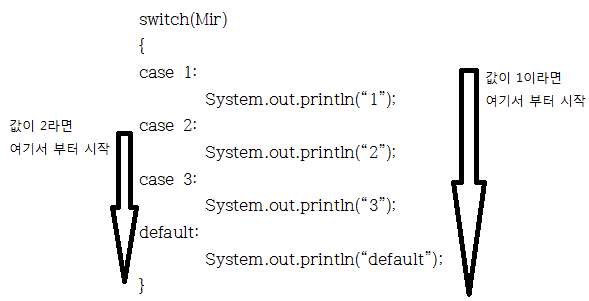
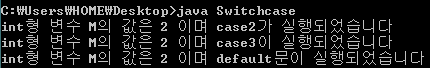
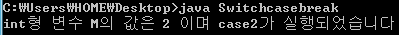
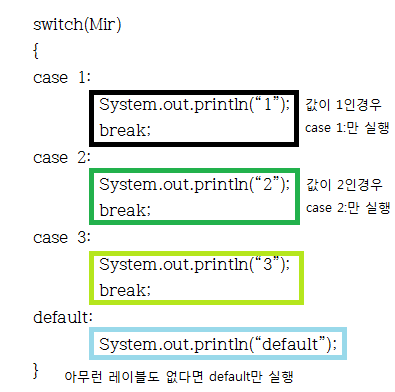

먼저 이 강좌는 SDA, 디벨로이드, ADF카페에 보급(?)되며 티스토리와 네이버의 글양식 차이로 인해 사진과 글씨가 깨져 보일 경우 원본 링크로 와서 감상해 주시길 바랍니다.

안녕하세요.

이번에 살펴볼 switch문은 말 그대로 스위치 입니ㅏㄷ. *(←고의적 오타)*

if~else와 비슷하면서도 다른 문구이니 꼭 숙지해 두시길 바랍니다.

스위치 문은 case와 default라는 레이블로 구성이 됩니다.

한번 기본 구성을 살펴보도록 하겠습니다.

> switch(Mir)
>
> {
>
>   case 1:
>
>     . . . .
>
>   case 2:
>
>     . . . .
>
>   case 3:
>
>     . . . .
>
>   default:
>
>     . . . .
>
> }

이런 구성을 가지고 있습니다.

Mir의 값이 1이면 case 1:부터 시작되며 값이 3이라면 case 3:부터, 만약 아무것도 포함되어 있지 않다면 default부터 시작되는 것이지요



제 허접한 그림 솜씨로 한번 표현해 봤습니다. ㅠㅠ 역시 그림에는 절대로 소질이 없네요..

아무튼 이런 구조로 실행 됩니다.

case라는 레이블은 switch의 값이 n이라면 여기서부터 시작하세요. 라는 뜻을 가지고 있으며,

default 레이블은 값 n에 해당하는 레이블(case)이 없다면 여기서 부터 실행하세요!라는 뜻으로 이해하시면 됩니다. ㅎㅎ

한번 예제를 통해 보도록 하겠습니다.

이런 종류의 문구는 엄청난 설명보다 하나의 예제가 도움이 더 많이 되는 듯 해요.

```java
class Switchcase
{
 public static void main(String[] args)
 {
  int M=2;
  
  switch(M)
  {
  case 1:
   System.out.println("int형 변수 M의 값은 "+M+" 이며 case1이 실행되었습니다");
  case 2:
   System.out.println("int형 변수 M의 값은 "+M+" 이며 case2가 실행되었습니다");
  case 3:
   System.out.println("int형 변수 M의 값은 "+M+" 이며 case3이 실행되었습니다");
  default:
   System.out.println("int형 변수 M의 값은 "+M+" 이며 default문이 실행되었습니다");
  }
 }
}
```


이렇게 구성했습니다.

예상을 해보면 M이 2이므로 case2부터 실행될 것임을 알수 있습니다.

한번 실행 결과를 보도록 하겠습니다.



이렇게 M의 값이 2 이므로 case 2: 부터 아래로 실행이 되었음을 알 수 있습니다.

그런대 여기서 잠깐!

우리가 프로그램을 짜다 보면 값이 2일 경우 case 2만 실행되어야 하는 경우가 있습니다.

이 경우가 더욱더 많다고 생각하는데요.

이럴 때는 어떻게 해야 할까요?

이러한 이유로 만들어 진 것이 바로 break레이블 입니다.

일단 위 예제에 break를 넣어 만들어 보도록 하겠습니다.

```java
class Switchcasebreak
{
 public static void main(String[] args)
 {
  int M=2;
  
  switch(M)
  {
  case 1:
   System.out.println("int형 변수 M의 값은 "+M+" 이며 case1이 실행되었습니다");
   break;
  case 2:
   System.out.println("int형 변수 M의 값은 "+M+" 이며 case2가 실행되었습니다");
   break;
  case 3:
   System.out.println("int형 변수 M의 값은 "+M+" 이며 case3이 실행되었습니다");
   break;
  default:
   System.out.println("int형 변수 M의 값은 "+M+" 이며 default문이 실행되었습니다");
  }
 }
}
```


각 case마다 break를 넣었습니다.

실행 결과를 한번 볼까요?



이렇게 case 2로 들어간다음 println이 실행되고 break를 만나 switch를 빠져나온 모습을 볼 수 있습니다.

다시 한 번 그림으로 표현해 보도록 하겠습니다.



그림이 허접해도 그냥 봐주세요. ㅠㅅㅠ

이런 그림으로 표현이 가능합니다.

break문을 만나는 즉시 반복문(switch등)을 빠져나올 수 있지요. ㅋㅋ

이렇게 switch와 break에 대해 살펴봤습니다.

이런 구문은 많은 연습이 필요하다 생각합니다. 저 역시 이 강좌를 쓰며 연습하고 있습니다.

여러분도 많은 연습 하셔서 꼭 마스터 하시길 바랍니다. ㅎㅎ

다음 강좌에서는 for와 while, do~while에 대해 배워보겠습니다.