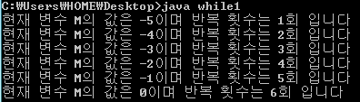
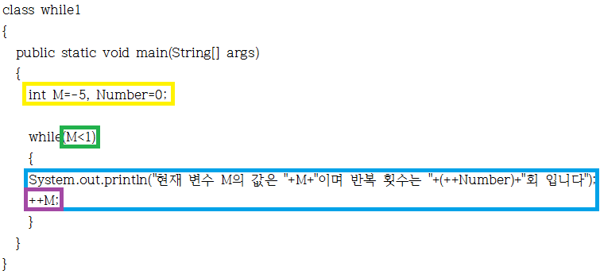
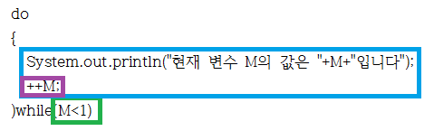
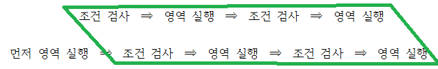
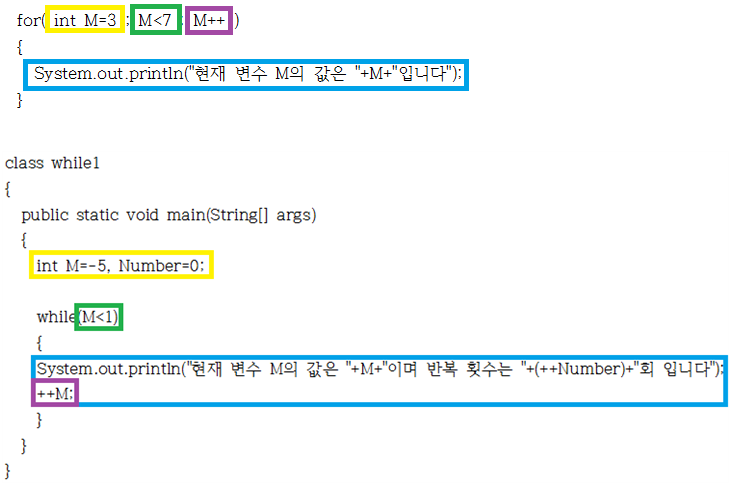

이번에는 저번 강좌와 비슷한 반복문인 while과 for, do~while에 대해 알아보겠습니다.

제가 저번 switch배울 때 반복문 이라는 용어를 사용했는지 모르겠습니다.

엄밀하게 따지면 ( if~else  ==  switch )  !=  ( while  ==  for  ==  do~while ) 이렇게 나눌 수 있습니다.

이 연산자들( !=, == )은 전에 배운 것 이므로 한번 보시면 뜻을 딱 아셔야 합니다. ㅎㅎ 아시겠죠? 뜻이 생각이 안 나시면 다시 전전전 강좌로..

while부터 알아보겠습니다.

예제를 통해 확인해 볼까요?

```java
class while1
{
	public static void main(String[] args)
	{
		int M=-5, Number=0;
		
		while(M<1)
		{
			System.out.println("현재 변수 M의 값은 "+M+"이며 반복 횟수는 "+(++Number)+"회 입니다");
			++M;
		}
	}
}
```

[ while1.java](http://itmir.tistory.com/attachment/cfile7.uf@25710F40513067D6161DE8.java)

제 나름대로 재미있게 짜봤습니다. ㅋㅋ

먼저 실행결과를 보겠습니다.



보시면 while의 { }안 구문이 반복된 것을 알 수 있습니다.

제가 일부로 짜봤는데요. System.out.println안의  (++Number), 즉 괄호는 우선 연산을 뜻하기에 ++Number가 먼저 연산된 뒤 나타나겠지요.

이번에도 그림을 통해 확인해 볼까요?



노란 박스를 보시면 변수 선언이 이루어 지고 있습니다 먼저 선언이 이루어져야겠지요?

초록 박스를 보시면 반복 조건을 명시해 주고 있습니다.

파란 박스를 보시면 반복되는 영역을 표시하고 있습니다. 반복 조건 부분이 true일 경우 계속 이 영역이 실행되지요.

마지막으로 제가 일부러 ++M;을 보라색 박스로 표시해 뒀습니다 이건 이 반복문이 깨질 수 있도록 명시해 주는겁니다.

만약 이 문구가 없다면 M<1을 만족하지 않는 경우가 절대로 생길 수 없으므로 항상 참이 되서 무한 반복이 되겠지요.

이렇게 while에 대한 설명이 끝났습니다.

그냥 설명을 그림으로 해도 될까봐요....

이번엔 do~while 반복문에 대해 살펴보겠습니다.

> do
>
> {
>
> System.out.println("현재 변수 M의 값은 "+M+"입니다");
>
> ++M;
>
> )while(M<1)

이런 구조를 지니고 있습니다.

역시 그림으로 보겠습니다 ㄷㅅㄷ



이렇게 나타낼 수 있습니다.

while과 같은 색을 사용해 구분하기 쉬울 겁니다. ㅎㅎ

설명하자면 이 do~while반복문은 while문과 다르게 일단 한번은 실행합니다.

그 다음 반복 여부 검사가 이루어지죠.



이렇게 이해하시면 쉽습니다.

아 정말 그림이.. ㄷㄷ

아무튼 do~while와 while의 차이점은 먼저 반복 영역을 실행 하느냐죠.

그러므로 최소 한 번은 실행이 필요한 경우는 do~while문을, 상관 없는 경우는 while문을 사용하게 됩니다.

그럼 마지막으로 for문에 대해 알아보겠습니다.

for문은 while문의 단축형이라 생각하시면 아주 쉽습니다.

> for( int M=3 ; M<7 ; M++ )
>
> {
>
>   System.out.println("현재 변수 M의 값은 "+M+"입니다");
>
> }

for문은 간단합니다.

반복문에 필요한 3요소, 즉 변수 선언, 반복 조건, 반복을 끝내기 위한 조건

이 3개를 한번에 나열하고 있는 것이 for문입니다.

그림으로 while문과 비교해 보겟습니다.



이렇게 비교가 가능합니다.

보시면 while에서 분산 되어 있는 요소를 for문에서는 한 줄에서 표시하고 있는 것을 알 수 있습니다.

변수 선언, 반복 조건, 반복을 끝내기 위한 연산을 한 줄에 가지고 있는 것이 for문의 특징이지요.

for문이 시작되게 되면 먼저 노란 박스, 즉 변수가 선언됩니다.

그다음 초록 박스로 반복 조건을 따져 보게 되지요.

세 번째로 반복 영역이 실행되고.

마지막으로 반복을 끝내기 위한 연산, 즉 보라 박스가 실행되는 것이지요.

참고로 for문에서 쓰인 변수 이름은 그 for에서만 유효하며 for문 밖이나 다른 for에는 영향을 미치지 않습니다.

또한 for문에서 꼭 변수 선언을 해줘야 할 필요는 없습니다.

이미 선언한 변수를 반복 조건(초록 박스)에 넣어 주시고 변수 선언(노란 박스)는 비워두셔도 되지요.

이렇게 해서 대부분의 반복문을 마쳤습니다. ㅎㅎ

이번 강좌는 좀 길면서 어렵군요..

모르시는게 있으시면 덧글로 알려주시길... 보충하겠습니다~

아 그런대 정말 그림 정말 짜증나네요.. ㅡㅡ;;

그래도 너그럽게 이해해주세요..

다음 강좌에서는 continue와 break에 대해 더 살펴보겠습니다. ㅎㅎ

아직 저도 배우지 않았기에 조금 시간이 걸릴 수 있는 점 양해 부탁드려요..
