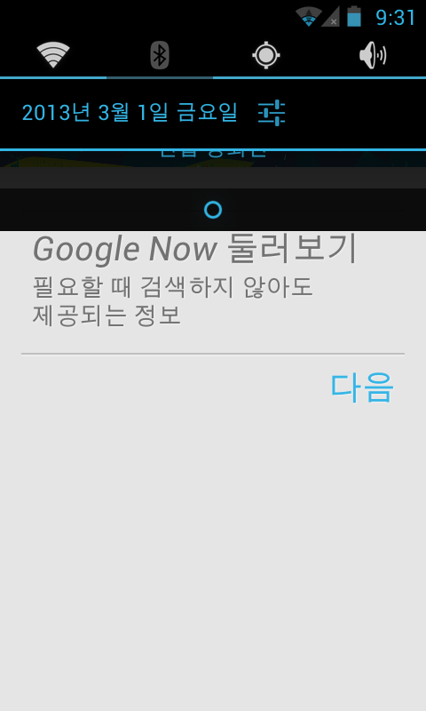
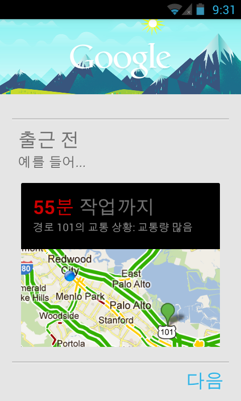
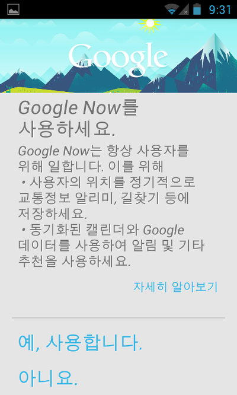

이번 포스팅에서는 안드로이드 젤리빈에서 추가된 Google Now(구글 나우)에 관해 살펴보며, ICS(아샌, 아이스크림 샌드위치)에서 구글 나우를 사용하는 방법에 대해 알아보겠습니다

구글 나우를 한마디로 정리해 본다면

"검색하지 않아도 정보를 보여주는 비서" 라고 할 수 있지 않을까요?

이런 구글 나우를 ICS에서는 사용할 수 없다는 점이 큰 단점이라 할 수 있습니다

그러므로 시중에 유통되는(?) 대표적인 2가지 방법을 소개하려 합니다

먼저 준비물이 필요합니다

ICS가 올려진 루팅된 안드로이드 기기

CWM등의 커스텀 리커버리 & 루트 익스플로러등 시스탬에 접근할 수 있는 루트 탐색기

기본 루트 상식

준비를 완료하셨다면 잘 따라오시길 바랍니다 ㅎ

먼저 블로거에서 많이 유통된(?) 방법입니다

젤리빈에서 추출한 파일을 설치하는 방법인대요

박스를 따라하시면 됩니다

> 1. 루트 익스플로러로 /system폴더에 접근하여 r/w모드로 변경
>
> 2. Build.prop를 텍스트 에디터(Text Editor)으로 열기
>
> 3. ro.build.version.sdk를 찾아 값을 16으로 변경후 저장
>
> 4. /system/app으로 들어가 GoogleQuickSerachBox.apk어플의 이름을 GoogleQuickSerachBox1.apk로 변경
>
> 즉, GoogleQuickSerachBox.apk을 백업하란 소리입니다
>
> 5. 재부팅 한뒤 첨부 파일을 다운받아 설치
>
> 6. 언어를 영어로 변경후 구글 나우 활성화
>
> 7. 활성화가 확인되면 언어를 원상복구 한뒤 Build.prop를 열어 ro.build.version.sdk의 값을 15로 변경
>
> 원본 XDA 게시글 : http://forum.xda-developers.com/showthread.php?t=1749045

이것이 첫번째 방법입니다

이 방법은 음성 인식 기능이 지원되지 않는다 하네요 원본 게시글을 보시면 **VOICE SEARCH IS NOT WORKING**이 있습니다

그럼 두번째 방법을 설명드리겠습니다

위 방법과 마찬가지로 ICS를 탑제한 루팅된 기기가 필요하며 deodex롬만 가능하다 합니다

역시 CWM등의 커스텀 리커버리는 있어야지요

그럼 아래 파일을 받아주세요

-On/Offline 버전

-Only Online 버전

zip분활압축하여 올려두었습니다

원본 링크는 [Offline링크](http://www.mediafire.com/download.php?hsos53699wq2ttm) / [On](http://www.mediafire.com/download.php?g55mv3df79s6rez)[line링크](http://www.mediafire.com/download.php?g55mv3df79s6rez) 입니다

이 파일을 받아 압축 풀으신다음 CWM리커버리에서 설치 해주시면 됩니다 ㅎㅎ

그럼 ICS에서 구글 나우 기능을 재대로 사용하실수 있으실겁니다 ㅋ

원본 XDA 게시글 : http://forum.xda-developers.com/showthread.php?t=1747224

검정 배경의 구글 나우 버전

색이 반전된, 검은 테마의 구글 나우도 있습니다

설치방법은 위와 같습니다

인증샷!

상태바를 보시면 젤리빈이 아니란걸 아실수 있으실겁니다

젤리빈은 터치시 파랗게 빛나죠

ICS기기에 구글 나우가 추가된것을 볼 수 있습니다 ㅋ

이렇게 해서 ICS기기에 구글 나우 사용방법을 살펴보았습니다 ㅎㅎ