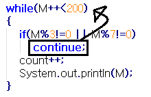

반복문에 관한 설명이 이번 강좌와 다음 강좌면 끝이 날거라 예상하고 있습니다.

그러는 동시에 제 java책 챕터5가 끝나게 되지요.

즉 여러분께선 프로그램에서 흐름을 잡는 if, 스위치, while에 대한 이해가 끝나게 되실겁니다.

*돈안내고 책을 본다는 느낌이 들수도..*

아무튼 늦은 밤 빨리 써내려가겠습니다.

오늘 배울 continue와 break는 while과 switch문처럼 반복문은 아니지만,

이런 반복문 중간에 들어가 작업을 하게 만드는(?) 키워드 입니다.

먼저 조금 익숙한 break에 대해 알아보겠습니다.

```java
class Break
{
  public static void main(String[] args)
  {
    int Mir=1;
    boolean number=false;

    while(Mir<100)
    {
      if(Mir%3==0 && Mir%7==0)
      {
        number=true;
        break;
      }
      Mir++;
    }

    if(number)
        System.out.println("3과 7의 최소 공배수는 " + Mir + "입니다");
    else
        System.out.println("100 미만 3과 7의 최소 공배수를 찾을수 없습니다");
  }
}
```


점점 소스의 양이 많아지는걸 느끼시겟나요?

보시면 간단한 구조로 이루어져 있음을 알 수 있습니다.

먼저 int와 boolean으로 변수를 선언한 다음 while문으로 반복하고 있습니다.

"Mir%3==0 && Mir%7==0" 이 부분이 이해가 가지 않으신다면... 뒷 강좌를 다시 보셔야 합니다.

Mir를(저는 아니고요;;) 3으로 나눈 나머지가 0이고 또한 Mir를 7로 나눈 나머지가 0이 동시에 될 때 &&연산에 의해 true가 나오게 되고,

그 순간 if절이 실행되어 number를 ture로 바꾸고 break로 while반복문을 빠져나오게 되지요.

여기서 break가 실행될 때 if문 안에 있어서 if문이 끝나는 게 아닌가라는 생각이 드실 수 있으실텐데요.

반복문은 while, for, do~while등이지 if문이 반복문이라 배우진 않았습니다.

그러므로 break가 실행되면 가장 가까운, 자신을 감싸는 반복문을 빠져나오게 되는 것 이지요.

while을 빠져나왔고 number을 true로 바꼈으니 그다음 if절에서는 최소 공배수의 숫자가 나타나게 되는 것 이지요.

만약 100안에 값이 나오지 않을 경우 while(Mir<100)에 의해 반복문을 빠져나오게 될 것이고,

true로 바뀌지 않았음이므로 마지막 if문에서는 else가 실행되겠죠?

이렇게 break문은 반복문을 중단하는 역할을 합니다.

반복문이 중첩되어 있다면(아마 다음 강좌에서 언급할 듯 합니다) 하나의 반복만 빠져나올 수 있는데요.

그때는 레이블을 설정해 한번에 중첩된 반복을 빠져 나올 수도 있습니다.

그럼 break에 대한 설명은 끝난 듯 합니다. 쉬워요 ㅎ

이어서 continue에 대해 설명하겠습니다.

설명하기전 continue는 오타가 쉽게 나더라고요.. 이해 부탁드리겠습니다..

continue는 break와는 너무나도 다른 기능을 지니고 있습니다.

break가 반복문을 끝내는 역할을 한다면,

continue는 실행되면 아래 반복 영역을 실행하지 않고 조건 검사로 넘기는 역할을 합니다.



그림으로 설명하자면 이렇게 되지요.

continue가 실행되면 그 반복문의 조건 검사 부분으로 넘어가게 되지요.

예제를 보겠습니다.

```java
class Continue
{
  public static void main(String[] args)
  {
    int M=0, count=0;

    System.out.println("200이하 숫자중 3과 7의 최소 공배수 목록");

    while(M++<200)
    {
      if(M%3!=0 || M%7!=0)
        continue;
      count++;
      System.out.println(M);
    }

    System.out.println("3과 7의 최소 공배수의 수 :"+count);
  }
}
```


while문을 보시면 반복 영역이 실행되자 마자 if문이 실행됩니다.

M%3!=0 || M%7!=0을 보시면 다들 아시죠...?

다들 아실거라 생각해서 연산의 특성은 생략하겠습니다.

||연산으로 true가 나오게 되면 continue가 실행되면서 처음 조건 검사로 넘어갑니다.

그러니 M%3!=0와 M%7!=0가 둘다 false여야 연산 결과가 false가 되며 continue가 실행되지 않습니다.

*즉, M%3!=0 || M%7!=0를 M%3==0 && M%7==0이렇게 바꿔도 된다는 결론이 나오게 됩니다*

오해의 소지가 있어 글을 수정합니다.

위의 &&을 이용한 최소 공배수 수를 구하는 코드와,

아래의 ||을 이용한 최소 공배수 수를 구하는 코드를 구분하실 때는 전체적인 코드를 보셔야 합니다.

위 코드는 if문을 이용해서 100 미만인 3과 7의 최소 공배수를 구하는 코드입니다.

if문을 보시면 M을 3으로, 7으로 나눈 값이 모두(&&) 0일때 break;를 사용해서 반복문을 종료하고 있습니다.

아래 코드는 if문을 이용하고 있지만, 또한 continue;를 이용해서 200 이하 수 중 3과 7의 최소 공배수를 구하고 있습니다.

if문을 보시면 M을 3으로 나눈 나머지가 0이 아니거나, 또는 7으로 나눈 나머지가 0이 아니면 continue가 실행되고, 저 if문이 false가 될 때, 즉, M%3!=0도 false, M%7!=0도 false가 될때 if(M%3!=0 || M%7!=0)가 false가 되어 continue;가 실행되지 않고 count++와 System.out.println()이 실행됩니다.

두 개의 코드는 무엇을 구하는지부터 다릅니다.

오해의 소지가 있도록 문장을 작성해서 죄송합니다.

아무튼 본론으로 돌아가서 false가 나오면 continue는 실행되지 않으므로 아래 count++와 println이 실행되는 것이지요.

그리고 while문은 M++<200이 false가 될때까지 반복하게 되지요.

여기서 M++를 보시면 postfix연산입니다 즉 이 행이 끝나야 값이 늘어나게 되지요.

그러니 200도 연산결과에 포함되게 됩니다. (이해가 안되신다면 천천히 생각해 보시길 postfix의 연산특성을 생각해 보세요.)

이렇게 해서 continue를 사용한 예제를 살펴 보았습니다.

아러ㅏㄴ리ㅓ 이렇게 멘붕하시는 분이 계실까 모르지만 이해하면 완전 쉽습니다. ㅎㅎ

이제 무한 루프를 배워야 하는데요.

이번 강좌의 길이가 너무 길어지는 바람에...

다음 강좌에서 무한 루프부터 반복문의 중첩까지 배워보도록 하겠습니다. ㅎㅎ